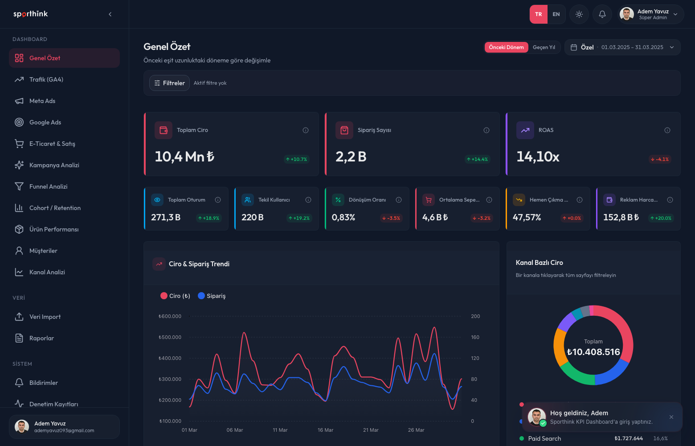
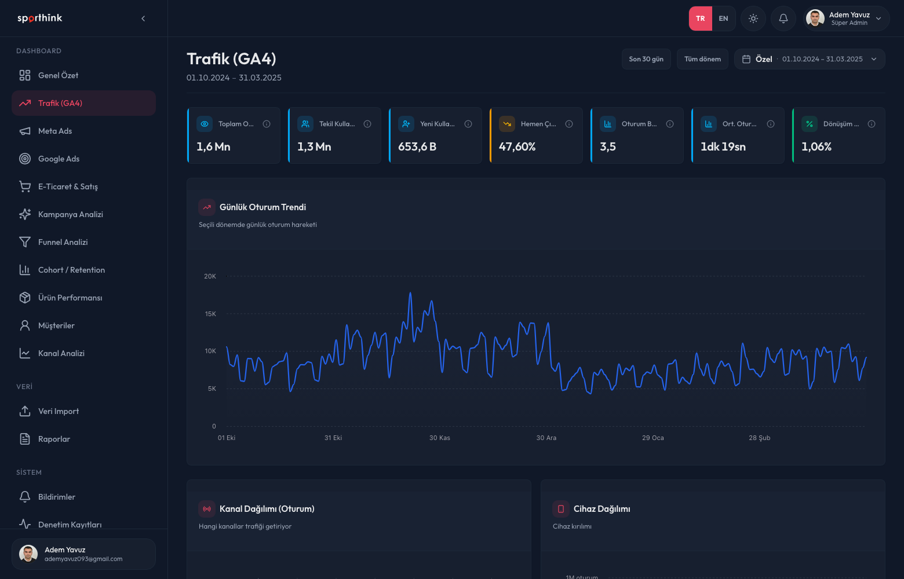
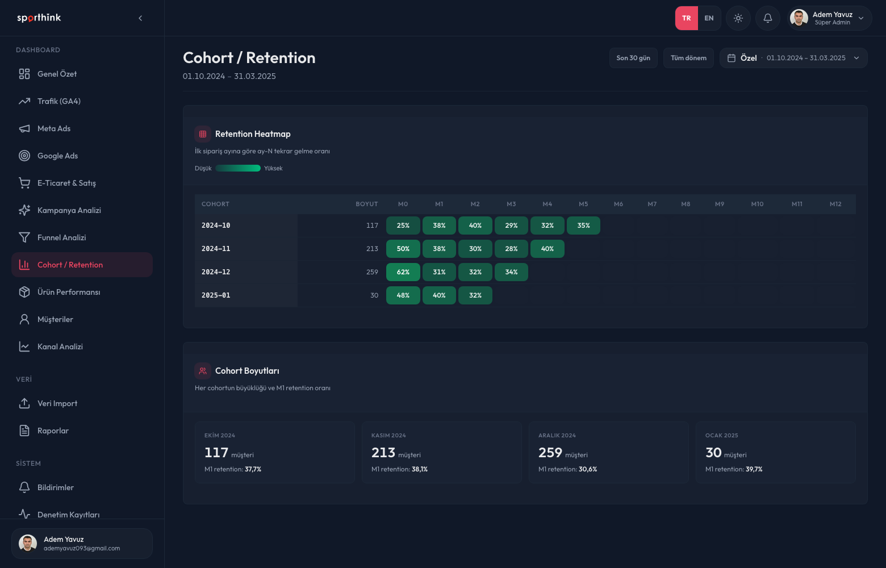
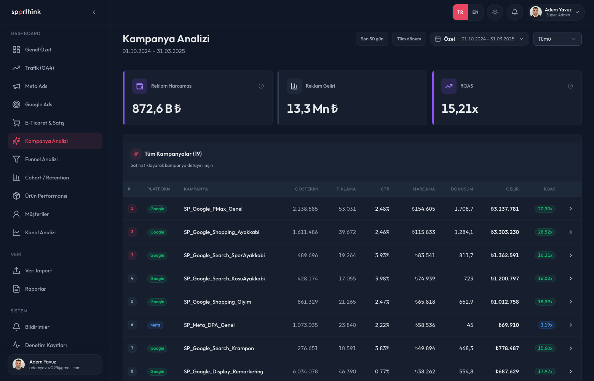
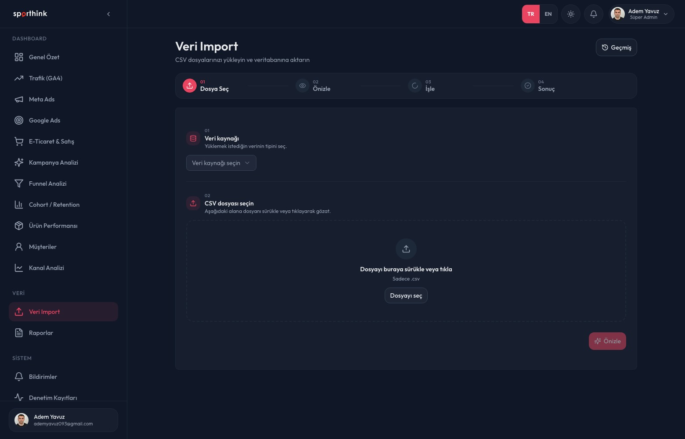
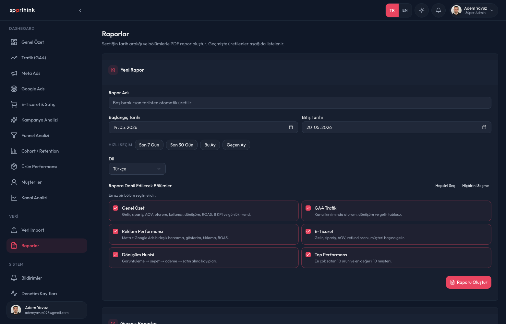
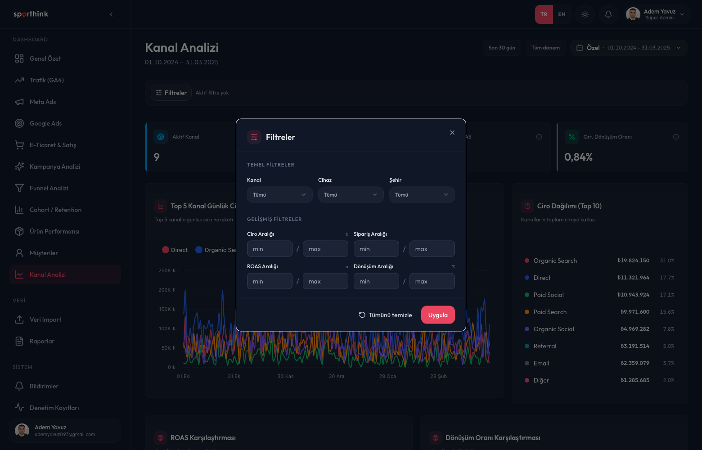
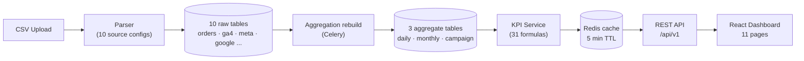

<div align="center">

<picture>
  <source media="(prefers-color-scheme: dark)" srcset="frontend/src/assets/brand/sporthink-wordmark-white.png">
  
</picture>

# KPI Dashboard

**An internal SaaS application that tracks marketing and e-commerce performance across 31 KPIs in one place**

[](https://github.com/ademyavuzz/sporthink-kpi-dashboard/actions/workflows/ci.yml)


### [Live application](https://sporthinkkpidashboard.com/login) · [Demo video](https://www.youtube.com/watch?v=ZKEY5kyo8fc)

[Features](#features) · [Screenshots](#screenshots) · [Architecture](#architecture) · [Quick start](#quick-start) · [Documentation](#documentation)



</div>

## Overview

Sporthink's marketing team tracked GA4, Meta Ads, Google Ads and e-commerce data in separate tools, and compiled KPIs by hand in spreadsheets. This application merges those four data sources into a single database, computes **31 standard KPIs** from one formula source, and visualizes them across **11 dashboard pages**.

It runs self hosted with no licensing cost, ships a Turkish and English interface, and enforces team level authorization through role based access control. The application is currently live in production.

## Features

- **Four data sources:** GA4 for traffic, Meta Ads, Google Ads, and e-commerce for orders, customers and products
- **31 KPIs** across traffic, advertising, sales and marketing categories, each with a comparison period (previous period or year over year), trend direction, and explicit NULL semantics for missing data
- **11 dashboard pages** with KPI cards, ApexCharts visualizations, sortable and customizable tables, and a Turkey heat map
- **Advanced filtering:** per page multi select filters (channel, device, city, category, brand, campaign, objective), cross filtering from charts, and shareable filter state encoded in the URL
- **CSV import wizard:** four steps with drag and drop, header validation, automatic type conversion, foreign key resolution, deduplication, and a row level error report downloadable as CSV
- **PDF reporting:** asynchronous report generation through Celery with selectable sections
- **Role based access control:** 41 granular permissions, customizable roles, a Super Admin system role, and an audit trail
- **User management:** email invitation flow, password reset, profile and avatar, notification center
- **Internationalization and theming:** Turkish (default) and English, light and dark themes, Europe/Istanbul timezone

## Dashboard pages

| Page | Contents |
| :-- | :-- |
| **Overview** | 9 KPI summary, revenue trend, channel distribution, funnel, new against returning, top 10 products |
| **Traffic** | 7 GA4 KPIs, daily session trend, channel, device and city breakdowns, Turkey map |
| **Meta Ads** | 8 KPIs, spend and revenue trend, campaign table |
| **Google Ads** | 8 KPIs, spend and revenue trend, campaign table |
| **E-commerce** | 7 KPIs, daily revenue and orders, payment and status breakdown, top 20 customers |
| **Campaigns** | All campaigns by ROAS, CTR and CPA, platform filter, campaign detail modal |
| **Conversion Funnel** | View to cart to checkout to purchase, with drop off rates |
| **Cohort** | Signup month against month N retention heat map |
| **Products** | Top 20 products, category and brand breakdown |
| **Customers** | Top customers, new against returning analysis |
| **Channel Analysis** | Revenue and conversion comparison by channel |

## Screenshots

<details>
<summary><b>Open gallery</b> (dashboards, import, administration)</summary>
<br>

| | |
|---|---|
|  |  |
|  |  |
|  |  |
|  |  |
|  |  |
|  |  |

</details>

## Architecture



- **Layered backend:** Router, Service, Repository. KPI formulas live in a single file (`kpi_service.py`) and permissions in a single enum (`permissions.py`)
- **Two stage computation:** KPI queries read from aggregate tables rebuilt by Celery after each import, not from raw tables
- **Auth:** short lived JWT access token plus a rotating refresh token in an httpOnly cookie, with bcrypt at cost 12
- **Time and money:** the database and API use UTC and `DECIMAL(15,2)` TRY, and the interface converts to Europe/Istanbul

For detailed architecture decisions see [`docs/overview/03-architecture.md`](docs/overview/03-architecture.md).

## Tech stack

| Layer | Technologies |
| :-- | :-- |
| **Backend** | Python 3.12 · FastAPI · SQLAlchemy 2 (async) · Pydantic 2 · Celery 5 · Alembic |
| **Data** | MySQL 8.4 LTS · Redis 7.4 (cache and broker) |
| **Frontend** | React 19 · Vite 6 · TypeScript 5.7 (strict) · TailwindCSS 4 · shadcn/ui · ApexCharts |
| **State** | Zustand · TanStack Query · React Hook Form with Zod · i18next |
| **Testing** | pytest (139 tests) · Vitest with RTL (28 tests) · Playwright (E2E) |
| **Quality** | Ruff · ESLint 9 with Prettier · `tsc --noEmit` · GitHub Actions CI |
| **Infrastructure** | Docker Compose · Nginx · Let's Encrypt · Gunicorn and Uvicorn |

## Quick start

**Prerequisites:** Docker 27+ and Docker Compose 2.30+. Nothing else is required.

```bash
git clone https://github.com/ademyavuzz/sporthink-kpi-dashboard.git
cd sporthink-kpi-dashboard

# Prepare the env file (development defaults work as is)
cp .env.example .env

# Bring the stack up
docker compose -f docker-compose.dev.yml up -d

# Seed the Super Admin and permissions (idempotent)
docker compose -f docker-compose.dev.yml exec backend python -m app.seed
```

| Service | Address |
| :-- | :-- |
| Frontend | http://localhost:5173 |
| API (Swagger) | http://localhost:8000/api/docs |
| API (ReDoc) | http://localhost:8000/api/redoc |
| MySQL | localhost:3306 |
| Redis | localhost:6379 |

Sign in with `admin@sporthink.local` and the `SUPER_ADMIN_PASSWORD` value from `.env`.

## Testing and quality

```bash
# Backend: 139 tests (unit and integration)
docker compose -f docker-compose.dev.yml exec backend pytest -q

# Backend lint and format
docker compose -f docker-compose.dev.yml exec backend ruff check .

# Frontend: 28 tests
docker compose -f docker-compose.dev.yml exec frontend npx vitest run

# Frontend lint and typecheck
docker compose -f docker-compose.dev.yml exec frontend npm run lint
docker compose -f docker-compose.dev.yml exec frontend npx tsc --noEmit
```

GitHub Actions runs backend lint plus frontend lint, typecheck and unit tests on every push.

## Deployment

Production runs on a single host Docker Compose stack on an Ubuntu 24.04 LTS VDS, live at https://sporthinkkpidashboard.com. The two phase setup (IP over HTTP first, then Let's Encrypt HTTPS once the domain resolves) and the update flow are both scripted:

```bash
# First installation
./scripts/deploy.sh --init

# Subsequent updates (git pull, build, migrate, restart, health check)
./scripts/deploy.sh --update
```

Step by step guides: [`DEPLOY.md`](DEPLOY.md) · [`docs/overview/11-deployment.md`](docs/overview/11-deployment.md)

## Documentation

| Document | Contents |
| :-- | :-- |
| [`docs/overview/`](docs/overview/) | 16 chapter technical specification: architecture, data model, RBAC, API, KPI formulas, import system, test strategy |
| [`USER_GUIDE.md`](USER_GUIDE.md) | End user guide for marketing and e-commerce teams |
| [`DEPLOY.md`](DEPLOY.md) | Production installation and operations guide |
| [`CLAUDE.md`](CLAUDE.md) | Development rules and project invariants |
| `/api/docs` | Live OpenAPI (Swagger) documentation |

## Project structure

```
sporthink-kpi-dashboard/
├── backend/                 # FastAPI, Celery, MySQL
│   ├── app/
│   │   ├── api/v1/          # HTTP routers
│   │   ├── services/        # Business logic and 31 KPI formulas
│   │   ├── repositories/    # SQLAlchemy queries
│   │   ├── models/          # ORM (18 tables)
│   │   ├── schemas/         # Pydantic API contracts
│   │   ├── parsers/         # CSV parser and 10 source configs
│   │   ├── tasks/           # Celery (aggregation, email, reports)
│   │   └── core/            # Permissions, security, cache keys
│   ├── alembic/versions/    # Database migrations
│   └── tests/               # Unit and integration (139 tests)
├── frontend/                # React 19, Vite, TypeScript, Tailwind
│   ├── src/
│   │   ├── pages/           # 11 dashboards plus admin, import, reports
│   │   ├── components/      # KPI cards, charts, filters, tables
│   │   ├── lib/api/         # Typed Axios clients
│   │   └── stores/          # Zustand (auth, theme, language, filters)
│   └── public/locales/      # i18n (TR and EN)
├── docs/                    # Technical specification and screenshots
├── nginx/ · mysql/          # Production reverse proxy and DB tuning
├── scripts/                 # deploy.sh plus API smoke and CRUD checks
└── docker-compose.*.yml     # dev, prod and demo stacks
```

## Security

- Every business endpoint passes through JWT verification and a permission check. All 41 permissions are managed from a single backend enum
- Refresh tokens live in httpOnly cookies, are tracked in the database by JTI, and rotate on every use
- Passwords are stored with bcrypt at cost 12, and sensitive data is never written to logs, in line with KVKK
- Audit trail: authentication events and all administrative mutations are recorded in the `audit_logs` table

## License

Copyright 2026 Sporthink Sport Apparel. All rights reserved. This software was developed for Sporthink's internal use and may not be copied or distributed without permission. See [`LICENSE`](LICENSE) for details.

## Developer

**Adem Yavuz** · Dokuz Eylul University, Management Information Systems

[](https://www.linkedin.com/in/ademyavuztr/)
[](https://github.com/ademyavuzz)
[](https://www.kaggle.com/ademyavuz1)
[](https://digitalatolye.medium.com/)
[](mailto:ademyavuz093@gmail.com)

**Academic advisor:** Prof. Dr. Vahap Tecim · **Industry sponsor:** Sporthink Sport Apparel
