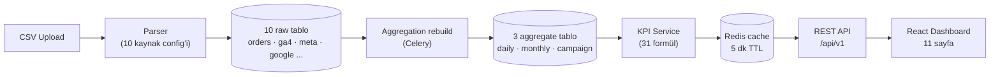

<div align="center">

<picture>
  <source media="(prefers-color-scheme: dark)" srcset="frontend/src/assets/brand/sporthink-wordmark-white.png">
  
</picture>

# KPI Dashboard

**Pazarlama ve e-ticaret performansını 31 KPI üzerinden tek noktada izleyen internal SaaS uygulaması**

[](https://github.com/ademyavuzz/sporthink-kpi-dashboard/actions/workflows/ci.yml)


[Özellikler](#özellikler) · [Ekran Görüntüleri](#ekran-görüntüleri) · [Mimari](#mimari) · [Hızlı Başlangıç](#hızlı-başlangıç) · [Dokümantasyon](#dokümantasyon)


</div>

---

## Genel Bakış

Sporthink'in pazarlama ekibi GA4, Meta Ads, Google Ads ve e-ticaret verilerini ayrı araçlarda takip ediyor; KPI'lar manuel Excel hesaplarıyla derleniyordu. Bu uygulama dört veri kaynağını tek veritabanında birleştirir, **31 standart KPI**'yi tek formül kaynağından hesaplar ve **11 dashboard sayfası** üzerinden görselleştirir.

Self-hosted çalışır (lisans maliyeti yok), Türkçe/İngilizce arayüz sunar ve rol bazlı erişim kontrolü (RBAC) ile ekip içi yetkilendirme sağlar.

## Özellikler

- **4 veri kaynağı** — GA4 (trafik), Meta Ads, Google Ads, E-Ticaret (sipariş/müşteri/ürün)
- **31 KPI** — trafik, reklam, satış ve pazarlama kategorilerinde; karşılaştırma dönemi (önceki dönem / YoY), trend yönü ve NULL ("veri yok") semantiği ile
- **11 dashboard sayfası** — KPI kartları, ApexCharts grafikler, sıralanabilir/özelleştirilebilir tablolar, Türkiye ısı haritası
- **Gelişmiş filtreleme** — sayfa bazlı çok-seçimli filtreler (kanal, cihaz, şehir, kategori, marka, kampanya, hedef...), grafiklerden cross-filter, URL ile paylaşılabilir filtre durumu
- **CSV import sihirbazı** — 4 adımlı, drag-drop, header doğrulama, otomatik tip dönüşümü, FK çözümleme, dedup ve satır bazlı hata raporu (CSV indirme)
- **PDF raporlama** — seçilebilir bölümlerle asenkron (Celery) rapor üretimi ve indirme
- **RBAC** — 41 granüler izin, özelleştirilebilir roller, Süper Admin sistem rolü, denetim (audit) kaydı
- **Kullanıcı yönetimi** — e-posta davet akışı, şifre sıfırlama, profil/avatar, bildirim merkezi
- **i18n & tema** — TR (varsayılan) + EN, açık/koyu tema, Europe/Istanbul zaman dilimi

## Dashboard Sayfaları

| Sayfa | İçerik |
|---|---|
| **Genel Özet** | 9 KPI özeti · ciro trendi · kanal dağılımı · funnel · yeni/tekrarlayan · top 10 ürün |
| **Trafik** | 7 GA4 KPI · günlük oturum trendi · kanal/cihaz/şehir kırılımları · Türkiye haritası |
| **Meta Ads** | 8 KPI · harcama–gelir trendi · kampanya tablosu |
| **Google Ads** | 8 KPI · harcama–gelir trendi · kampanya tablosu |
| **E-Ticaret** | 7 KPI · günlük ciro & sipariş · ödeme/durum kırılımı · top 20 müşteri |
| **Kampanyalar** | Tüm kampanyalar × ROAS/CTR/CPA · platform filtresi · kampanya detay modalı |
| **Dönüşüm Hunisi** | Görüntüleme → Sepet → Checkout → Satın alma + drop-off oranları |
| **Cohort** | Kayıt ayı × ay-N retention ısı haritası |
| **Ürünler** | Top 20 ürün · kategori/marka kırılımı |
| **Müşteriler** | Top müşteriler · yeni/tekrarlayan analizi |
| **Kanal Analizi** | Kanal bazlı gelir ve dönüşüm karşılaştırması |

## Ekran Görüntüleri

<details>
<summary><b>Galeriyi aç</b> (dashboard, import, yönetim ekranları)</summary>
<br>

| | |
|---|---|
|  |  |
|  |  |
|  |  |
|  |  |
|  |  |
|  |  |

</details>

## Mimari



- **Katmanlı backend** — Router → Service → Repository; KPI formülleri tek dosyada (`kpi_service.py`), izinler tek enum'da (`permissions.py`)
- **İki katmanlı hesap** — KPI sorguları raw tablolardan değil, import sonrası Celery ile yeniden kurulan aggregate tablolardan çalışır
- **Auth** — kısa ömürlü JWT access token + httpOnly cookie'de rotasyonlu refresh token; bcrypt (cost 12)
- **Zaman & para** — veritabanı ve API UTC + `DECIMAL(15,2)` TRY; kullanıcı arayüzü Europe/Istanbul'a çevirir

Detaylı mimari kararlar için: [`docs/overview/03-architecture.md`](docs/overview/03-architecture.md)

## Teknoloji Yığını

| Katman | Teknolojiler |
|---|---|
| **Backend** | Python 3.12 · FastAPI · SQLAlchemy 2 (async) · Pydantic 2 · Celery 5 · Alembic |
| **Veri** | MySQL 8.4 LTS · Redis 7.4 (cache + broker) |
| **Frontend** | React 19 · Vite 6 · TypeScript 5.7 (strict) · TailwindCSS 4 · shadcn/ui · ApexCharts |
| **State** | Zustand · TanStack Query · React Hook Form + Zod · i18next |
| **Test** | pytest (139 test) · Vitest + RTL (28 test) · Playwright (E2E) |
| **Kalite** | Ruff · ESLint 9 + Prettier · `tsc --noEmit` · GitHub Actions CI |
| **Altyapı** | Docker Compose · Nginx · Let's Encrypt · Gunicorn/Uvicorn |

## Hızlı Başlangıç

**Önkoşul:** Docker 27+ ve Docker Compose 2.30+ (başka hiçbir şey gerekmez).

```bash
git clone https://github.com/ademyavuzz/sporthink-kpi-dashboard.git
cd sporthink-kpi-dashboard

# Env dosyasını hazırla (dev varsayılanları çalışır durumdadır)
cp .env.example .env

# Stack'i ayağa kaldır
docker compose -f docker-compose.dev.yml up -d

# Süper Admin + izinleri seed'le (idempotent)
docker compose -f docker-compose.dev.yml exec backend python -m app.seed
```

| Servis | Adres |
|---|---|
| Frontend | http://localhost:5173 |
| API (Swagger) | http://localhost:8000/api/docs |
| API (ReDoc) | http://localhost:8000/api/redoc |
| MySQL | localhost:3306 |
| Redis | localhost:6379 |

Giriş: `admin@sporthink.local` / `.env` içindeki `SUPER_ADMIN_PASSWORD`.

## Test & Kalite

```bash
# Backend — 139 test (unit + integration)
docker compose -f docker-compose.dev.yml exec backend pytest -q

# Backend lint/format
docker compose -f docker-compose.dev.yml exec backend ruff check .

# Frontend — 28 test
docker compose -f docker-compose.dev.yml exec frontend npx vitest run

# Frontend lint + typecheck
docker compose -f docker-compose.dev.yml exec frontend npm run lint
docker compose -f docker-compose.dev.yml exec frontend npx tsc --noEmit
```

CI (GitHub Actions) her push'ta backend lint'i ve frontend lint + typecheck + unit testlerini çalıştırır.

## Deployment

Production, tek host Docker Compose ile Ubuntu 24.04 LTS VDS üzerinde çalışır. İki fazlı kurulum (önce IP/HTTP, domain hazır olunca Let's Encrypt HTTPS) ve güncelleme akışı script'e bağlanmıştır:

```bash
# İlk kurulum
./scripts/deploy.sh --init

# Sonraki güncellemeler (git pull + build + migrate + restart + health check)
./scripts/deploy.sh --update
```

Adım adım rehber: [`DEPLOY.md`](DEPLOY.md) · [`docs/overview/11-deployment.md`](docs/overview/11-deployment.md)

## Dokümantasyon

| Doküman | İçerik |
|---|---|
| [`docs/overview/`](docs/overview/) | 16 bölümlük teknik spesifikasyon: mimari, veri modeli, RBAC, API, KPI formülleri, import sistemi, test stratejisi... |
| [`USER_GUIDE.md`](USER_GUIDE.md) | Son kullanıcı kılavuzu (pazarlama/e-ticaret ekipleri için) |
| [`DEPLOY.md`](DEPLOY.md) | Production kurulum ve işletme rehberi |
| [`CLAUDE.md`](CLAUDE.md) | Geliştirme kuralları ve proje değişmezleri |
| `/api/docs` | Canlı OpenAPI (Swagger) dokümantasyonu |

## Proje Yapısı

```
sporthink-kpi-dashboard/
├── backend/                 # FastAPI + Celery + MySQL
│   ├── app/
│   │   ├── api/v1/          # HTTP router'ları
│   │   ├── services/        # İş mantığı + 31 KPI formülü
│   │   ├── repositories/    # SQLAlchemy sorguları
│   │   ├── models/          # ORM (18 tablo)
│   │   ├── schemas/         # Pydantic API contract'ları
│   │   ├── parsers/         # CSV parser + 10 kaynak config'i
│   │   ├── tasks/           # Celery (aggregation, e-posta, rapor)
│   │   └── core/            # İzinler, güvenlik, cache key'leri
│   ├── alembic/versions/    # DB migration'ları
│   └── tests/               # unit + integration (139 test)
├── frontend/                # React 19 + Vite + TS + Tailwind
│   ├── src/
│   │   ├── pages/           # 11 dashboard + yönetim + import + raporlar
│   │   ├── components/      # KPI kartları, grafikler, filtreler, tablolar
│   │   ├── lib/api/         # Typed Axios client'ları
│   │   └── stores/          # Zustand (auth, tema, dil, filtreler)
│   └── public/locales/      # i18n (TR/EN)
├── docs/                    # Teknik spesifikasyon + ekran görüntüleri
├── nginx/ · mysql/          # Production reverse proxy + DB tuning
├── scripts/                 # deploy.sh + API smoke/CRUD kontrolleri
└── docker-compose.*.yml     # dev / prod / demo stack'leri
```

## Güvenlik

- Tüm iş endpoint'leri JWT + izin kontrolünden geçer; 41 izin backend'de tek enum kaynağından yönetilir
- Refresh token'lar httpOnly cookie'de, DB'de JTI ile izlenir ve her kullanımda rotate edilir
- Şifreler bcrypt (cost 12) ile saklanır; hassas veriler log'a yazılmaz (KVKK)
- Denetim kaydı: auth olayları ve tüm yönetimsel mutasyonlar `audit_logs` tablosuna işlenir

## Lisans

© 2026 Sporthink Sport Apparel — Tüm hakları saklıdır. Bu yazılım Sporthink'in iç kullanımı için geliştirilmiştir; izinsiz kopyalanamaz ve dağıtılamaz. Ayrıntılar: [`LICENSE`](LICENSE)

---

<div align="center">

**Geliştirici:** Adem Yavuz · Dokuz Eylül Üniversitesi YBS ·
**Akademik danışman:** Prof. Dr. Vahap Tecim · **Sektör sponsoru:** Sporthink Sport Apparel

</div>
