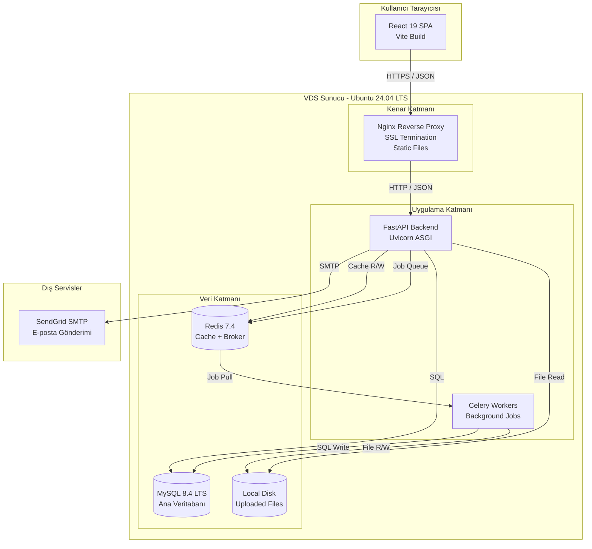
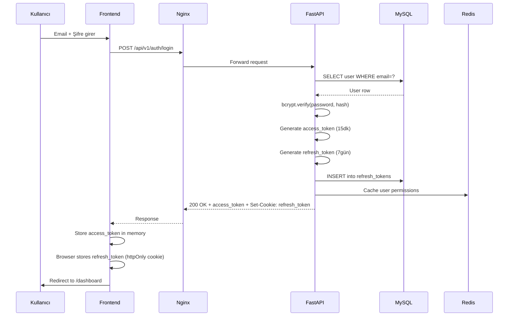
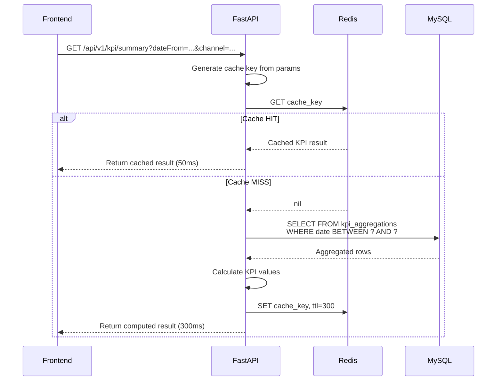
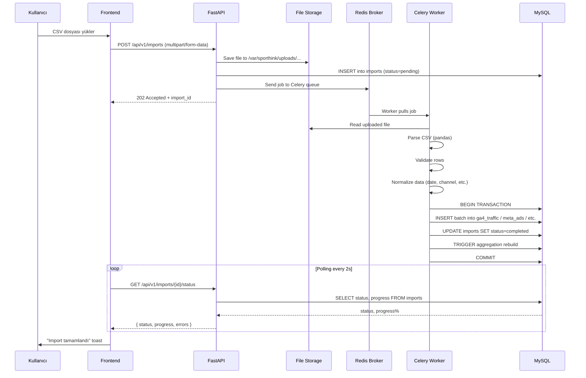
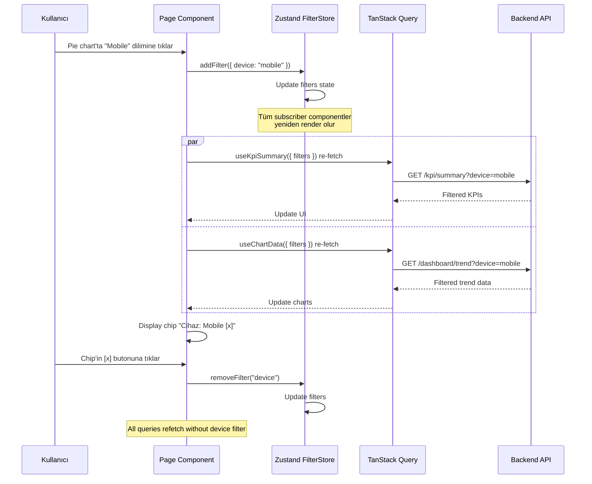
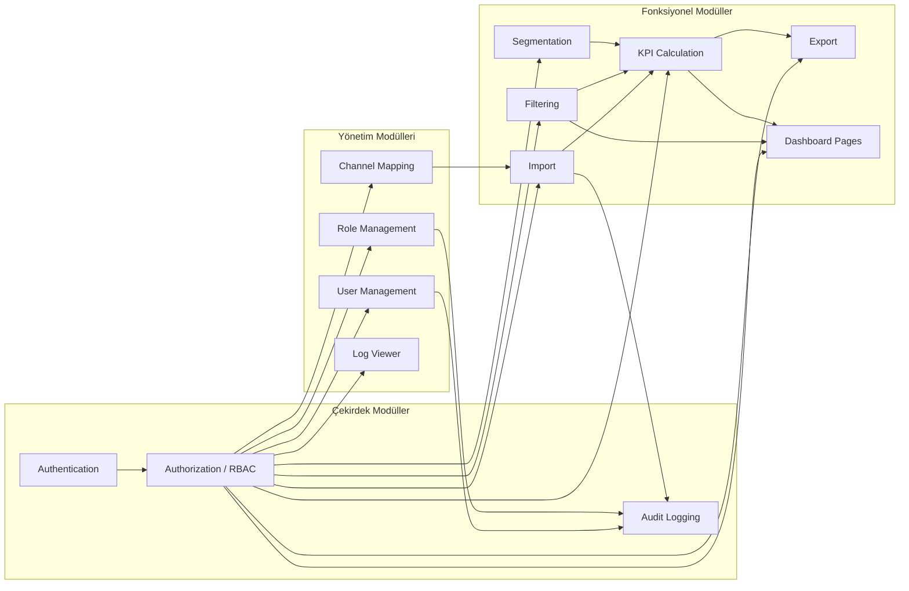

# 3. SİSTEM MİMARİSİ

> **Bu Bölümde Neler Var?**
> Bu bölüm, sistemin yüksek seviyeli mimari tasarımını, bileşenlerin birbiriyle nasıl iletişim kurduğunu ve veri akışının nasıl gerçekleştiğini detaylı olarak ele almaktadır. Mantıksal mimari, deployment topolojisi, veri akış diyagramları, kimlik doğrulama akışı ve modüller arası bağımlılıklar incelenmektedir.

## 3.1 Mimari İlkeleri

Sistem mimarisi tasarlanırken aşağıdaki ilkeler benimsenmiştir:

**Sorumlulukların Ayrılığı (Separation of Concerns).** Frontend (sunum), backend (iş mantığı) ve veritabanı (veri saklama) net şekilde ayrılmıştır. Her katman kendi sorumluluğunu yerine getirir, başka katmanların iç işleyişine müdahale etmez.

**Stateless Backend.** Backend hiçbir kullanıcı oturum bilgisi tutmaz. Her HTTP isteği bağımsız olarak değerlendirilir, kimlik bilgisi JWT token üzerinden taşınır. Bu yaklaşım yatay ölçeklenebilirliğin temelidir.

**API-First Yaklaşım.** Frontend ve backend birbirinden bağımsız geliştirilir. Backend yalnızca REST API endpoint'leri sunar, frontend bu endpoint'leri tüketir. İleride mobil uygulama veya başka bir frontend eklenmek istenirse, aynı backend tekrar kullanılabilir.

**Soyutlama Katmanları.** Uygulama içinde Repository Pattern, Service Layer gibi soyutlamalar kullanılır. Bu sayede veritabanı erişimi, iş mantığı ve API endpoint'leri birbirinden ayrılır; test edilebilirlik ve bakım yapılabilirlik artar.

**Cache First.** Sık erişilen veriler önce Redis'ten kontrol edilir, yoksa veritabanından çekilip cache'lenir. KPI hesaplamaları gibi maliyetli operasyonlar bu sayede hızlandırılır.

## 3.2 Yüksek Seviye Mimari (High-Level Architecture)

Sistem üç ana katmandan ve birden fazla destek bileşeninden oluşmaktadır.



### 3.2.1 Bileşenlerin Açıklaması

**Nginx (Edge Layer):** Tüm dış trafiğin ilk karşılaştığı bileşendir. SSL sertifikası burada terminate edilir, dış istemcilerle HTTPS, iç servislerle HTTP iletişim kurar. Static frontend dosyalarını doğrudan kendisi serve eder; `/api/*` rotalarını backend container'ına yönlendirir. Gzip sıkıştırma ve security header'ları burada uygulanır.

**FastAPI Backend (Application Layer):** İş mantığının çalıştığı asıl katmandır. Uvicorn ASGI server üzerinde çalışır. Tüm REST API endpoint'lerini sunar. Authentication, authorization, KPI hesaplama, filtreleme gibi tüm fonksiyonel işlemler burada gerçekleştirilir.

**Celery Workers (Background Jobs):** Uzun süren işlemler (veri import, büyük export) için ayrı bir worker process'inde çalışır. Backend bir görev oluşturduğunda Redis broker'a job mesajı atar; worker bu mesajı pull eder ve işler. Frontend job durumunu polling ile sorgular.

**MySQL (Data Layer):** Ana veritabanı. Kullanıcılar, roller, izinler, importlar, segmentler, audit loglar ve tüm pazarlama verileri (GA4, Meta Ads, Google Ads, e-ticaret) bu katmanda saklanır.

**Redis (Cache + Broker):** İki rolü vardır. Birincisi cache layer; KPI sorgu sonuçları, kullanıcı izin listeleri, oturum bilgileri burada cache'lenir. İkincisi Celery broker; background görev kuyruğu olarak hizmet verir. İki rol farklı Redis veritabanlarında (db 0 ve db 1) izole edilir.

**Local File Storage:** Kullanıcıların yüklediği orijinal CSV/XLSX/JSON dosyaları, VDS'in lokal diskinde `/var/sporthink/uploads/{year}/{month}/` dizininde saklanır. 90 günden eski dosyalar otomatik temizlik cron job ile silinir.

**SendGrid SMTP:** Şifre sıfırlama linkleri ve gelecekteki e-posta bildirimleri için kullanılan harici servis.

## 3.3 Mantıksal Mimari (Logical Architecture)

Yüksek seviye mimari fiziksel bileşenleri gösteriyordu. Mantıksal mimari ise yazılımın iç organizasyonunu, modülleri ve bunlar arasındaki bağımlılıkları gösterir.

### 3.3.1 Backend Modül Yapısı

```
backend/
├── app/
│   ├── main.py                 # FastAPI uygulama giriş noktası
│   ├── config.py               # Ortam değişkenleri ve ayarlar
│   ├── dependencies.py         # FastAPI bağımlılıkları (auth, db session)
│   │
│   ├── api/                    # API Endpoint Katmanı (Routers)
│   │   ├── v1/
│   │   │   ├── auth.py         # /api/v1/auth/*
│   │   │   ├── users.py        # /api/v1/users/*
│   │   │   ├── roles.py        # /api/v1/roles/*
│   │   │   ├── imports.py      # /api/v1/imports/*
│   │   │   ├── kpi.py          # /api/v1/kpi/*
│   │   │   ├── dashboard.py    # /api/v1/dashboard/*
│   │   │   ├── filters.py      # /api/v1/filters/*
│   │   │   ├── segments.py     # /api/v1/segments/*
│   │   │   ├── export.py       # /api/v1/export/*
│   │   │   ├── mappings.py     # /api/v1/mappings/*
│   │   │   └── logs.py         # /api/v1/logs/*
│   │   └── deps.py             # Yetki kontrolü dependencies
│   │
│   ├── services/               # İş Mantığı Katmanı
│   │   ├── auth_service.py     # Login, JWT, password reset
│   │   ├── user_service.py     # Kullanıcı CRUD
│   │   ├── role_service.py     # Rol yönetimi
│   │   ├── import_service.py   # Dosya import iş akışı
│   │   ├── kpi_service.py      # KPI hesaplamaları
│   │   ├── filter_service.py   # Filtre mantığı
│   │   ├── segment_service.py  # Segment kuralları
│   │   ├── export_service.py   # Veri dışa aktarma
│   │   ├── normalize_service.py # Veri standardizasyon
│   │   └── audit_service.py    # Audit log yazımı
│   │
│   ├── repositories/           # Veri Erişim Katmanı
│   │   ├── base_repository.py  # Generic CRUD
│   │   ├── user_repository.py
│   │   ├── role_repository.py
│   │   ├── ga4_repository.py
│   │   ├── meta_ads_repository.py
│   │   ├── google_ads_repository.py
│   │   ├── orders_repository.py
│   │   └── kpi_aggregate_repository.py
│   │
│   ├── models/                 # SQLAlchemy ORM Modelleri
│   │   ├── base.py             # Base class, common columns
│   │   ├── user.py
│   │   ├── role.py
│   │   ├── permission.py
│   │   ├── ga4_traffic.py
│   │   ├── meta_ads.py
│   │   ├── google_ads.py
│   │   ├── orders.py
│   │   ├── customers.py
│   │   ├── products.py
│   │   ├── campaigns.py
│   │   └── audit_log.py
│   │
│   ├── schemas/                # Pydantic Request/Response Modelleri
│   │   ├── auth.py
│   │   ├── user.py
│   │   ├── kpi.py
│   │   └── ...
│   │
│   ├── tasks/                  # Celery Görevleri
│   │   ├── import_tasks.py     # async_process_import()
│   │   ├── normalize_tasks.py  # rebuild_aggregations()
│   │   └── cleanup_tasks.py    # delete_old_files()
│   │
│   ├── parsers/                # Dosya Parser'ları
│   │   ├── csv_parser.py
│   │   ├── xlsx_parser.py
│   │   ├── json_parser.py
│   │   └── auto_detector.py    # Veri tipini otomatik tespit
│   │
│   ├── utils/                  # Yardımcı Fonksiyonlar
│   │   ├── jwt.py              # Token oluşturma/doğrulama
│   │   ├── password.py         # Bcrypt hash/verify
│   │   ├── pagination.py
│   │   ├── date_utils.py       # UTC dönüşümleri
│   │   └── fuzzy_match.py      # Kolon eşleme için
│   │
│   └── middleware/             # FastAPI Middleware
│       ├── cors.py
│       ├── audit_middleware.py # Otomatik audit log
│       └── rate_limit.py
│
├── alembic/                    # DB Migration
│   └── versions/
│
├── tests/                      # Pytest Testleri
│   ├── unit/
│   ├── integration/
│   └── conftest.py
│
├── Dockerfile
├── docker-compose.yml
├── pyproject.toml              # Bağımlılıklar (Poetry veya pip)
├── ruff.toml                   # Lint config
└── .env.example
```

**Katman Sorumlulukları:**

**API Katmanı (Routers):** HTTP istek/yanıt işlemleri. Request validation, response serialization, status code yönetimi. İş mantığı içermez, ilgili service'i çağırır.

**Service Katmanı:** Tüm iş mantığı burada yer alır. Birden fazla repository'yi koordine eder, validation kuralları uygular, transaction yönetir. API katmanından bağımsız test edilebilir.

**Repository Katmanı:** Yalnızca veritabanı erişiminden sorumlu. SQLAlchemy ORM sorguları burada yazılır. Service katmanı SQL bilmek zorunda kalmaz.

**Model Katmanı:** SQLAlchemy ORM modelleri. Tablo yapısını ve ilişkileri tanımlar.

**Schema Katmanı:** Pydantic modeller. API'nin kabul ettiği ve döndürdüğü veri yapısını tanımlar. Model'lerden ayrıdır; bir tablo birden fazla schema (Create, Update, Response) gerektirebilir.

### 3.3.2 Frontend Modül Yapısı

```
frontend/
├── public/
│   └── locales/
│       ├── tr/                 # Türkçe çeviriler
│       │   ├── common.json
│       │   ├── kpi.json
│       │   └── errors.json
│       └── en/                 # İngilizce çeviriler
│
├── src/
│   ├── main.tsx                # Vite entry point
│   ├── App.tsx                 # Root component, router
│   │
│   ├── pages/                  # Sayfa Componentleri
│   │   ├── auth/
│   │   │   ├── LoginPage.tsx
│   │   │   ├── ForgotPasswordPage.tsx
│   │   │   └── ResetPasswordPage.tsx
│   │   ├── dashboard/
│   │   │   ├── OverviewPage.tsx
│   │   │   ├── TrafficPage.tsx
│   │   │   ├── MetaAdsPage.tsx
│   │   │   ├── GoogleAdsPage.tsx
│   │   │   ├── EcommercePage.tsx
│   │   │   ├── CampaignsPage.tsx
│   │   │   ├── FunnelPage.tsx
│   │   │   ├── CohortPage.tsx
│   │   │   └── ProductsPage.tsx
│   │   ├── import/
│   │   │   └── ImportPage.tsx
│   │   ├── admin/
│   │   │   ├── UserManagementPage.tsx
│   │   │   └── ChannelMappingPage.tsx
│   │   └── settings/
│   │       └── ProfileSettingsPage.tsx
│   │
│   ├── components/             # Tekrar Kullanılabilir Bileşenler
│   │   ├── ui/                 # shadcn/ui copy-paste
│   │   │   ├── button.tsx
│   │   │   ├── input.tsx
│   │   │   ├── dialog.tsx
│   │   │   └── ...
│   │   ├── layout/
│   │   │   ├── Sidebar.tsx
│   │   │   ├── TopBar.tsx
│   │   │   ├── SettingsPanel.tsx
│   │   │   └── MainLayout.tsx
│   │   ├── kpi/
│   │   │   ├── KpiCard.tsx
│   │   │   └── KpiGrid.tsx
│   │   ├── charts/
│   │   │   ├── LineChart.tsx
│   │   │   ├── BarChart.tsx
│   │   │   ├── DonutChart.tsx
│   │   │   ├── FunnelChart.tsx
│   │   │   └── CohortHeatmap.tsx
│   │   ├── filters/
│   │   │   ├── DateRangePicker.tsx
│   │   │   ├── FilterChip.tsx
│   │   │   └── FilterModal.tsx
│   │   ├── tables/
│   │   │   ├── DataTable.tsx
│   │   │   └── PivotTable.tsx
│   │   └── common/
│   │       ├── EmptyState.tsx
│   │       ├── LoadingSkeleton.tsx
│   │       └── ErrorBoundary.tsx
│   │
│   ├── hooks/                  # Custom React Hooks
│   │   ├── useAuth.ts
│   │   ├── usePermissions.ts
│   │   ├── useFilters.ts
│   │   └── useDebounce.ts
│   │
│   ├── stores/                 # Zustand Stores
│   │   ├── authStore.ts
│   │   ├── themeStore.ts
│   │   ├── languageStore.ts
│   │   ├── filtersStore.ts
│   │   └── toastStore.ts
│   │
│   ├── api/                    # API Client (Axios)
│   │   ├── client.ts           # Axios instance, interceptors
│   │   ├── endpoints/
│   │   │   ├── authApi.ts
│   │   │   ├── kpiApi.ts
│   │   │   ├── importApi.ts
│   │   │   └── ...
│   │   └── types.ts            # Backend response tipleri
│   │
│   ├── queries/                # TanStack Query Hooks
│   │   ├── useKpiSummary.ts
│   │   ├── useImports.ts
│   │   └── ...
│   │
│   ├── lib/                    # Yardımcı Fonksiyonlar
│   │   ├── i18n.ts             # i18next config
│   │   ├── theme.ts
│   │   ├── format.ts           # Para, tarih formatlama
│   │   └── utils.ts            # cn() helper (clsx + tailwind-merge)
│   │
│   ├── types/                  # TypeScript Type Definitions
│   │   ├── auth.ts
│   │   ├── kpi.ts
│   │   └── ...
│   │
│   └── routes/
│       └── ProtectedRoute.tsx  # RBAC route guard
│
├── tests/
├── index.html
├── vite.config.ts
├── tailwind.config.js
├── tsconfig.json
└── package.json
```

**Frontend Mimari Yaklaşımları:**

**Feature-Based Folder Structure.** Sayfalar (`pages/`) modüler olarak organize edilmiştir. Bir özelliğin tüm dosyaları (componentler, queryler, types) ilgili klasörlerde toplanır.

**API Client Soyutlaması.** Tüm API çağrıları `src/api/endpoints/` altında merkezi olarak tanımlanır. Component'ler doğrudan axios kullanmaz, bu fonksiyonları çağırır. Bu sayede API değişikliği tek noktadan yapılır.

**TanStack Query Hook'ları.** Her API endpoint için bir custom hook (`useKpiSummary`, `useImports` vb.) yazılır. Component'ler bu hook'ları kullanır, cache yönetimi otomatik olur.

**Type Safety End-to-End.** Backend Pydantic schemas → OpenAPI export → Frontend TypeScript types. Bu pipeline ile API contract'ı her iki tarafta da type-safe kalır.

## 3.4 Veri Akışı Diyagramları

### 3.4.1 Kullanıcı Login Akışı



### 3.4.2 KPI Sorgu Akışı (Cache First)



### 3.4.3 Async Veri Import Akışı



### 3.4.4 Cross-Filter Etkileşim Akışı



## 3.5 Deployment Topolojisi

Production ortamındaki fiziksel ve lojistik yerleşim aşağıdaki şekilde organize edilmiştir.

### 3.5.1 Sunucu Topolojisi

```
                    ┌──────────────────────────┐
                    │       INTERNET            │
                    └──────────┬────────────────┘
                               │
                    ┌──────────▼────────────────┐
                    │   DNS (sporthink.com.tr)  │
                    │   A record:                │
                    │   dashboard → VDS_IP       │
                    └──────────┬────────────────┘
                               │ HTTPS (443)
                               │ HTTP (80) → 301 → HTTPS
                               │
        ┌──────────────────────▼──────────────────────────┐
        │           VDS Sunucu (Ubuntu 24.04 LTS)          │
        │                                                   │
        │  ┌─────────────────────────────────────────┐    │
        │  │       Nginx Container :80, :443          │    │
        │  │  - SSL termination (Let's Encrypt)       │    │
        │  │  - Static file serving (frontend build)  │    │
        │  │  - Reverse proxy /api/* → backend:8000   │    │
        │  └────────────┬────────────────────────────┘    │
        │               │                                   │
        │  ┌────────────▼────────────────────────────┐    │
        │  │      Internal Docker Network             │    │
        │  │      (sporthink_network)                 │    │
        │  └────┬─────────────┬──────────────┬───────┘    │
        │       │             │              │             │
        │  ┌────▼────┐  ┌────▼─────┐  ┌────▼──────┐      │
        │  │ Backend │  │  Celery   │  │  Celery   │      │
        │  │ FastAPI │  │  Worker 1 │  │  Worker 2 │      │
        │  │  :8000  │  │           │  │           │      │
        │  └────┬────┘  └────┬─────┘  └────┬──────┘      │
        │       │             │              │             │
        │       └─────┬───────┴──────────────┘             │
        │             │                                     │
        │  ┌──────────▼──────────┐  ┌─────────────────┐   │
        │  │   MySQL Container   │  │ Redis Container │   │
        │  │   :3306 (internal)  │  │ :6379 (internal)│   │
        │  │                     │  │                  │   │
        │  │ Volume:             │  │ Volume:          │   │
        │  │ /var/lib/mysql      │  │ /data/redis      │   │
        │  └─────────────────────┘  └─────────────────┘   │
        │                                                   │
        │  Host File System:                                │
        │  /var/sporthink/uploads/   (mounted to backend)   │
        │  /var/sporthink/backups/   (cron yedekler)        │
        │  /var/sporthink/logs/      (rotating logs)        │
        │  /etc/letsencrypt/         (SSL sertifikaları)    │
        │                                                   │
        └───────────────────────────────────────────────────┘

        Açık Portlar (Firewall - UFW):
        - 22  (SSH, sadece izinli IP'ler)
        - 80  (HTTP, → HTTPS yönlendirme)
        - 443 (HTTPS)

        Kapalı Portlar (sadece iç network):
        - 3306 (MySQL)
        - 6379 (Redis)
        - 8000 (Backend)
```

### 3.5.2 Docker Compose Yapısı

Production deployment'ı tek bir `docker-compose.yml` dosyası ile yönetilir:

```yaml
version: '3.9'

services:
  nginx:
    image: nginx:1.27-alpine
    ports:
      - "80:80"
      - "443:443"
    volumes:
      - ./nginx/nginx.conf:/etc/nginx/nginx.conf:ro
      - /etc/letsencrypt:/etc/letsencrypt:ro
      - ./frontend/dist:/usr/share/nginx/html:ro
    depends_on:
      - backend
    restart: unless-stopped
    networks:
      - sporthink_network

  backend:
    build: ./backend
    expose:
      - "8000"
    env_file: .env
    depends_on:
      mysql:
        condition: service_healthy
      redis:
        condition: service_started
    volumes:
      - /var/sporthink/uploads:/app/uploads
      - /var/sporthink/logs:/app/logs
    restart: unless-stopped
    networks:
      - sporthink_network

  celery_worker:
    build: ./backend
    command: celery -A app.celery_app worker --loglevel=info --concurrency=4
    env_file: .env
    depends_on:
      - redis
      - mysql
    volumes:
      - /var/sporthink/uploads:/app/uploads
      - /var/sporthink/logs:/app/logs
    restart: unless-stopped
    networks:
      - sporthink_network

  mysql:
    image: mysql:8.4
    environment:
      MYSQL_ROOT_PASSWORD: ${MYSQL_ROOT_PASSWORD}
      MYSQL_DATABASE: ${MYSQL_DATABASE}
      MYSQL_USER: ${MYSQL_USER}
      MYSQL_PASSWORD: ${MYSQL_PASSWORD}
    volumes:
      - mysql_data:/var/lib/mysql
      - ./mysql/my.cnf:/etc/mysql/conf.d/my.cnf:ro
    healthcheck:
      test: ["CMD", "mysqladmin", "ping", "-h", "localhost"]
      interval: 10s
      timeout: 5s
      retries: 5
    restart: unless-stopped
    networks:
      - sporthink_network

  redis:
    image: redis:7.4-alpine
    volumes:
      - redis_data:/data
    restart: unless-stopped
    networks:
      - sporthink_network

volumes:
  mysql_data:
  redis_data:

networks:
  sporthink_network:
    driver: bridge
```

### 3.5.3 Network Güvenliği

**Firewall (UFW) Kuralları:**

```bash
# Sadece SSH, HTTP, HTTPS açık
ufw default deny incoming
ufw default allow outgoing
ufw allow 22/tcp
ufw allow 80/tcp
ufw allow 443/tcp
ufw enable
```

MySQL (3306) ve Redis (6379) portları **dışarıya kapalıdır**. Sadece Docker internal network üzerinden erişilebilir. Backend dışındaki bir servis bu portlara doğrudan ulaşamaz.

SSH erişimi sadece public key authentication ile yapılır; password authentication kapalıdır. `/etc/ssh/sshd_config` içinde `PasswordAuthentication no` ayarı zorunludur.

## 3.6 Modüller Arası Bağımlılıklar

Modüllerin birbirine olan bağımlılıkları aşağıdaki gibi organize edilmiştir. Bu yapı sayesinde her modül izole olarak test edilebilir, değiştirilebilir veya silinebilir.



**Açıklamalar:**

Authentication modülü, RBAC modülünün ön koşuludur. Önce kullanıcı kimliği doğrulanmalıdır, sonra yetkilendirme yapılır.

RBAC modülü tüm fonksiyonel modüllerin önündedir. Hiçbir endpoint yetki kontrolünden geçmeden çalışmaz.

Audit Logging, kritik modüllerin hepsi tarafından kullanılır. Import, kullanıcı işlemleri, rol değişiklikleri otomatik olarak audit log'a yazılır.

Import modülü KPI Calculation'ı tetikler. Yeni veri import edildiğinde aggregation tabloları yeniden hesaplanır.

Channel Mapping, Import sırasında kullanılır. Veri normalizasyonunda kanal bilgileri bu mapping üzerinden çevrilir.

## 3.7 Hata Yönetimi ve Resilience

Sistemin hatalara karşı dayanıklılığı için aşağıdaki mekanizmalar uygulanmaktadır:

### 3.7.1 Backend Hata Hiyerarşisi

```python
# Custom exception base class
class SporthinkException(Exception):
    code: str
    status_code: int

class AuthenticationError(SporthinkException):
    code = "AUTH_REQUIRED"
    status_code = 401

class PermissionDeniedError(SporthinkException):
    code = "PERMISSION_DENIED"
    status_code = 403

class ResourceNotFoundError(SporthinkException):
    code = "RESOURCE_NOT_FOUND"
    status_code = 404

class ValidationError(SporthinkException):
    code = "VALIDATION_ERROR"
    status_code = 422

class RateLimitError(SporthinkException):
    code = "RATE_LIMIT_EXCEEDED"
    status_code = 429
```

Tüm exception'lar global exception handler tarafından yakalanır ve standart JSON formatında dönülür:

```json
{
  "success": false,
  "error": {
    "code": "PASSWORD_TOO_SHORT",
    "message": "Password must be at least 10 characters",
    "field": "password",
    "params": { "min": 10 }
  }
}
```

### 3.7.2 Database Connection Resilience

SQLAlchemy connection pool kullanılır. Geçici DB bağlantı kesintilerinde otomatik retry yapılır:

```python
engine = create_async_engine(
    DATABASE_URL,
    pool_size=10,
    max_overflow=20,
    pool_pre_ping=True,  # Her sorgu öncesi ping
    pool_recycle=3600,   # 1 saatte bir bağlantı yenile
)
```

### 3.7.3 Celery Task Resilience

Background görevler hata durumunda otomatik retry edilir:

```python
@celery_app.task(
    autoretry_for=(SQLAlchemyError, ConnectionError),
    retry_kwargs={'max_retries': 3, 'countdown': 60},
)
def process_import(import_id: int):
    ...
```

### 3.7.4 Frontend Hata Sınırı

React Error Boundary ile tüm uygulama korunur. Beklenmeyen hata durumunda kullanıcıya açıklayıcı mesaj gösterilir, sayfa boş kalmaz.

```tsx
<ErrorBoundary fallback={<ErrorPage />}>
  <App />
</ErrorBoundary>
```

API çağrılarında axios interceptor ile global hata yakalama yapılır. 401 hatası alındığında otomatik olarak refresh token denenir, başarısızsa login sayfasına yönlendirilir.

### 3.7.5 Health Check Endpoints

Sistem durumunu izlemek için health check endpoint'leri sunulur:

```
GET /api/v1/health        → { "status": "ok" }
GET /api/v1/health/db     → { "status": "ok", "latency_ms": 3 }
GET /api/v1/health/redis  → { "status": "ok", "latency_ms": 1 }
GET /api/v1/health/celery → { "status": "ok", "active_workers": 4 }
```

Bu endpoint'ler ileride monitoring araçlarıyla (Uptime Kuma, UptimeRobot) entegre edilebilir.

## 3.8 Sonraki Bölüm

Bu bölümde sistemin yüksek seviyeli mimarisi ve bileşenlerin birbiriyle nasıl iletişim kurduğu detaylandırıldı. Sonraki bölümde, sistemin **veri katmanı** detaylı olarak ele alınacaktır: 11 ana tablo, ER diyagramı, indexleme ve partition stratejisi.

**Sonraki Bölüm:** [04 - Veri Modeli ve Veritabanı Tasarımı](04-data-model.md)

*Bölüm 03 sonu.*
