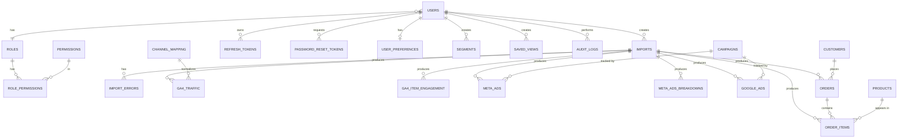

# 4. VERİ MODELİ VE VERİTABANI TASARIMI

> **Bu Bölümde Neler Var?**
> Bu bölüm, sistemin veri katmanını detaylı olarak ele almaktadır. 11 ana veri tablosu, sistem tabloları, aggregation tabloları, ilişkiler, indexleme stratejisi, partition yaklaşımı ve foreign key davranışları belgelenmiştir. Tablolar gerçek API alanlarına (GA4 Data API, Meta Marketing API, Google Ads API) 1:1 uyumlu tasarlanmıştır.

## 4.1 Veri Modeli Genel Görünüm

Sistem dört ana veri kaynağından veri toplamaktadır:

**Google Analytics 4 (GA4):** Web sitesi trafik verileri ve ürün etkileşim verileri.

**Meta Ads:** Facebook ve Instagram reklam performans verileri.

**Google Ads:** Arama, alışveriş ve performance max kampanya verileri.

**E-Ticaret Sistemi:** Sipariş, ürün ve müşteri verileri.

Bu veri kaynaklarının her biri kendi tablo grubuna sahiptir. Tüm veriler MySQL 8.4 LTS üzerinde saklanır. Tablo yapısı, gerçek platform API'lerinin döndürdüğü alanlarla uyumlu olacak şekilde tasarlanmıştır. Bu sayede ileride dummy veri yerine canlı API entegrasyonuna geçildiğinde veri modelinde değişiklik gerekmez.

## 4.2 Veri Modeli Tablo Listesi

### 4.2.1 Veri Tabloları (11 adet)

Bu tablolar pazarlama ve e-ticaret verilerini içerir.

| Tablo | Amaç | Veri Kaynağı |
|---|---|---|
| `ga4_traffic` | Web trafik verileri (oturum, kullanıcı) | GA4 Data API |
| `ga4_item_engagement` | Ürün etkileşim verileri | GA4 Data API |
| `meta_ads` | Meta reklam performans verileri | Meta Marketing API |
| `meta_ads_breakdowns` | Meta reklam kırılım verileri (yaş, cinsiyet, vs.) | Meta Marketing API |
| `google_ads` | Google reklam performans verileri | Google Ads API |
| `orders` | Sipariş başlık verileri | E-ticaret sistemi |
| `order_items` | Sipariş kalem verileri | E-ticaret sistemi |
| `products` | Ürün master verisi | E-ticaret sistemi |
| `customers` | Müşteri master verisi | E-ticaret sistemi |
| `campaigns` | Kampanya master verisi | İç sistem |
| `channel_mapping` | Kanal eşleme tablosu | İç sistem |

### 4.2.2 Aggregation Tabloları (3 adet)

Performans için önceden hesaplanmış özet tablolar.

| Tablo | Amaç |
|---|---|
| `kpi_daily_aggregates` | Günlük KPI özetleri |
| `kpi_monthly_aggregates` | Aylık KPI özetleri |
| `kpi_campaign_aggregates` | Kampanya bazlı KPI özetleri |

### 4.2.3 Sistem Tabloları

Kullanıcı yönetimi, yetkilendirme, denetim ve uygulama içi işlevler için tablolar.

| Tablo | Amaç |
|---|---|
| `users` | Kullanıcı kayıtları |
| `roles` | Rol tanımları |
| `permissions` | İzin tanımları (37 izin) |
| `role_permissions` | Rol-izin ilişki tablosu (M:N) |
| `refresh_tokens` | Aktif refresh token kayıtları |
| `password_reset_tokens` | Şifre sıfırlama token kayıtları |
| `user_preferences` | Kullanıcı tercihleri (tema, dil) |
| `imports` | Import işlem kayıtları |
| `import_errors` | Import hatalı satır detayları |
| `segments` | Kullanıcı tanımlı segmentler |
| `saved_views` | Kayıtlı dashboard görünümleri |
| `audit_logs` | Kritik işlem denetim kayıtları |

## 4.3 Veri Tablolarının Detaylı Yapısı

### 4.3.1 ga4_traffic Tablosu

Web sitesi trafik verilerini içerir. GA4 Data API'nin `runReport` endpoint'inden alınan dimension ve metric'leri saklar.

```sql
CREATE TABLE ga4_traffic (
    id BIGINT UNSIGNED AUTO_INCREMENT PRIMARY KEY,
    import_id BIGINT UNSIGNED NOT NULL,

    -- Tarih ve kanal bilgileri
    date DATE NOT NULL,
    session_source VARCHAR(255) NOT NULL,
    session_medium VARCHAR(100) NOT NULL,
    session_campaign_name VARCHAR(255),
    session_default_channel_group VARCHAR(100),
    derived_channel VARCHAR(100),  -- channel_mapping üzerinden hesaplanır

    -- Cihaz ve lokasyon
    device_category VARCHAR(50) NOT NULL,
    city VARCHAR(100),
    landing_page_plus_query_string VARCHAR(1000),
    new_vs_returning ENUM('new', 'returning'),

    -- Metrikler
    sessions INT UNSIGNED NOT NULL DEFAULT 0,
    total_users INT UNSIGNED NOT NULL DEFAULT 0,
    new_users INT UNSIGNED NOT NULL DEFAULT 0,
    bounce_rate DECIMAL(5,4) NOT NULL DEFAULT 0,
    average_session_duration DECIMAL(10,2) NOT NULL DEFAULT 0,
    screen_page_views_per_session DECIMAL(8,2) NOT NULL DEFAULT 0,
    engaged_sessions INT UNSIGNED NOT NULL DEFAULT 0,
    engagement_rate DECIMAL(5,4) NOT NULL DEFAULT 0,
    user_engagement_duration DECIMAL(15,2) NOT NULL DEFAULT 0,
    conversions INT UNSIGNED NOT NULL DEFAULT 0,
    purchase_revenue DECIMAL(15,2) NOT NULL DEFAULT 0,
    transactions INT UNSIGNED NOT NULL DEFAULT 0,

    -- Audit
    created_at DATETIME NOT NULL DEFAULT CURRENT_TIMESTAMP,

    -- Foreign key
    CONSTRAINT fk_ga4_traffic_import FOREIGN KEY (import_id)
        REFERENCES imports(id) ON DELETE RESTRICT ON UPDATE CASCADE,

    -- Indexler
    INDEX idx_date (date),
    INDEX idx_date_channel (date, session_default_channel_group),
    INDEX idx_date_device (date, device_category),
    INDEX idx_date_source_medium (date, session_source(50), session_medium),
    INDEX idx_import (import_id)
)
ENGINE=InnoDB
CHARSET=utf8mb4 COLLATE=utf8mb4_unicode_ci
PARTITION BY RANGE (TO_DAYS(date)) (
    PARTITION p202601 VALUES LESS THAN (TO_DAYS('2026-02-01')),
    PARTITION p202602 VALUES LESS THAN (TO_DAYS('2026-03-01')),
    PARTITION p202603 VALUES LESS THAN (TO_DAYS('2026-04-01')),
    -- ... aylık partitionlar 36 ay ileriye
    PARTITION pmax VALUES LESS THAN MAXVALUE
);
```

**Önemli Notlar:**

`bounce_rate` ve `engagement_rate` GA4 API'den 0-1 arası float olarak gelir (örn: 0.45 = %45). UI'da yüzde olarak gösterilir.

`derived_channel` alanı, import sırasında `channel_mapping` tablosu üzerinden otomatik hesaplanır. Her sorguda runtime hesaplama yapılmaz, performans için import sırasında yazılır.

`session_source` ve `session_medium` kombinasyonu, session-scoped bilgidir. GA4'te event-scoped versiyonlarından farklıdır; raporlamada session-scoped tercih edilir.

Tarih bazlı RANGE partition kullanılır; 1 yıllık veri sorgulanırken sadece ilgili partition'lar taranır.

### 4.3.2 ga4_item_engagement Tablosu

Ürün bazlı GA4 etkileşim verilerini içerir. Item-scoped dimensions ve metrics, GA4 API kısıtı nedeniyle session-scoped verilerden ayrı tabloda tutulur.

```sql
CREATE TABLE ga4_item_engagement (
    id BIGINT UNSIGNED AUTO_INCREMENT PRIMARY KEY,
    import_id BIGINT UNSIGNED NOT NULL,

    date DATE NOT NULL,

    -- Ürün bilgileri
    item_id VARCHAR(100) NOT NULL,
    item_name VARCHAR(500),
    item_category VARCHAR(100),
    item_category2 VARCHAR(100),
    item_brand VARCHAR(100),

    -- Funnel metrikleri
    items_viewed INT UNSIGNED NOT NULL DEFAULT 0,
    items_added_to_cart INT UNSIGNED NOT NULL DEFAULT 0,
    items_checked_out INT UNSIGNED NOT NULL DEFAULT 0,
    items_purchased INT UNSIGNED NOT NULL DEFAULT 0,
    item_revenue DECIMAL(15,2) NOT NULL DEFAULT 0,
    item_list_views INT UNSIGNED NOT NULL DEFAULT 0,
    item_list_clicks INT UNSIGNED NOT NULL DEFAULT 0,
    cart_to_view_rate DECIMAL(5,4) NOT NULL DEFAULT 0,

    created_at DATETIME NOT NULL DEFAULT CURRENT_TIMESTAMP,

    CONSTRAINT fk_ga4_item_import FOREIGN KEY (import_id)
        REFERENCES imports(id) ON DELETE RESTRICT,

    INDEX idx_date (date),
    INDEX idx_item (item_id),
    INDEX idx_date_item (date, item_id),
    INDEX idx_brand (item_brand),
    INDEX idx_category (item_category)
)
ENGINE=InnoDB
CHARSET=utf8mb4 COLLATE=utf8mb4_unicode_ci
PARTITION BY RANGE (TO_DAYS(date)) (...);
```

`item_id` alanı tüm platformlar arası ürün birleştirme anahtarıdır. `products.sku` ile join yapılır.

### 4.3.3 meta_ads Tablosu

Meta (Facebook + Instagram) reklam performans verileri. Meta Marketing API'nin Insights endpoint'inden alınır.

```sql
CREATE TABLE meta_ads (
    id BIGINT UNSIGNED AUTO_INCREMENT PRIMARY KEY,
    import_id BIGINT UNSIGNED NOT NULL,

    -- Tarih ve hesap
    date_start DATE NOT NULL,
    date_stop DATE NOT NULL,
    account_id VARCHAR(50),
    account_name VARCHAR(255),

    -- Kampanya hiyerarşisi
    campaign_id VARCHAR(50) NOT NULL,
    campaign_name VARCHAR(500),
    adset_id VARCHAR(50),
    adset_name VARCHAR(500),
    ad_id VARCHAR(50),
    ad_name VARCHAR(500),
    objective VARCHAR(50),
    buying_type VARCHAR(50),

    -- Temel metrikler
    impressions INT UNSIGNED NOT NULL DEFAULT 0,
    reach INT UNSIGNED NOT NULL DEFAULT 0,
    frequency DECIMAL(8,4) NOT NULL DEFAULT 0,
    clicks INT UNSIGNED NOT NULL DEFAULT 0,
    inline_link_clicks INT UNSIGNED NOT NULL DEFAULT 0,
    spend DECIMAL(15,2) NOT NULL DEFAULT 0,
    cpc DECIMAL(10,4) NOT NULL DEFAULT 0,
    cpm DECIMAL(10,4) NOT NULL DEFAULT 0,
    cpp DECIMAL(10,4) NOT NULL DEFAULT 0,
    ctr DECIMAL(8,4) NOT NULL DEFAULT 0,
    inline_link_click_ctr DECIMAL(8,4) NOT NULL DEFAULT 0,

    -- Action metrikleri (Pixel events)
    actions_link_click INT UNSIGNED NOT NULL DEFAULT 0,
    actions_landing_page_view INT UNSIGNED NOT NULL DEFAULT 0,
    actions_view_content INT UNSIGNED NOT NULL DEFAULT 0,
    actions_add_to_cart INT UNSIGNED NOT NULL DEFAULT 0,
    actions_initiate_checkout INT UNSIGNED NOT NULL DEFAULT 0,
    actions_purchase INT UNSIGNED NOT NULL DEFAULT 0,
    action_values_purchase DECIMAL(15,2) NOT NULL DEFAULT 0,
    actions_page_engagement INT UNSIGNED NOT NULL DEFAULT 0,
    actions_post_engagement INT UNSIGNED NOT NULL DEFAULT 0,
    actions_video_view INT UNSIGNED NOT NULL DEFAULT 0,

    created_at DATETIME NOT NULL DEFAULT CURRENT_TIMESTAMP,

    CONSTRAINT fk_meta_ads_import FOREIGN KEY (import_id)
        REFERENCES imports(id) ON DELETE RESTRICT,

    INDEX idx_date (date_start),
    INDEX idx_date_campaign (date_start, campaign_id),
    INDEX idx_campaign (campaign_id),
    INDEX idx_adset (adset_id),
    INDEX idx_ad (ad_id)
)
ENGINE=InnoDB
CHARSET=utf8mb4 COLLATE=utf8mb4_unicode_ci
PARTITION BY RANGE (TO_DAYS(date_start)) (...);
```

**Önemli Notlar:**

Meta API tüm metrikleri STRING olarak döner. Import sırasında INT/FLOAT'a parse edilir, normalize edilir.

`actions_*` ve `action_values_*` alanları, Meta API'nin nested JSON yapısındaki action array'lerinden parse edilerek düz kolonlara açılır.

`ctr` Meta API'de yüzde olarak döner (3.33 = %3.33), GA4'ten farklıdır. Import sırasında dikkate alınır.

### 4.3.4 meta_ads_breakdowns Tablosu

Meta reklamlarının yaş, cinsiyet, platform gibi kırılım bazlı performans verileri.

```sql
CREATE TABLE meta_ads_breakdowns (
    id BIGINT UNSIGNED AUTO_INCREMENT PRIMARY KEY,
    import_id BIGINT UNSIGNED NOT NULL,

    date_start DATE NOT NULL,
    campaign_id VARCHAR(50) NOT NULL,
    adset_id VARCHAR(50),

    -- Breakdown alanları
    age VARCHAR(20),
    gender ENUM('male', 'female', 'unknown'),
    publisher_platform VARCHAR(50),
    platform_position VARCHAR(50),
    impression_device VARCHAR(50),
    country VARCHAR(2),
    region VARCHAR(100),

    -- Metrikler
    impressions INT UNSIGNED NOT NULL DEFAULT 0,
    reach INT UNSIGNED NOT NULL DEFAULT 0,
    clicks INT UNSIGNED NOT NULL DEFAULT 0,
    spend DECIMAL(15,2) NOT NULL DEFAULT 0,
    actions_purchase INT UNSIGNED NOT NULL DEFAULT 0,
    action_values_purchase DECIMAL(15,2) NOT NULL DEFAULT 0,

    created_at DATETIME NOT NULL DEFAULT CURRENT_TIMESTAMP,

    CONSTRAINT fk_meta_brk_import FOREIGN KEY (import_id)
        REFERENCES imports(id) ON DELETE RESTRICT,

    INDEX idx_date_campaign (date_start, campaign_id),
    INDEX idx_age_gender (age, gender),
    INDEX idx_platform (publisher_platform)
);
```

### 4.3.5 google_ads Tablosu

Google Ads reklam performans verileri. Google Ads API'nin GAQL (Google Ads Query Language) ile alınır.

```sql
CREATE TABLE google_ads (
    id BIGINT UNSIGNED AUTO_INCREMENT PRIMARY KEY,
    import_id BIGINT UNSIGNED NOT NULL,

    date DATE NOT NULL,

    -- Hesap ve kampanya
    customer_id BIGINT,
    customer_descriptive_name VARCHAR(255),
    campaign_id BIGINT NOT NULL,
    campaign_name VARCHAR(500),
    campaign_status ENUM('ENABLED', 'PAUSED', 'REMOVED'),
    advertising_channel_type ENUM('SEARCH', 'SHOPPING', 'PERFORMANCE_MAX', 'DISPLAY', 'VIDEO'),

    ad_group_id BIGINT,
    ad_group_name VARCHAR(500),
    ad_group_status ENUM('ENABLED', 'PAUSED', 'REMOVED'),

    -- Segment alanları
    device ENUM('MOBILE', 'DESKTOP', 'TABLET', 'OTHER'),
    ad_network_type VARCHAR(50),
    conversion_action_name VARCHAR(255),

    -- Shopping/PMax ürün bilgileri (sadece bu kampanyalarda dolu)
    product_item_id VARCHAR(100),
    product_title VARCHAR(500),
    product_brand VARCHAR(100),
    product_type_l1 VARCHAR(100),
    product_type_l2 VARCHAR(100),

    -- Search keyword bilgileri
    keyword_text VARCHAR(500),
    keyword_match_type ENUM('EXACT', 'PHRASE', 'BROAD'),
    search_term VARCHAR(500),

    -- Metrikler (cost_micros TL'ye dönüştürülmüş halde saklanır)
    impressions BIGINT UNSIGNED NOT NULL DEFAULT 0,
    clicks BIGINT UNSIGNED NOT NULL DEFAULT 0,
    cost DECIMAL(15,2) NOT NULL DEFAULT 0,  -- /1000000 ile micro'dan TL'ye
    ctr DECIMAL(5,4) NOT NULL DEFAULT 0,
    average_cpc DECIMAL(10,4) NOT NULL DEFAULT 0,
    average_cpm DECIMAL(10,4) NOT NULL DEFAULT 0,
    conversions DECIMAL(10,2) NOT NULL DEFAULT 0,
    conversions_value DECIMAL(15,2) NOT NULL DEFAULT 0,
    all_conversions DECIMAL(10,2) NOT NULL DEFAULT 0,
    all_conversions_value DECIMAL(15,2) NOT NULL DEFAULT 0,
    cost_per_conversion DECIMAL(10,2) NOT NULL DEFAULT 0,
    conversions_from_interactions_rate DECIMAL(8,4) NOT NULL DEFAULT 0,
    value_per_conversion DECIMAL(10,2) NOT NULL DEFAULT 0,
    search_impression_share DECIMAL(5,4),
    search_budget_lost_impression_share DECIMAL(5,4),
    search_rank_lost_impression_share DECIMAL(5,4),
    view_through_conversions BIGINT UNSIGNED NOT NULL DEFAULT 0,

    created_at DATETIME NOT NULL DEFAULT CURRENT_TIMESTAMP,

    CONSTRAINT fk_google_ads_import FOREIGN KEY (import_id)
        REFERENCES imports(id) ON DELETE RESTRICT,

    INDEX idx_date (date),
    INDEX idx_date_campaign (date, campaign_id),
    INDEX idx_campaign (campaign_id),
    INDEX idx_ad_group (ad_group_id),
    INDEX idx_product (product_item_id),
    INDEX idx_channel_type (advertising_channel_type)
)
ENGINE=InnoDB
CHARSET=utf8mb4 COLLATE=utf8mb4_unicode_ci
PARTITION BY RANGE (TO_DAYS(date)) (...);
```

**Önemli Notlar:**

Google Ads API tüm maliyet metriklerini "micro" birimde döner (1 TL = 1.000.000 micro). Import sırasında 1.000.000'a bölünerek `DECIMAL(15,2)` olarak saklanır.

`product_item_id` sadece Shopping ve PerformanceMax kampanyalarında dolu gelir. Search kampanyalarında null olur, onun yerine `keyword_text` dolar.

### 4.3.6 orders Tablosu

E-ticaret sipariş başlık verileri.

```sql
CREATE TABLE orders (
    id BIGINT UNSIGNED AUTO_INCREMENT PRIMARY KEY,
    import_id BIGINT UNSIGNED NOT NULL,

    -- Sipariş bilgileri
    order_id VARCHAR(50) NOT NULL UNIQUE,
    order_date DATETIME NOT NULL,
    customer_id VARCHAR(50) NOT NULL,

    -- Lokasyon ve cihaz
    city VARCHAR(100) NOT NULL,
    device ENUM('mobile', 'desktop', 'tablet') NOT NULL,

    -- Attribution
    channel VARCHAR(100) NOT NULL,
    source VARCHAR(255),
    medium VARCHAR(100),
    campaign_name VARCHAR(500),
    coupon_code VARCHAR(50),

    -- Finansal
    product_count INT UNSIGNED NOT NULL DEFAULT 0,
    order_revenue DECIMAL(15,2) NOT NULL,
    shipping_cost DECIMAL(10,2) NOT NULL DEFAULT 0,
    discount_amount DECIMAL(15,2) NOT NULL DEFAULT 0,
    refund_amount DECIMAL(15,2) NOT NULL DEFAULT 0,
    net_revenue DECIMAL(15,2) NOT NULL,  -- order_revenue - discount - refund

    -- Durum
    order_status ENUM('completed', 'cancelled', 'refunded', 'pending', 'shipped') NOT NULL,
    payment_method ENUM('credit_card', 'debit_card', 'bank_transfer', 'pay_at_door') NOT NULL,

    created_at DATETIME NOT NULL DEFAULT CURRENT_TIMESTAMP,

    CONSTRAINT fk_orders_import FOREIGN KEY (import_id)
        REFERENCES imports(id) ON DELETE RESTRICT,
    CONSTRAINT fk_orders_customer FOREIGN KEY (customer_id)
        REFERENCES customers(customer_id) ON DELETE RESTRICT ON UPDATE CASCADE,

    INDEX idx_order_date (order_date),
    INDEX idx_customer (customer_id),
    INDEX idx_channel (channel),
    INDEX idx_status (order_status),
    INDEX idx_date_channel (order_date, channel),
    INDEX idx_date_device (order_date, device)
)
ENGINE=InnoDB
CHARSET=utf8mb4 COLLATE=utf8mb4_unicode_ci
PARTITION BY RANGE (TO_DAYS(order_date)) (...);
```

### 4.3.7 order_items Tablosu

Sipariş kalem detayları (her bir siparişin içindeki ürünler).

```sql
CREATE TABLE order_items (
    id BIGINT UNSIGNED AUTO_INCREMENT PRIMARY KEY,
    import_id BIGINT UNSIGNED NOT NULL,

    order_id VARCHAR(50) NOT NULL,
    line_id INT UNSIGNED NOT NULL,

    -- Ürün bilgileri
    item_id VARCHAR(100) NOT NULL,
    item_name VARCHAR(500),
    item_category VARCHAR(100),
    item_category2 VARCHAR(100),
    item_brand VARCHAR(100),

    -- Adet ve fiyat
    quantity INT UNSIGNED NOT NULL,
    unit_price DECIMAL(15,2) NOT NULL,
    line_total DECIMAL(15,2) NOT NULL,
    discount_amount DECIMAL(15,2) NOT NULL DEFAULT 0,
    refund_amount DECIMAL(15,2) NOT NULL DEFAULT 0,

    created_at DATETIME NOT NULL DEFAULT CURRENT_TIMESTAMP,

    UNIQUE KEY uk_order_line (order_id, line_id),

    CONSTRAINT fk_oi_order FOREIGN KEY (order_id)
        REFERENCES orders(order_id) ON DELETE CASCADE ON UPDATE CASCADE,
    CONSTRAINT fk_oi_import FOREIGN KEY (import_id)
        REFERENCES imports(id) ON DELETE RESTRICT,

    INDEX idx_order (order_id),
    INDEX idx_item (item_id),
    INDEX idx_brand (item_brand),
    INDEX idx_category (item_category)
);
```

### 4.3.8 products Tablosu

Ürün master tablosu. Tüm platformlardaki SKU/itemId/product_item_id bu tabloya referans verir.

```sql
CREATE TABLE products (
    id BIGINT UNSIGNED AUTO_INCREMENT PRIMARY KEY,

    sku VARCHAR(100) NOT NULL UNIQUE,
    product_name VARCHAR(500) NOT NULL,
    category VARCHAR(100) NOT NULL,
    sub_category VARCHAR(100),
    brand VARCHAR(100) NOT NULL,
    gender ENUM('Erkek', 'Kadın', 'Unisex'),

    price DECIMAL(15,2) NOT NULL,
    cost_price DECIMAL(15,2) NOT NULL,  -- Maliyet, kâr marjı için

    stock_quantity INT NOT NULL DEFAULT 0,
    is_active BOOLEAN NOT NULL DEFAULT TRUE,

    color VARCHAR(50),
    size_range VARCHAR(50),

    created_at DATETIME NOT NULL DEFAULT CURRENT_TIMESTAMP,
    updated_at DATETIME NOT NULL DEFAULT CURRENT_TIMESTAMP ON UPDATE CURRENT_TIMESTAMP,

    INDEX idx_brand (brand),
    INDEX idx_category (category),
    INDEX idx_active (is_active),
    INDEX idx_brand_category (brand, category)
)
ENGINE=InnoDB
CHARSET=utf8mb4 COLLATE=utf8mb4_unicode_ci;
```

### 4.3.9 customers Tablosu

Müşteri master tablosu. Cohort ve retention analizleri için kritik.

```sql
CREATE TABLE customers (
    id BIGINT UNSIGNED AUTO_INCREMENT PRIMARY KEY,

    customer_id VARCHAR(50) NOT NULL UNIQUE,
    first_order_date DATE NOT NULL,
    registration_date DATE NOT NULL,

    city VARCHAR(100),
    gender ENUM('M', 'F'),
    age_group ENUM('18-24', '25-34', '35-44', '45-54', '55+'),

    registration_source VARCHAR(100),
    is_newsletter_subscriber BOOLEAN NOT NULL DEFAULT FALSE,

    -- Hesaplanmış alanlar (her sipariş import sonrası güncellenir)
    total_orders INT UNSIGNED NOT NULL DEFAULT 0,
    total_revenue DECIMAL(15,2) NOT NULL DEFAULT 0,
    last_order_date DATE,

    created_at DATETIME NOT NULL DEFAULT CURRENT_TIMESTAMP,
    updated_at DATETIME NOT NULL DEFAULT CURRENT_TIMESTAMP ON UPDATE CURRENT_TIMESTAMP,

    INDEX idx_first_order (first_order_date),
    INDEX idx_last_order (last_order_date),
    INDEX idx_city (city),
    INDEX idx_gender_age (gender, age_group),
    INDEX idx_total_orders (total_orders),
    INDEX idx_total_revenue (total_revenue)
)
ENGINE=InnoDB
CHARSET=utf8mb4 COLLATE=utf8mb4_unicode_ci;
```

`first_order_date` cohort belirleme için kullanılır. `last_order_date` recency hesabı için kullanılır. `total_orders` ve `total_revenue` her sipariş import sonrası trigger veya Celery task ile yeniden hesaplanır.

### 4.3.10 campaigns Tablosu

Kampanya master tablosu. Meta ve Google Ads kampanya metadata'sı.

```sql
CREATE TABLE campaigns (
    id BIGINT UNSIGNED AUTO_INCREMENT PRIMARY KEY,

    campaign_name VARCHAR(500) NOT NULL UNIQUE,
    platform ENUM('meta', 'google') NOT NULL,
    campaign_type VARCHAR(100),  -- OUTCOME_SALES, SEARCH, PERFORMANCE_MAX, vb.
    objective VARCHAR(100),  -- Awareness, Traffic, Conversion, Retargeting

    start_date DATE NOT NULL,
    end_date DATE NOT NULL,
    daily_budget DECIMAL(15,2),
    total_budget DECIMAL(15,2),

    target_audience VARCHAR(500),
    status ENUM('active', 'paused', 'completed') NOT NULL,

    created_at DATETIME NOT NULL DEFAULT CURRENT_TIMESTAMP,
    updated_at DATETIME NOT NULL DEFAULT CURRENT_TIMESTAMP ON UPDATE CURRENT_TIMESTAMP,

    INDEX idx_platform (platform),
    INDEX idx_dates (start_date, end_date),
    INDEX idx_status (status)
);
```

### 4.3.11 channel_mapping Tablosu

GA4 source/medium kombinasyonlarını standart channel_group değerlerine eşler.

```sql
CREATE TABLE channel_mapping (
    id BIGINT UNSIGNED AUTO_INCREMENT PRIMARY KEY,

    source VARCHAR(255) NOT NULL,
    medium VARCHAR(100) NOT NULL,
    channel_group VARCHAR(100) NOT NULL,

    is_auto_assigned BOOLEAN NOT NULL DEFAULT FALSE,
    notes TEXT,

    created_at DATETIME NOT NULL DEFAULT CURRENT_TIMESTAMP,
    created_by BIGINT UNSIGNED,
    updated_at DATETIME NOT NULL DEFAULT CURRENT_TIMESTAMP ON UPDATE CURRENT_TIMESTAMP,
    updated_by BIGINT UNSIGNED,

    UNIQUE KEY uk_source_medium (source, medium),

    CONSTRAINT fk_cm_created_by FOREIGN KEY (created_by)
        REFERENCES users(id) ON DELETE SET NULL,
    CONSTRAINT fk_cm_updated_by FOREIGN KEY (updated_by)
        REFERENCES users(id) ON DELETE SET NULL
);

-- İlk seed verisi
INSERT INTO channel_mapping (source, medium, channel_group) VALUES
('google', 'organic', 'Organic Search'),
('google', 'cpc', 'Paid Search'),
('bing', 'organic', 'Organic Search'),
('bing', 'cpc', 'Paid Search'),
('facebook', 'cpc', 'Paid Social'),
('facebook', 'social', 'Organic Social'),
('instagram', 'cpc', 'Paid Social'),
('instagram', 'social', 'Organic Social'),
('(direct)', '(none)', 'Direct'),
('newsletter', 'email', 'Email'),
('youtube.com', 'cpc', 'Paid Video'),
('youtube.com', 'organic', 'Organic Video');
```

`is_auto_assigned=TRUE` olan mappingler, sistem tarafından otomatik "Other" olarak atanmıştır. Süper Admin manuel olarak düzenleyebilir.

## 4.4 Aggregation Tabloları

KPI sorgularının 50ms altında yanıt vermesi için önceden hesaplanmış özet tablolar kullanılır. Her import sonrası bu tablolar yeniden hesaplanır.

### 4.4.1 kpi_daily_aggregates

```sql
CREATE TABLE kpi_daily_aggregates (
    id BIGINT UNSIGNED AUTO_INCREMENT PRIMARY KEY,

    date DATE NOT NULL,
    channel VARCHAR(100),
    platform ENUM('ga4', 'meta', 'google', 'ecommerce'),
    device VARCHAR(50),

    -- Trafik metrikleri
    sessions INT UNSIGNED DEFAULT 0,
    users INT UNSIGNED DEFAULT 0,
    new_users INT UNSIGNED DEFAULT 0,
    bounce_sessions INT UNSIGNED DEFAULT 0,
    total_session_duration DECIMAL(15,2) DEFAULT 0,
    total_page_views INT UNSIGNED DEFAULT 0,

    -- Reklam metrikleri
    impressions BIGINT UNSIGNED DEFAULT 0,
    clicks BIGINT UNSIGNED DEFAULT 0,
    spend DECIMAL(15,2) DEFAULT 0,
    ad_conversions DECIMAL(10,2) DEFAULT 0,
    ad_revenue DECIMAL(15,2) DEFAULT 0,

    -- Satış metrikleri
    orders INT UNSIGNED DEFAULT 0,
    revenue DECIMAL(15,2) DEFAULT 0,
    items_sold INT UNSIGNED DEFAULT 0,
    discount_total DECIMAL(15,2) DEFAULT 0,
    refund_total DECIMAL(15,2) DEFAULT 0,

    last_calculated_at DATETIME NOT NULL DEFAULT CURRENT_TIMESTAMP,

    UNIQUE KEY uk_date_channel_platform_device (date, channel, platform, device),
    INDEX idx_date (date),
    INDEX idx_date_channel (date, channel),
    INDEX idx_date_platform (date, platform)
)
PARTITION BY RANGE (TO_DAYS(date)) (...);
```

### 4.4.2 kpi_monthly_aggregates

Aylık özetleri tutar. `kpi_daily_aggregates`'in aylık versiyonudur. Tarih bazlı geniş aralık sorguları (yıllık trend gibi) bu tablodan beslenir.

### 4.4.3 kpi_campaign_aggregates

Kampanya bazlı özet tablosu.

```sql
CREATE TABLE kpi_campaign_aggregates (
    id BIGINT UNSIGNED AUTO_INCREMENT PRIMARY KEY,

    campaign_id VARCHAR(100) NOT NULL,
    campaign_name VARCHAR(500),
    platform ENUM('meta', 'google'),
    period_start DATE NOT NULL,
    period_end DATE NOT NULL,

    impressions BIGINT UNSIGNED DEFAULT 0,
    clicks BIGINT UNSIGNED DEFAULT 0,
    spend DECIMAL(15,2) DEFAULT 0,
    conversions DECIMAL(10,2) DEFAULT 0,
    conversions_value DECIMAL(15,2) DEFAULT 0,

    -- Hesaplanmış metrikler
    ctr DECIMAL(8,4) GENERATED ALWAYS AS
        (IF(impressions > 0, clicks / impressions * 100, 0)) STORED,
    cpc DECIMAL(10,4) GENERATED ALWAYS AS
        (IF(clicks > 0, spend / clicks, 0)) STORED,
    roas DECIMAL(10,4) GENERATED ALWAYS AS
        (IF(spend > 0, conversions_value / spend, 0)) STORED,

    last_calculated_at DATETIME NOT NULL DEFAULT CURRENT_TIMESTAMP,

    UNIQUE KEY uk_campaign_period (campaign_id, period_start, period_end),
    INDEX idx_period (period_start, period_end),
    INDEX idx_platform (platform),
    INDEX idx_roas (roas)
);
```

`GENERATED ALWAYS AS` ifadesi MySQL 8.x'in "computed column" özelliğidir. CTR, CPC, ROAS gibi türetilmiş metrikler veritabanı tarafından otomatik hesaplanır ve indexlenebilir.

## 4.5 Sistem Tabloları

### 4.5.1 users Tablosu

```sql
CREATE TABLE users (
    id BIGINT UNSIGNED AUTO_INCREMENT PRIMARY KEY,

    email VARCHAR(255) NOT NULL UNIQUE,
    password_hash VARCHAR(255) NOT NULL,

    first_name VARCHAR(100) NOT NULL,
    last_name VARCHAR(100) NOT NULL,
    phone VARCHAR(20),
    department VARCHAR(100),
    job_title VARCHAR(100),
    avatar_url VARCHAR(500),

    role_id BIGINT UNSIGNED,

    is_active BOOLEAN NOT NULL DEFAULT TRUE,
    deactivated_reason VARCHAR(255),

    last_login_at DATETIME,
    last_login_ip VARCHAR(45),  -- IPv6 destekli
    failed_login_attempts INT UNSIGNED NOT NULL DEFAULT 0,
    locked_until DATETIME,

    created_at DATETIME NOT NULL DEFAULT CURRENT_TIMESTAMP,
    created_by BIGINT UNSIGNED,
    updated_at DATETIME NOT NULL DEFAULT CURRENT_TIMESTAMP ON UPDATE CURRENT_TIMESTAMP,
    updated_by BIGINT UNSIGNED,
    deleted_at DATETIME,

    CONSTRAINT fk_users_role FOREIGN KEY (role_id)
        REFERENCES roles(id) ON DELETE RESTRICT ON UPDATE CASCADE,
    CONSTRAINT fk_users_created_by FOREIGN KEY (created_by)
        REFERENCES users(id) ON DELETE SET NULL,
    CONSTRAINT fk_users_updated_by FOREIGN KEY (updated_by)
        REFERENCES users(id) ON DELETE SET NULL,

    INDEX idx_email (email),
    INDEX idx_role (role_id),
    INDEX idx_active (is_active),
    INDEX idx_deleted (deleted_at)
);
```

### 4.5.2 roles Tablosu

```sql
CREATE TABLE roles (
    id BIGINT UNSIGNED AUTO_INCREMENT PRIMARY KEY,

    name VARCHAR(100) NOT NULL UNIQUE,
    description TEXT,
    color VARCHAR(7),  -- Hex color, örn: #E63946
    icon VARCHAR(20),  -- Emoji veya icon kodu

    is_system BOOLEAN NOT NULL DEFAULT FALSE,  -- Süper Admin için TRUE

    created_at DATETIME NOT NULL DEFAULT CURRENT_TIMESTAMP,
    created_by BIGINT UNSIGNED,
    updated_at DATETIME NOT NULL DEFAULT CURRENT_TIMESTAMP ON UPDATE CURRENT_TIMESTAMP,
    updated_by BIGINT UNSIGNED,
    deleted_at DATETIME,

    INDEX idx_system (is_system),
    INDEX idx_deleted (deleted_at)
);

-- İlk seed (Süper Admin)
INSERT INTO roles (name, description, color, icon, is_system) VALUES
('Süper Admin', 'Sistem yöneticisi - tüm yetkilere sahip', '#E63946', '👑', TRUE);
```

### 4.5.3 permissions Tablosu

```sql
CREATE TABLE permissions (
    id BIGINT UNSIGNED AUTO_INCREMENT PRIMARY KEY,

    code VARCHAR(100) NOT NULL UNIQUE,  -- örn: 'imports.create'
    module VARCHAR(50) NOT NULL,         -- örn: 'imports'
    action VARCHAR(50) NOT NULL,         -- örn: 'create'
    description VARCHAR(255),
    category VARCHAR(50) NOT NULL,       -- 'view', 'data', 'admin', 'system'

    INDEX idx_module (module),
    INDEX idx_category (category)
);

-- 37 izin seed verisi (Bölüm 05'te detayları)
INSERT INTO permissions (code, module, action, description, category) VALUES
('dashboard.view', 'dashboard', 'view', 'Genel Özet sayfasını görme', 'view'),
('traffic.view', 'traffic', 'view', 'Trafik (GA4) sayfasını görme', 'view'),
-- ... 35 daha
('settings.update', 'settings', 'update', 'Sistem ayarlarını düzenleme', 'system');
```

### 4.5.4 role_permissions Tablosu (Many-to-Many)

```sql
CREATE TABLE role_permissions (
    role_id BIGINT UNSIGNED NOT NULL,
    permission_id BIGINT UNSIGNED NOT NULL,

    granted_at DATETIME NOT NULL DEFAULT CURRENT_TIMESTAMP,
    granted_by BIGINT UNSIGNED,

    PRIMARY KEY (role_id, permission_id),

    CONSTRAINT fk_rp_role FOREIGN KEY (role_id)
        REFERENCES roles(id) ON DELETE CASCADE,
    CONSTRAINT fk_rp_permission FOREIGN KEY (permission_id)
        REFERENCES permissions(id) ON DELETE CASCADE,
    CONSTRAINT fk_rp_granted_by FOREIGN KEY (granted_by)
        REFERENCES users(id) ON DELETE SET NULL,

    INDEX idx_role (role_id),
    INDEX idx_permission (permission_id)
);
```

Süper Admin rolü bu tabloda yer almaz; kod tarafında `is_system=TRUE` olan rol tüm yetkilere otomatik sahiptir.

### 4.5.5 imports Tablosu

```sql
CREATE TABLE imports (
    id BIGINT UNSIGNED AUTO_INCREMENT PRIMARY KEY,

    user_id BIGINT UNSIGNED,  -- Kim import etti
    file_name VARCHAR(500) NOT NULL,
    file_path VARCHAR(1000) NOT NULL,
    file_size BIGINT UNSIGNED NOT NULL,  -- bytes
    file_format ENUM('csv', 'xlsx', 'json') NOT NULL,
    data_type ENUM('ga4_traffic', 'ga4_items', 'meta_ads', 'meta_breakdowns',
                   'google_ads', 'orders', 'order_items', 'products',
                   'customers', 'campaigns') NOT NULL,

    status ENUM('pending', 'parsing', 'validating', 'committing',
                'completed', 'failed', 'cancelled') NOT NULL DEFAULT 'pending',

    progress_percentage INT NOT NULL DEFAULT 0,
    total_rows INT,
    valid_rows INT,
    invalid_rows INT,
    skipped_rows INT,
    inserted_rows INT,

    duplicate_strategy ENUM('overwrite', 'skip', 'cancel'),
    error_strategy ENUM('skip', 'abort', 'ask'),

    column_mapping JSON,
    error_message TEXT,

    started_at DATETIME,
    completed_at DATETIME,
    duration_seconds INT,

    created_at DATETIME NOT NULL DEFAULT CURRENT_TIMESTAMP,

    CONSTRAINT fk_imports_user FOREIGN KEY (user_id)
        REFERENCES users(id) ON DELETE SET NULL,

    INDEX idx_user (user_id),
    INDEX idx_status (status),
    INDEX idx_data_type (data_type),
    INDEX idx_created (created_at)
);
```

### 4.5.6 import_errors Tablosu

```sql
CREATE TABLE import_errors (
    id BIGINT UNSIGNED AUTO_INCREMENT PRIMARY KEY,

    import_id BIGINT UNSIGNED NOT NULL,
    row_number INT NOT NULL,
    field_name VARCHAR(100),
    error_code VARCHAR(50) NOT NULL,
    error_message TEXT,
    row_data JSON,

    created_at DATETIME NOT NULL DEFAULT CURRENT_TIMESTAMP,

    CONSTRAINT fk_ie_import FOREIGN KEY (import_id)
        REFERENCES imports(id) ON DELETE CASCADE,

    INDEX idx_import (import_id),
    INDEX idx_error_code (error_code)
);
```

### 4.5.7 segments Tablosu

```sql
CREATE TABLE segments (
    id BIGINT UNSIGNED AUTO_INCREMENT PRIMARY KEY,

    user_id BIGINT UNSIGNED NOT NULL,
    name VARCHAR(255) NOT NULL,
    description TEXT,

    rules JSON NOT NULL,  -- Segment kural ağacı
    cached_count INT,     -- Önizleme cache'i (eşleşen müşteri sayısı)
    cached_at DATETIME,

    is_shared BOOLEAN NOT NULL DEFAULT FALSE,  -- Future: paylaşılabilir segmentler

    created_at DATETIME NOT NULL DEFAULT CURRENT_TIMESTAMP,
    created_by BIGINT UNSIGNED,
    updated_at DATETIME NOT NULL DEFAULT CURRENT_TIMESTAMP ON UPDATE CURRENT_TIMESTAMP,
    updated_by BIGINT UNSIGNED,
    deleted_at DATETIME,

    CONSTRAINT fk_seg_user FOREIGN KEY (user_id)
        REFERENCES users(id) ON DELETE CASCADE,
    CONSTRAINT fk_seg_created_by FOREIGN KEY (created_by)
        REFERENCES users(id) ON DELETE SET NULL,
    CONSTRAINT fk_seg_updated_by FOREIGN KEY (updated_by)
        REFERENCES users(id) ON DELETE SET NULL,

    INDEX idx_user (user_id),
    INDEX idx_deleted (deleted_at)
);
```

`rules` alanı JSON formatında segment kurallarını tutar:

```json
{
  "logic": "AND",
  "conditions": [
    { "field": "total_orders", "operator": ">=", "value": 2 },
    { "field": "city", "operator": "=", "value": "Istanbul" },
    {
      "logic": "OR",
      "conditions": [
        { "field": "gender", "operator": "=", "value": "F" },
        { "field": "is_newsletter_subscriber", "operator": "=", "value": true }
      ]
    }
  ]
}
```

### 4.5.8 saved_views Tablosu

```sql
CREATE TABLE saved_views (
    id BIGINT UNSIGNED AUTO_INCREMENT PRIMARY KEY,

    user_id BIGINT UNSIGNED NOT NULL,
    page VARCHAR(50) NOT NULL,  -- 'overview', 'traffic', vs.
    name VARCHAR(255) NOT NULL,
    description VARCHAR(500),

    filters JSON NOT NULL,
    is_default BOOLEAN NOT NULL DEFAULT FALSE,

    created_at DATETIME NOT NULL DEFAULT CURRENT_TIMESTAMP,
    updated_at DATETIME NOT NULL DEFAULT CURRENT_TIMESTAMP ON UPDATE CURRENT_TIMESTAMP,
    deleted_at DATETIME,

    CONSTRAINT fk_sv_user FOREIGN KEY (user_id)
        REFERENCES users(id) ON DELETE CASCADE,

    INDEX idx_user_page (user_id, page),
    INDEX idx_deleted (deleted_at)
);
```

### 4.5.9 audit_logs Tablosu

```sql
CREATE TABLE audit_logs (
    id BIGINT UNSIGNED AUTO_INCREMENT PRIMARY KEY,

    user_id BIGINT UNSIGNED,
    user_email VARCHAR(255),  -- Snapshot, kullanıcı silinse bile log durur

    action VARCHAR(100) NOT NULL,  -- 'login', 'user.created', 'role.deleted', vb.
    resource_type VARCHAR(50),     -- 'user', 'role', 'import', vb.
    resource_id VARCHAR(100),

    ip_address VARCHAR(45),
    user_agent VARCHAR(500),

    details JSON,  -- Önceki/sonraki değerler, ek context

    created_at DATETIME NOT NULL DEFAULT CURRENT_TIMESTAMP,

    INDEX idx_user (user_id),
    INDEX idx_action (action),
    INDEX idx_resource (resource_type, resource_id),
    INDEX idx_created (created_at)
)
PARTITION BY RANGE (TO_DAYS(created_at)) (...);
```

### 4.5.10 refresh_tokens Tablosu

```sql
CREATE TABLE refresh_tokens (
    id BIGINT UNSIGNED AUTO_INCREMENT PRIMARY KEY,

    user_id BIGINT UNSIGNED NOT NULL,
    token_hash VARCHAR(255) NOT NULL UNIQUE,  -- Token hash'i, kendisi değil
    device_info VARCHAR(500),
    ip_address VARCHAR(45),

    issued_at DATETIME NOT NULL DEFAULT CURRENT_TIMESTAMP,
    expires_at DATETIME NOT NULL,
    revoked_at DATETIME,

    CONSTRAINT fk_rt_user FOREIGN KEY (user_id)
        REFERENCES users(id) ON DELETE CASCADE,

    INDEX idx_user (user_id),
    INDEX idx_expires (expires_at),
    INDEX idx_revoked (revoked_at)
);
```

### 4.5.11 password_reset_tokens Tablosu

```sql
CREATE TABLE password_reset_tokens (
    id BIGINT UNSIGNED AUTO_INCREMENT PRIMARY KEY,

    user_id BIGINT UNSIGNED NOT NULL,
    token_hash VARCHAR(255) NOT NULL UNIQUE,

    expires_at DATETIME NOT NULL,
    used_at DATETIME,
    requested_ip VARCHAR(45),

    created_at DATETIME NOT NULL DEFAULT CURRENT_TIMESTAMP,

    CONSTRAINT fk_prt_user FOREIGN KEY (user_id)
        REFERENCES users(id) ON DELETE CASCADE,

    INDEX idx_user (user_id),
    INDEX idx_expires (expires_at)
);
```

### 4.5.12 user_preferences Tablosu

```sql
CREATE TABLE user_preferences (
    user_id BIGINT UNSIGNED NOT NULL PRIMARY KEY,

    theme ENUM('light', 'dark', 'system') NOT NULL DEFAULT 'system',
    language ENUM('tr', 'en') NOT NULL DEFAULT 'tr',
    sidebar_collapsed BOOLEAN NOT NULL DEFAULT FALSE,

    notifications_enabled BOOLEAN NOT NULL DEFAULT TRUE,

    updated_at DATETIME NOT NULL DEFAULT CURRENT_TIMESTAMP ON UPDATE CURRENT_TIMESTAMP,

    CONSTRAINT fk_up_user FOREIGN KEY (user_id)
        REFERENCES users(id) ON DELETE CASCADE
);
```

## 4.6 Entity Relationship Diagram (ER)

Sistemin tüm tablolarının ilişkilerini gösteren genel ER diyagramı:



## 4.7 Foreign Key Davranışları

Foreign key constraint'leri için belirlenen ON DELETE ve ON UPDATE davranışları:

| FK İlişki | ON DELETE | ON UPDATE | Açıklama |
|---|---|---|---|
| `imports.user_id` → `users.id` | SET NULL | CASCADE | Kullanıcı silinse import kaydı durur (audit için) |
| `orders.customer_id` → `customers.id` | RESTRICT | CASCADE | Müşteri silinmesin (siparişleri var) |
| `order_items.order_id` → `orders.id` | CASCADE | CASCADE | Sipariş silinince kalemleri de silinsin |
| `users.role_id` → `roles.id` | RESTRICT | CASCADE | Rol silinmesin, önce kullanıcılar pasifleştirilir (uygulama tarafında) |
| `meta_ads.import_id` → `imports.id` | RESTRICT | CASCADE | Import kaydı, veri silinmeden silinemez |
| `role_permissions.role_id` → `roles.id` | CASCADE | CASCADE | Rol silinince yetkiler de silinsin |
| `role_permissions.permission_id` → `permissions.id` | CASCADE | CASCADE | İzin silinince mapping silinsin |
| `refresh_tokens.user_id` → `users.id` | CASCADE | CASCADE | Kullanıcı silinince token'ları silinsin |
| `audit_logs.user_id` → `users.id` | SET NULL | CASCADE | Kullanıcı silinse bile audit kaydı kalsın |

**Önemli Not:** `users.role_id` için `RESTRICT` kullanılması, rol silme operasyonunun veritabanı katmanında engellenmesini sağlar. Uygulama tarafında "rol silindiğinde kullanıcılar pasifleşir" mantığı şu şekilde implementli edilir:

```python
@router.delete("/roles/{role_id}")
async def delete_role(role_id: int, db: AsyncSession):
    async with db.begin():  # Transaction
        # 1. Bu role atanmış aktif kullanıcıları bul
        users = await db.execute(
            select(User).where(User.role_id == role_id, User.is_active == True)
        )
        affected_users = users.scalars().all()

        # 2. Hepsini pasifleştir
        for user in affected_users:
            user.is_active = False
            user.deactivated_reason = f"Role deleted: {role.name}"

        # 3. Kullanıcılardan rol bağlantısını kaldır (NULL'a set)
        await db.execute(
            update(User).where(User.role_id == role_id).values(role_id=None)
        )

        # 4. Rolü soft delete
        role.deleted_at = func.now()

        # 5. Audit log
        await create_audit_log(
            action="role.deleted",
            resource_type="role",
            resource_id=role_id,
            details={"affected_user_count": len(affected_users)}
        )
```

## 4.8 Indexleme Stratejisi

Performans için kritik tablolar üzerinde aşağıdaki index'ler tanımlanmıştır:

### 4.8.1 Tarih Bazlı Index'ler

Tüm veri tablolarında tarih sorguları çok sıktır. Single column index tarih kolonlarına atanmıştır.

```sql
INDEX idx_date ON ga4_traffic(date)
INDEX idx_date ON meta_ads(date_start)
INDEX idx_date ON google_ads(date)
INDEX idx_order_date ON orders(order_date)
```

### 4.8.2 Composite Index'ler

Sık kullanılan filtre kombinasyonları için.

```sql
-- "Belirli tarih aralığında belirli kanalın trafiği"
INDEX idx_date_channel ON ga4_traffic(date, session_default_channel_group)

-- "Belirli tarih aralığında belirli kampanyanın Meta Ads performansı"
INDEX idx_date_campaign ON meta_ads(date_start, campaign_id)

-- "Belirli tarih aralığında belirli cihazın siparişleri"
INDEX idx_date_device ON orders(order_date, device)

-- "Belirli tarih ve cihazın trafiği"
INDEX idx_date_device ON ga4_traffic(date, device_category)
```

### 4.8.3 Foreign Key Index'leri

MySQL otomatik olarak foreign key kolonlarına index ekler. Manuel eklemeye gerek yoktur.

### 4.8.4 Unique Constraint Index'leri

```sql
UNIQUE KEY uk_email ON users(email)
UNIQUE KEY uk_order_id ON orders(order_id)
UNIQUE KEY uk_sku ON products(sku)
UNIQUE KEY uk_customer_id ON customers(customer_id)
UNIQUE KEY uk_source_medium ON channel_mapping(source, medium)
```

## 4.9 Partition Stratejisi

Büyük tablolar için tarih bazlı RANGE partition kullanılır. Bu sayede:

1 yıllık veri sorgulanırken sadece ilgili 12 partition taranır, diğer partition'lar atlanır.

Eski verileri silmek (örn: 2 yıldan eski) `DROP PARTITION` komutuyla saniyeler içinde yapılabilir; tüm tabloyu DELETE etmekten çok hızlıdır.

Index boyutları küçülür, performans artar.

**Partition Yapılan Tablolar:**

```sql
ga4_traffic           -- Aylık partition
ga4_item_engagement   -- Aylık partition
meta_ads              -- Aylık partition
meta_ads_breakdowns   -- Aylık partition
google_ads            -- Aylık partition
orders                -- Aylık partition
order_items           -- Sipariş bazlı (parent ile join, partition gereksiz)
audit_logs            -- Aylık partition
kpi_daily_aggregates  -- Aylık partition
```

**Partition Maintenance:**

Yeni partition'lar her ay sonunda otomatik eklenmesi gerekir. Bu, scheduled bir Celery task ile yapılır:

```python
@celery_app.task
def maintain_partitions():
    """Her ayın 25'inde çalışır, sonraki ay için partition ekler."""
    next_month_start = (date.today() + relativedelta(months=2)).replace(day=1)
    partition_name = f"p{next_month_start.strftime('%Y%m')}"

    for table in PARTITIONED_TABLES:
        execute_sql(f"""
            ALTER TABLE {table} REORGANIZE PARTITION pmax INTO (
                PARTITION {partition_name} VALUES LESS THAN (TO_DAYS('{next_month_start}')),
                PARTITION pmax VALUES LESS THAN MAXVALUE
            )
        """)
```

## 4.10 Standart Audit Kolonları

Sistem tabloları için standart audit kolonları:

```sql
created_at DATETIME NOT NULL DEFAULT CURRENT_TIMESTAMP,
created_by BIGINT UNSIGNED,                            -- FK to users.id
updated_at DATETIME NOT NULL DEFAULT CURRENT_TIMESTAMP
                                  ON UPDATE CURRENT_TIMESTAMP,
updated_by BIGINT UNSIGNED,                            -- FK to users.id
deleted_at DATETIME                                    -- Soft delete
```

Bu kolonlar şu tablolarda bulunur: `users`, `roles`, `imports`, `segments`, `saved_views`, `channel_mapping`, `products`, `customers`, `campaigns`.

Veri tablolarında (`ga4_traffic`, `meta_ads` vb.) yalnızca `created_at` bulunur. Bu tablolar import sırasında otomatik dolar, kullanıcı manuel düzenlemez. `import_id` FK üzerinden hangi import batch'inden geldiği takip edilir.

## 4.11 Charset ve Collation

Tüm tablolar şu karakter seti ile oluşturulur:

```sql
ENGINE=InnoDB
DEFAULT CHARSET=utf8mb4
COLLATE=utf8mb4_unicode_ci
```

`utf8mb4` (4-byte UTF-8) Türkçe karakterleri ve emojileri tam destekler. Eski 3-byte `utf8` charset emoji desteklemediği için terk edilmiştir.

`utf8mb4_unicode_ci` collation Türkçe ve İngilizce karşılaştırmalarda dengeli sonuç verir. Türkçe sıralama (örn: I/İ ayrımı) kritik değildir; UI tarafında frontend dayjs/Intl.Collator ile yapılır.

## 4.12 İlk Seed Verileri

Sistem ilk kurulumda aşağıdaki seed verilerini içerir:

**1. Süper Admin Kullanıcı:** `.env` dosyasındaki `SUPER_ADMIN_EMAIL` ve `SUPER_ADMIN_PASSWORD` değerleri ile otomatik oluşturulur.

**2. Süper Admin Rolü:** `is_system=TRUE` flag'i ile oluşturulur, silinemez.

**3. 37 İzin Kaydı:** Tüm permission'lar seed edilir.

**4. 12 Channel Mapping:** Yaygın source/medium kombinasyonları seed edilir.

Detaylar için bkz: Bölüm 11 (Deployment) - Initial Seed.

## 4.13 Sonraki Bölüm

Bu bölümde veritabanı tasarımı detaylı olarak ele alındı. Sonraki bölümde, veriye erişimi kontrol eden RBAC ve genel güvenlik mimarisi detaylandırılacaktır.

**Sonraki Bölüm:** [05 - RBAC ve Güvenlik](05-rbac-security.md)

*Bölüm 04 sonu.*
