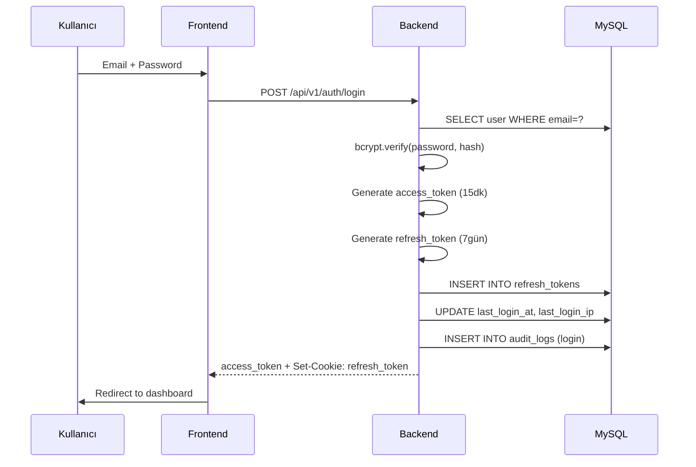

# 5. RBAC VE GÜVENLİK

> **Bu Bölümde Neler Var?**
> Bu bölüm, sistemin yetkilendirme (authorization) mimarisini ve genel güvenlik yaklaşımını ele almaktadır. Rol Bazlı Erişim Kontrolü (RBAC), 43 izinli yetki matrisi, JWT tabanlı kimlik doğrulama, şifre politikaları, oturum yönetimi, brute force koruması ve KVKK uyumluluğu detaylı olarak incelenmiştir.

## 5.1 Güvenlik Mimarisi Genel Bakış

Sporthink KPI Dashboard güvenlik mimarisi çok katmanlı bir yaklaşım benimser. Her katman kendi savunma görevini üstlenir; bir katman aşılsa bile diğerleri korumayı sürdürür.

```
Katman 1: Network Güvenliği (Firewall, HTTPS, Rate Limit)
        ▼
Katman 2: Kimlik Doğrulama (JWT Auth, Session Management)
        ▼
Katman 3: Yetkilendirme (RBAC, Permission Checks)
        ▼
Katman 4: Veri Güvenliği (Input Validation, SQL Injection Protection)
        ▼
Katman 5: Audit ve İzleme (Audit Logs, Error Tracking)
```

Defense in Depth (Derinlemesine Savunma) prensibi uygulanmıştır.

## 5.2 Kimlik Doğrulama (Authentication)

### 5.2.1 JWT Token Mimarisi

Sistem, JSON Web Token (JWT) standardına dayalı stateless authentication kullanır.

**Access Token:** 15 dakika süreli, frontend memory'de saklanır, HTTP Authorization header ile gönderilir.

**Refresh Token:** 7 gün süreli (Beni Hatırla seçilirse 30 gün), httpOnly cookie içinde saklanır, JavaScript tarafından erişilemez.

Access token kısa süreli olduğu için çalınma durumunda saldırgan en fazla 15 dakika faydalanabilir. Süre bittiğinde refresh token ile sessizce yenilenir.

### 5.2.2 Login Akışı



### 5.2.3 Token Refresh Akışı

Access token süresi dolduğunda Axios interceptor otomatik olarak `/api/v1/auth/refresh` endpoint'ini çağırır. Refresh token httpOnly cookie ile otomatik gönderilir. Yeni access token alındıktan sonra orijinal istek tekrar gönderilir.

### 5.2.4 Logout Akışı

Kullanıcı logout yaptığında refresh token DB'de revoke edilir, cookie silinir. Aynı token tekrar kullanılamaz.

### 5.2.5 Multi-Device Login

Kullanıcı aynı anda telefon, masaüstü, tablet gibi birden fazla cihazdan giriş yapabilir. Her giriş yeni bir refresh token üretir. Bu sayede bir cihazdan çıkış yapmak diğer cihazları etkilemez.

## 5.3 Şifre Yönetimi

### 5.3.1 Şifre Politikası

Yeni kullanıcı kaydı veya şifre değişimi sırasında uygulanan kurallar:

| Kural | Değer | Validasyon |
|---|---|---|
| Minimum uzunluk | 10 karakter | Frontend (Zod) + Backend (Pydantic) |
| Büyük harf zorunluluğu | En az 1 | Regex kontrol |
| Küçük harf zorunluluğu | En az 1 | Regex kontrol |
| Rakam zorunluluğu | En az 1 | Regex kontrol |
| Email içermesin | Email kullanıcı adıyla başlamasın | String comparison |
| Yaygın şifre kontrolü | Top 10000 yaygın şifre listesi | zxcvbn kütüphanesi |

### 5.3.2 Şifre Hash'leme

Şifreler bcrypt algoritması ile cost factor 12 kullanılarak hash'lenir. Plaintext şifre veritabanında hiçbir zaman saklanmaz.

```python
from passlib.context import CryptContext

pwd_context = CryptContext(schemes=["bcrypt"], bcrypt__rounds=12)

def hash_password(plain: str) -> str:
    return pwd_context.hash(plain)

def verify_password(plain: str, hashed: str) -> bool:
    return pwd_context.verify(plain, hashed)
```

### 5.3.3 Şifremi Unuttum Akışı

Kullanıcı email girer. Sistem 64-byte random token üretir, hash'ini DB'ye kaydeder, plaintext token'ı email ile gönderir. Token 30 dakika geçerlidir, tek kullanımlıktır.

Email enumeration saldırılarını önlemek için, hem geçerli hem geçersiz email için aynı response dönülür.

Şifre değişiminde kullanıcının tüm aktif refresh token'ları silinir. Bu sayede şifre çalınmış olsa bile, çalan kişi hesaba erişimi kaybeder.

## 5.4 Brute Force Koruması

### 5.4.1 Hesap Bazlı Kilitleme

Bir kullanıcı için 5 ardışık yanlış şifre denemesi yapıldığında hesap 15 dakika kilitlenir. `users.failed_login_attempts` ve `users.locked_until` alanları kullanılır.

### 5.4.2 IP Bazlı Rate Limit

`slowapi` kütüphanesi ile IP başına dakikada maksimum 10 login denemesi sınırlandırılır.

```python
@router.post("/login")
@limiter.limit("10/minute")
async def login(request: Request, ...):
    ...
```

### 5.4.3 Genel API Rate Limit

| Endpoint Grubu | Limit |
|---|---|
| Login, Şifre sıfırlama | 5/dakika (IP başına) |
| Genel API | 100/dakika (IP başına) |
| Import endpoint'leri | 20/dakika (IP başına) |

## 5.5 Yetkilendirme (Authorization) - RBAC

### 5.5.1 RBAC Modeli

Yetkilendirme zinciri:

```
Kullanıcı → Rol → İzinler
```

Bir kullanıcı tek bir role atanır. Rol birden fazla izne sahiptir. Kullanıcı, rolünün izinleri çerçevesinde işlem yapabilir.

### 5.5.2 Süper Admin Sistem Rolü

Süper Admin rolü `is_system=TRUE` flag ile işaretlenmiştir. Rol kaydının kendisi silinemez/düzenlenemez/kopyalanamaz. `role_permissions` tablosunda yer almaz; kod tarafında "tüm yetkilere sahip" kabul edilir.

İlk kurulumda DB seed işlemiyle `.env` dosyasındaki SUPER_ADMIN_EMAIL ve SUPER_ADMIN_PASSWORD değerleri kullanılarak otomatik oluşturulur.

#### Pattern C — Süper Admin Lifecycle (≥1 Aktif Süper Admin Invariant'ı)

Süper Admin **kullanıcıları** (rolün kendisi değil) eşittir — seed admin'in özel statüsü yoktur. Yönetim sektör standardı "peer + last-admin koruması" modelidir (Google Workspace / Microsoft 365 modeli).

**Tek invariant:** Sistemde her zaman en az bir aktif (`is_active=TRUE`, `deleted_at IS NULL`) Süper Admin bulunur. Bu, service layer'da tek bir guard (`_assert_super_admin_invariant_holds` — `backend/app/services/user_management_service.py`) ile her mutating action öncesi kontrol edilir.

**İzin verilen akışlar (≥1 başka aktif Süper Admin varsa):**

| Action | Endpoint | Davranış |
|---|---|---|
| Bir Süper Admin'i sil | `DELETE /users/{id}` | OK — soft delete, diğer SA'lere bildirim |
| Bir Süper Admin'i pasifleştir | `PATCH /users/{id}` (`is_active=false`) | OK — bildirim |
| Bir Süper Admin'i düşür (rol değiştir) | `PATCH /users/{id}` (`role_id` non-system) | OK — bildirim |
| Self-action (kendini silme/düşürme/pasifleştirme) | Yukarıdakiler | OK — başka aktif SA varsa |

**Engellenen akışlar (son aktif Süper Admin):**

Yukarıdaki action'ların hiçbiri son Süper Admin için yapılamaz → `LastSuperAdminError` (`code: LAST_SUPER_ADMIN`, HTTP 422). Frontend bu durumda butonları disable eder ve tooltip gösterir (`super_admin_last_tooltip` i18n key).

**Bildirim:** Bir Süper Admin'in statüsü değiştiğinde (silme, pasifleştirme, atama/düşürme), `notify_other_super_admins` helper'ı diğer tüm aktif Süper Admin'lere in-app notification düşer (sessiz ele geçirme görünür kalsın diye).

**Re-authentication / two-person rule:** Şimdilik yok — proje ölçeği (~50 kullanıcı, tek tenant) için over-engineering. İleride gerekirse guard'a onay adımı eklenir (geriye dönük breaking change değil).

**Test kapsamı:** `backend/tests/integration/test_super_admin_protection.py` — 8 test (count endpoint, peer delete/demote/deactivate happy + last-admin blocked + notification).

### 5.5.3 Per-User Custom Role Pattern

Süper Admin yeni kullanıcı eklerken aynı ekranda kullanıcıya özel rol oluşturur. İki seçenek vardır:

**Yeni Rol Oluşturma:** Form'da rol adı, rengi, ikonu ve yetkileri tanımlanır. Kullanıcı bu yeni role atanır.

**Mevcut Rolden Seçme:** Daha önce oluşturulmuş roller dropdown'da listelenir. Aynı rol birden fazla kullanıcıya atanabilir.

### 5.5.4 İzin Listesi (45 İzin)

İzinler 4 kategoriye ayrılır.

**Kategori 1: Veri Görüntüleme - 11 İzin**

`dashboard.view`, `traffic.view`, `meta_ads.view`, `google_ads.view`, `ecommerce.view`, `campaigns.view`, `funnel.view`, `cohort.view`, `products.view`, `customers.view`, `channel_analysis.view`

**Kategori 2: Veri İşlemleri - 20 İzin**

`imports.view`, `imports.create`, `imports.delete`, `mappings.view`, `mappings.create`, `mappings.update`, `mappings.delete`, `segments.view`, `segments.create`, `segments.update`, `segments.delete`, `views.view`, `views.create`, `views.update`, `views.delete`, `export.csv`, `export.report`, `reports.view`, `reports.create`, `reports.delete`

**Kategori 3: Kullanıcı ve Rol Yönetimi - 9 İzin**

`users.view`, `users.create`, `users.update`, `users.delete`, `users.reset_password`, `roles.view`, `roles.create`, `roles.update`, `roles.delete`

**Kategori 4: Sistem ve Loglar - 5 İzin**

`logs.view_api`, `logs.view_audit`, `logs.view_imports`, `settings.view`, `settings.update`

#### Sayfa → İzin Mapping Tablosu

Tek doğru kaynak. Yeni sayfa eklenirken bu tabloya eklenir; frontend `nav-items.ts` ve `App.tsx`, backend ilgili endpoint, **bu tabloya birebir uyar**.

| Sayfa (frontend nav id) | URL | Gerekli izin | Backend endpoint(leri) |
|---|---|---|---|
| `overview` | `/overview` | `dashboard.view` | `GET /dashboard/overview` |
| `traffic` | `/traffic` | `traffic.view` | `GET /dashboard/traffic` |
| `meta_ads` | `/meta-ads` | `meta_ads.view` | `GET /dashboard/meta` |
| `google_ads` | `/google-ads` | `google_ads.view` | `GET /dashboard/google` |
| `ecommerce` | `/ecommerce` | `ecommerce.view` | `GET /dashboard/ecom` |
| `campaigns` | `/campaigns` | `campaigns.view` | `GET /dashboard/campaign`, `/campaign-detail` |
| `funnel` | `/funnel` | `funnel.view` | `GET /dashboard/funnel` |
| `cohort` | `/cohort` | `cohort.view` | `GET /dashboard/cohort` |
| `products` | `/products` | `products.view` | `GET /dashboard/products` |
| `customers` | `/customers` | `customers.view` | `GET /dashboard/customers` |
| `channel_analysis` | `/channel-analysis` | `channel_analysis.view` | `GET /dashboard/channel-analysis` |
| `import` | `/import` | `imports.create` | `POST /imports` |
| `import/history` | `/import/history` | `imports.view` | `GET /imports` |
| `reports` | `/reports` | `reports.view` | `GET /reports`, `/reports/sections` |
| `segments` | `/segments` | `segments.view` | `GET /segments` |
| `channel_mapping` | `/channel-mappings` | `mappings.view` | `GET /admin/channel-mappings` |
| `user_management` | `/users` | `users.view` | `GET /users`, `/roles`, `/permissions` |
| `audit_logs` | `/audit-logs` | `logs.view_audit` | `GET /admin/audit-logs` |
| `notifications` | `/notifications` | — (kişisel) | yok (client-only Zustand store) |
| `settings` | `/settings/profile`, `/settings/security` | — (kişisel) | `PATCH /auth/me`, `/auth/me/change-password` |

#### Kişisel Sayfalar (izin matrisi dışında)

`/notifications`, `/settings/profile`, `/settings/security` rotaları **izin matrisinin dışındadır**: her oturum açan kullanıcıya açıktırlar. Frontend tarafında `<ProtectedRoute>` `permission` prop'u almaz; backend tarafında ilgili endpoint'ler `Depends(get_current_user)` ile sadece auth ister, `require_permission` koymaz. Gerekçe: bunlar kullanıcının **kendi** verilerine eriştiği kişisel ekranlardır (kendi bildirim merkezi, kendi profil bilgileri, kendi parolası); izin yaratıp kapatmak anlamsızdır.

Sistem ayarları (`settings.view` / `settings.update` izinleri) **farklı bir sayfadır**, ileride `/admin/settings` veya benzeri bir route altında ayrı eklenir; mevcut `/settings/profile` ile karıştırılmaz.

### 5.5.5 Yetki Kontrolü Implementasyonu

Her API endpoint, gerektirdiği izni FastAPI dependency olarak deklare eder.

```python
async def require_permission(permission: str):
    async def checker(
        current_user: User = Depends(get_current_user),
        cache: Redis = Depends(get_redis),
    ):
        if current_user.role and current_user.role.is_system:
            return current_user

        cached = await cache.get(f"user_perms:{current_user.id}")
        if cached:
            permissions = json.loads(cached)
        else:
            permissions = await get_user_permissions(current_user.id)
            await cache.setex(f"user_perms:{current_user.id}", 300, json.dumps(permissions))

        if permission not in permissions:
            raise PermissionDeniedError(required_permission=permission)

        return current_user

    return checker

@router.delete("/users/{user_id}")
async def delete_user(
    user_id: int,
    current_user: User = Depends(require_permission("users.delete")),
):
    ...
```

### 5.5.6 Permission Cache Stratejisi

Kullanıcı izinleri Redis'te 5 dakika TTL ile cache'lenir. Permission değişikliği yapıldığında ilgili cache key'leri invalidate edilir. Bu sayede yetki değişiklikleri kullanıcının bir sonraki isteğinde otomatik yansır.

### 5.5.7 Frontend Permission Kontrolü

Frontend'de UX için permission kontrolü yapılır. Yetkisi olmayan menüler ve butonlar gizlenir.

```typescript
function Sidebar() {
  const { has } = usePermissions();
  return (
    <nav>
      {has('dashboard.view') && <NavItem to="/dashboard" />}
      {has('users.view') && <NavItem to="/users" />}
    </nav>
  );
}
```

Frontend kontrolü yalnızca UX içindir. Asıl güvenlik backend tarafındadır.

### 5.5.8 Rol Silme Davranışı

Bir rol silindiğinde, o role atanmış tüm kullanıcılar otomatik pasifleşir. İşlem transaction içinde yapılır:

1. Role atanmış aktif kullanıcılar bulunur
2. Hepsi pasifleştirilir (`is_active=false`), `role_id` null'a set edilir
3. Aktif refresh token'lar revoke edilir
4. Permission cache temizlenir
5. Rol soft delete edilir
6. Audit log yazılır

## 5.6 Veri Güvenliği

### 5.6.1 SQL Injection Koruması

Tüm veritabanı sorguları SQLAlchemy ORM üzerinden parametrik olarak yapılır. String concatenation veya f-string ile SQL oluşturulmaz.

### 5.6.2 XSS Koruması

React, default olarak tüm string'leri otomatik escape eder. Proje boyunca `dangerouslySetInnerHTML` hiçbir yerde kullanılmaz.

### 5.6.3 CSRF Koruması

Refresh token httpOnly cookie içinde olduğu için CSRF saldırılarına karşı `SameSite=Lax` flag'i kullanılır.

```python
response.set_cookie(
    key="refresh_token",
    value=refresh_token,
    httponly=True,
    secure=True,
    samesite="lax",
    max_age=7 * 24 * 3600,
)
```

### 5.6.4 Input Validation

Backend tüm istek parametrelerini Pydantic ile doğrular. Frontend Zod ile çift katmanlı validation yapar. Geçersiz veri 422 Unprocessable Entity hatası ile reddedilir.

### 5.6.5 Hassas Veri Maskeleme

Belirli alanlar (kişisel telefon, ciro tutarları) yalnızca yetkili rollere açık olabilir. Backend serializer'larda permission'a göre alan dahil/hariç tutulur.

## 5.7 Network Güvenliği

### 5.7.1 HTTPS Zorunluluğu

Tüm trafik HTTPS üzerinden TLS 1.2+ ile şifrelenir. HTTP istekleri otomatik HTTPS'e yönlendirilir. Let's Encrypt sertifikası kullanılır.

### 5.7.2 Security Headers

Nginx tarafında uygulanan güvenlik header'ları:

| Header | Değer | Amaç |
|---|---|---|
| `Strict-Transport-Security` | max-age=31536000 | HTTPS zorla |
| `X-Frame-Options` | SAMEORIGIN | Clickjacking koruması |
| `X-Content-Type-Options` | nosniff | MIME-type sniffing koruması |
| `Referrer-Policy` | strict-origin-when-cross-origin | Referrer sızıntısı koruması |
| `Content-Security-Policy` | default-src 'self' | XSS koruma |

### 5.7.3 CORS

Backend yalnızca izinli origin'lerden gelen istekleri kabul eder. Production'da `dashboard.sporthink.com.tr`, development'ta `localhost:5173` izinlidir.

### 5.7.4 Firewall (UFW) Kuralları

VDS sunucuda yalnızca gerekli portlar açıktır: 22 (SSH), 80 (HTTP), 443 (HTTPS). MySQL (3306), Redis (6379), Backend (8000) portları sadece Docker iç network üzerinden erişilebilir.

### 5.7.5 SSH Güvenliği

SSH erişimi yalnızca public key authentication ile yapılır. Password authentication kapalıdır. Root user ile direkt giriş yasaklanır.

## 5.8 Audit ve İzleme

### 5.8.1 Audit Log Kapsamı

Aşağıdaki kritik işlemler audit log'a kaydedilir:

**Kimlik Doğrulama:** login, login.failed, logout, password.reset, account.locked

**Kullanıcı Yönetimi:** user.created, user.updated, user.deleted, user.deactivated, user.activated

**Rol Yönetimi:** role.created, role.updated, role.deleted

**Veri İşlemleri:** import.started, import.completed, import.failed, import.cancelled, import.rollback

**Konfigürasyon:** mapping.created, mapping.updated, settings.updated

### 5.8.2 Audit Log Yapısı

Her kayıt user_id, user_email (snapshot), action, resource_type, resource_id, ip_address, user_agent, details (JSON) ve created_at alanlarını içerir.

### 5.8.3 Audit Log Görüntüleme

`logs.view_audit` yetkisi olan kullanıcılar audit log sayfasından geçmiş işlemleri tarih, kullanıcı, işlem türü ve kaynak türü filtreleriyle görüntüleyebilir.

### 5.8.4 Log Saklama Süresi

Audit log'lar 6 ay süreyle saklanır. Eski kayıtlar otomatik temizlik cron job ile silinir.

## 5.9 KVKK Uyumluluğu

Kişisel Verilerin Korunması Kanunu (KVKK) gereği aşağıdaki uygulamalar yapılır:

### 5.9.1 Veri Saklama Süreleri

| Veri Türü | Saklama Süresi |
|---|---|
| Müşteri kişisel verileri (name, email, phone) | İlişki sürdüğü sürece + 5 yıl |
| Sipariş verileri | 10 yıl (vergi mevzuatı) |
| Audit logları | 6 ay |
| API logları | 30 gün |
| Refresh token kayıtları | Token süresi + 7 gün |
| Şifre sıfırlama tokenları | 30 dakika (kullanım sonrası silinir) |

### 5.9.2 Veri Silme Talebi (Right to be Forgotten)

KVKK kapsamında bir kişi kendi verilerinin silinmesini talep edebilir. Bu durumda manuel hard delete prosedürü uygulanır:

1. Talep email ile alınır
2. Süper Admin manual SQL komutu ile ilgili kullanıcı verilerini siler
3. Audit log'da silme işlemi kaydedilir (kişi kimliği maskelenir)

### 5.9.3 Veri Erişim Kayıtları

Her kullanıcı kendi verilerine kimlerin eriştiğini öğrenme hakkına sahiptir. Audit log sistemi bu bilgiyi sağlar.

### 5.9.4 Veri Maskeleme

Hassas alanlar (kişisel telefon, ciro tutarları) yetki bazlı maskelenebilir. Süper Admin dışındaki rollere "***" görüntülenebilir.

### 5.9.5 Aydınlatma Metni

Sistem kullanım koşulları ve veri işleme bilgilendirmesi, ilk login sırasında kullanıcıya gösterilir. Onay alınmadan sistem kullanımı engellenir (future feature).

## 5.10 Güvenlik Test ve Denetim

### 5.10.1 Güvenlik Testleri

Geliştirme sürecinde aşağıdaki güvenlik testleri yapılır:

**Statik Kod Analizi:** Bandit (Python) ve npm audit (Node.js) ile bilinen güvenlik açıkları taranır.

**Bağımlılık Tarama:** Dependabot (GitHub) otomatik olarak vulnerable bağımlılıkları raporlar.

**Penetrasyon Testi:** Production öncesi temel penetrasyon testi yapılır:
- SQL injection denemesi
- XSS denemesi
- CSRF denemesi
- Yetki dışı endpoint erişim denemesi
- JWT manipulation denemesi

### 5.10.2 Güvenlik Olay Müdahale Planı

Bir güvenlik olayı tespit edildiğinde uygulanacak adımlar:

1. **Tespit:** Audit log incelemesi, anormal aktivite alarmları
2. **İzolasyon:** Şüpheli kullanıcı hesabı pasifleştirilir, aktif token'ları revoke edilir
3. **Soruşturma:** Audit log'dan saldırgan IP, etkilenen veriler tespit edilir
4. **Düzeltme:** Güvenlik açığı kapatılır, gerekirse sistem versiyon güncellemesi yapılır
5. **Bildirim:** Etkilenen kullanıcılar bilgilendirilir, KVKV ihlal durumlarında KVKK Kurumu'na bildirim yapılır
6. **Dökümantasyon:** Olay raporu hazırlanır, future-proof iyileştirmeler kaydedilir

## 5.11 Sonraki Bölüm

Bu bölümde sistemin güvenlik ve yetkilendirme mimarisi detaylandırıldı. Sonraki bölümde, frontend ve backend arasındaki tüm REST API endpoint'leri detaylı olarak ele alınacaktır.

**Sonraki Bölüm:** [06 - API Spesifikasyonu](06-api-spec.md)

*Bölüm 05 sonu.*
