# Sporthink Pazarlama ve E-Ticaret KPI Dashboard
## Kapsamlı Teknik Rapor

> Bu rapor, projenin mevcut kaynak kodu, yapılandırma dosyaları, canlı veritabanı şeması ve
> çalışan API'si incelenerek hazırlanmıştır. Tüm teknik bilgiler dosya ve kod referanslarıyla
> doğrulanmıştır; tahmine dayalı bir bölüm yoktur.

**Hazırlanma tarihi:** Mayıs 2026
**Proje:** Dokuz Eylül Üniversitesi, Yönetim Bilişim Sistemleri bitirme projesi
**Geliştirici:** Adem Yavuz (tek geliştirici)

---

## İçindekiler

1. [Yönetici Özeti](#1-yönetici-özeti)
2. [Proje Genel Bakışı](#2-proje-genel-bakışı)
3. [Teknoloji Yığını (Tech Stack)](#3-teknoloji-yığını-tech-stack)
4. [Sistem Mimarisi](#4-sistem-mimarisi)
5. [Veritabanı Tasarımı](#5-veritabanı-tasarımı)
6. [API / Endpoint Dokümantasyonu](#6-api--endpoint-dokümantasyonu)
7. [Klasör ve Dosya Yapısı](#7-klasör-ve-dosya-yapısı)
8. [Önemli İş Mantığı ve Akışlar](#8-önemli-iş-mantığı-ve-akışlar)
9. [Kimlik Doğrulama ve Güvenlik](#9-kimlik-doğrulama-ve-güvenlik)
10. [Kurulum ve Çalıştırma Rehberi](#10-kurulum-ve-çalıştırma-rehberi)
11. [Ekran Görüntüleri](#11-ekran-görüntüleri)
12. [Sonuç ve Öneriler](#12-sonuç-ve-öneriler)

---

## 1. Yönetici Özeti

**Sporthink KPI Dashboard**, sporthink.com.tr için geliştirilmiş, şirket içi kullanıma yönelik
(B2B internal) bir pazarlama ve e-ticaret analitik platformudur. Sistem; Google Analytics 4
(GA4), Meta Ads, Google Ads ve e-ticaret sipariş verilerini tek bir merkezde toplar, normalize
eder ve **31 KPI** üzerinden 12 ayrı analiz sayfasında görselleştirir.

### Çözülen Problem

Sporthink'in pazarlama ve e-ticaret verileri farklı platformlara (GA4 paneli, Meta Ads Manager,
Google Ads, e-ticaret altyapısı) dağılmış durumdadır. Bu dağınıklık nedeniyle:

- Bütünsel performans değerlendirmesi yapmak için birden fazla panele girmek gerekir,
- Kanal bazlı karşılaştırma (hangi kanal ne kadar ciro getiriyor) manuel hesaplama ister,
- Dönemsel raporlama zahmetli ve hataya açıktır.

Proje bu sorunu, tüm kaynakları **CSV/Excel içe aktarma** ile tek veritabanında birleştirip,
önceden hesaplanmış (pre-aggregated) KPI tabloları üzerinden hızlı ve tutarlı bir dashboard
sunarak çözer.

### Hedef Kitle

Sporthink pazarlama ekibi, e-ticaret yöneticileri ve üst yönetim. Sistem, **rol bazlı erişim
kontrolü (RBAC)** ile farklı yetki seviyelerini destekler; üretim hedefi **~50 eşzamanlı
kullanıcı** ve 1+ yıllık veri saklamadır.

### Genel Değerlendirme

Proje, teknik olgunluk açısından **üretim seviyesine yakın** bir noktadadır:

| Alan | Durum |
|---|---|
| Backend mimarisi | Katmanlı (Router/Service/Repository), async, temiz ayrıştırılmış |
| API kapsamı | 77 operasyon, OpenAPI 3.1 ile tam dokümante |
| Veritabanı | 27 alan tablosu + Alembic migration zinciri |
| Kimlik doğrulama | JWT (access + refresh), RBAC, audit log |
| Frontend | React 19, 12 dashboard sayfası, i18n (TR/EN), karanlık tema |
| Test | Backend pytest paketi (97 entegrasyon/birim testi), uçtan uca doğrulama |
| Dağıtım | Docker Compose, çok aşamalı (dev/demo/prod) yapılandırma |

Tespit edilen iyileştirme noktaları Bölüm 12'de önceliklendirilmiştir; en kritik bulgu
`db/init/01-baseline.sql` dosyasının migration head'inden sapmış olmasıdır (yalnızca sıfırdan
kurulum senaryosunu etkiler).

---

## 2. Proje Genel Bakışı

### Ne İşe Yarar

Sistem dört ana yetenek sunar:

1. **Veri Birleştirme (Import):** GA4, Meta Ads, Google Ads ve e-ticaret CSV/Excel
   dosyaları sihirbaz (wizard) üzerinden içe aktarılır; otomatik kolon eşleme, doğrulama ve
   hata raporlama yapılır.
2. **KPI Görselleştirme:** 12 analiz sayfasında KPI kartları, çizgi/bar/donut grafikleri,
   tablolar ve Türkiye şehir haritası ile metrikler sunulur.
3. **Filtreleme ve Cross-Filter:** Tarih aralığı, karşılaştırma modu, kanal/cihaz/şehir
   filtreleri; grafik üzerine tıklayarak sayfa genelinde filtreleme (cross-filter).
4. **Raporlama ve Yönetim:** PDF rapor üretimi (asenkron), kullanıcı/rol yönetimi, denetim
   kayıtları, bildirim merkezi.

### Temel Özellikler

- **12 dashboard sayfası:** Genel Özet, Trafik (GA4), Meta Ads, Google Ads, E-Ticaret,
  Kampanya Analizi, Funnel Analizi, Cohort/Retention, Ürün Performansı, Müşteriler,
  Kanal Analizi, Raporlar.
- **RBAC:** 4 kategori altında granüler izinler, sistem rolü (Süper Admin) bypass'ı.
- **i18n:** Türkçe (varsayılan) ve İngilizce; tüm kullanıcıya görünür metinler çeviri
  anahtarı üzerinden.
- **Tema:** Aydınlık/karanlık mod, semantik CSS değişkenleri.
- **Asenkron işler:** Import ve PDF üretimi Celery worker üzerinden arka planda çalışır.
- **Audit log:** Mutasyon yapan tüm istekler ve auth olayları kayıt altına alınır.

### Kullanım Senaryoları

| Senaryo | Akış |
|---|---|
| Aylık performans değerlendirmesi | Genel Özet sayfasında tarih aralığı seçilir, KPI'lar ve trend incelenir |
| Kanal verimliliği analizi | Kanal Analizi sayfasında ROAS/dönüşüm karşılaştırılır, filtre uygulanır |
| Yeni veri yükleme | Import sayfasından CSV yüklenir, önizleme yapılır, içe aktarılır |
| Yönetici raporu | Raporlar sayfasında dönem + bölüm seçilip PDF üretilir, indirilir |
| Kullanıcı yönetimi | Yönetici yeni kullanıcı davet eder, rol atar |

### Kapsam

**Dahil:** Pazarlama (GA4/Meta/Google Ads) ve e-ticaret verisi analitiği, RBAC, import,
raporlama. **Hariç:** Canlı API entegrasyonu (veriler manuel CSV ile gelir), ödeme,
gerçek zamanlı stok yönetimi. Veri kaynağı her zaman önce `docs/overview/` dokümantasyonunda
tanımlanır, sonra koda eklenir (scope creep kontrolü).

---

## 3. Teknoloji Yığını (Tech Stack)

Aşağıdaki sürümler `backend/requirements.txt` ve `frontend/package.json` dosyalarından birebir
okunmuştur.

### 3.1 Backend Teknolojileri

| Teknoloji | Sürüm | Ne Olduğu / Neden / Roldeki Amacı |
|---|---|---|
| **Python** | 3.12 | Ana programlama dili. Async/await desteği KPI sorgularının paralel çalışması için kritik. |
| **FastAPI** | 0.115.6 | ASGI web framework. Otomatik OpenAPI üretimi, Pydantic ile tip güvenli istek/yanıt; tüm REST API bu framework üzerinde. |
| **Uvicorn** | 0.34.0 | ASGI sunucusu. Geliştirmede `--reload` ile hot-reload; FastAPI uygulamasını çalıştırır. |
| **SQLAlchemy** | 2.0.43 | ORM. Async API kullanılır (`aiomysql` üzerinden); tüm veritabanı erişimi buradan geçer. |
| **aiomysql** | 0.2.0 | Async MySQL sürücüsü. SQLAlchemy'nin asenkron MySQL bağlantısını sağlar. |
| **Pydantic** | 2.10.4 | Veri doğrulama. API şemaları (Create/Update/Response) ve ayar yönetimi; Rust core ile hızlı. |
| **pydantic-settings** | 2.7.0 | Ortam değişkeni yönetimi. Tüm `.env` değişkenleri `app/config.py`'de buradan okunur. |
| **Alembic** | 1.14.0 | Veritabanı migration aracı. Şema değişiklikleri sürümlenir. |
| **Celery** | 5.4.0 | Dağıtık görev kuyruğu. Import ve PDF üretimi gibi uzun işler arka planda çalışır. |
| **Redis** | 5.2.1 (istemci) | Hem uygulama cache'i (db 0) hem Celery broker'ı (db 1). |
| **PyJWT** | 2.10.1 | JWT encode/decode. Access ve refresh token üretimi/doğrulaması. |
| **passlib + bcrypt** | 1.7.4 / 4.0.1 | Parola hashleme. bcrypt cost 12 ile parolalar saklanır. |
| **python-multipart** | 0.0.20 | Multipart form parsing. CSV/avatar dosya yüklemeleri için. |
| **pandas** | 2.2.3 | Veri işleme. CSV/Excel parse ve normalize aşamasında. |
| **openpyxl** | 3.1.5 | Excel (XLSX) okuma desteği. |
| **aiofiles** | 24.1.0 | Async dosya I/O. Yüklenen dosyaların bloklamadan işlenmesi. |
| **httpx** | 0.28.1 | Async HTTP istemcisi. |
| **Pillow** | 11.0.0 | Görüntü işleme. Avatar yükleme: yeniden boyutlandırma + format dönüşümü. |
| **WeasyPrint** | 63.1 | HTML'den PDF üretimi. Rapor PDF'leri Jinja2 şablonundan render edilir. |
| **Jinja2** | 3.1.4 | Şablon motoru. PDF rapor ve e-posta şablonları. |
| **slowapi** | 0.1.9 | Rate limiting. Brute-force koruması (örn. login). |
| **aiosmtplib** | 3.0.2 | Async SMTP. Davet ve şifre sıfırlama e-postaları (Gmail SMTP). |
| **structlog** | 24.4.0 | Yapılandırılmış loglama. |
| **Ruff** | 0.8.4 | Lint + format aracı (Black/Flake8/isort yerine tek araç). |
| **pytest** | 8.3.4 | Test framework'ü; `pytest-asyncio`, `pytest-cov` ile. |

### 3.2 Frontend Teknolojileri

| Teknoloji | Sürüm | Ne Olduğu / Neden / Roldeki Amacı |
|---|---|---|
| **React** | 19.0.0 | UI framework. Tüm arayüz bileşen tabanlı. |
| **Vite** | 6.0.7 | Build aracı + dev sunucu. Hızlı HMR, ESBuild/Rollup tabanlı. |
| **TypeScript** | 5.7.2 | Tip güvenli JavaScript. Strict mode açık. |
| **TailwindCSS** | 4.0.0 | Utility-first CSS. Tüm stiller; semantik tema değişkenleri. |
| **shadcn/ui + Radix UI** | 1.4.3 | Erişilebilir UI primitive'leri (Dialog, Popover, Tabs, Tooltip vb.). |
| **ApexCharts + react-apexcharts** | 4.4.0 / 1.7.0 | Grafik kütüphanesi. Çizgi, bar, donut grafikleri. |
| **TanStack Query** | 5.62.0 | Sunucu durumu yönetimi. API verisi cache'leme, refetch, 5 dk staleTime. |
| **Zustand** | 5.0.2 | İstemci durumu yönetimi. Auth, tema, dil, global filtreler. |
| **React Hook Form + Zod** | 7.54.2 / 3.24.1 | Form yönetimi ve şema doğrulama. |
| **React Router** | 7.1.1 | Yönlendirme. Lazy-loaded route'lar. |
| **Axios** | 1.7.9 | HTTP istemcisi. Tek instance + interceptor (token, 401 refresh). |
| **i18next + react-i18next** | 24.2.0 / 15.4.0 | Uluslararasılaştırma. TR/EN çeviriler. |
| **dayjs** | 1.11.13 | Tarih kütüphanesi. UTC/timezone (Europe/Istanbul) ve locale. |
| **lucide-react** | 0.468.0 | İkon seti. |
| **sonner** | 1.7.1 | Toast bildirimleri. |
| **react-easy-crop** | 5.5.7 | Avatar kırpma arayüzü. |
| **Playwright** | 1.59.1 | Uçtan uca (E2E) test aracı. |
| **Vitest + Testing Library** | 2.1.8 / 16.1.0 | Birim/entegrasyon test framework'ü. |
| **ESLint + Prettier** | 9.17.0 / 3.4.2 | Lint ve format. |

### 3.3 Veritabanı ve Veri Katmanı

- **MySQL 8.4 LTS** — Ana ilişkisel veritabanı. `utf8mb4` karakter seti, partition ve
  computed (generated) column desteği kullanılır.
- **Redis 7.4** — İki amaçla: `db 0` uygulama cache'i (KPI sonuçları, izin cache'i),
  `db 1` Celery broker'ı.
- **Alembic** — Şema sürümleme. Migration zinciri `0001` ... `0008`.

### 3.4 DevOps / Altyapı

- **Docker 27+ / Docker Compose 2.30+** — Tüm stack konteynerize. Üç compose dosyası:
  `docker-compose.dev.yml` (geliştirme), `docker-compose.prod.yml` (üretim override),
  `docker-compose.demo.yml` (ngrok demo).
- **Nginx 1.27+** — Üretimde reverse proxy (`nginx/` klasörü).
- **GitHub Actions** — CI/CD pipeline (`.github/workflows/`).
- **ngrok** — Demo amaçlı tünelleme (`docker-compose.demo.yml`).
- **Ubuntu 24.04 LTS VDS** — Üretim hedef ortamı; `scripts/deploy.sh` ile dağıtım.

### 3.5 Üçüncü Parti Servisler ve Entegrasyonlar

| Servis | Amaç |
|---|---|
| **Gmail SMTP** (aiosmtplib) | Davet ve şifre sıfırlama e-postaları |
| **GA4 / Meta Ads / Google Ads** | Veri kaynakları (canlı API değil, CSV/Excel dışa aktarımı ile) |

Sistem dış API'lere canlı bağlanmaz; veri her zaman manuel içe aktarma ile gelir. Bu, scope
kontrolü ve veri tutarlılığı için bilinçli bir mimari karardır.

---

## 4. Sistem Mimarisi

### 4.1 Üst Düzey Mimari

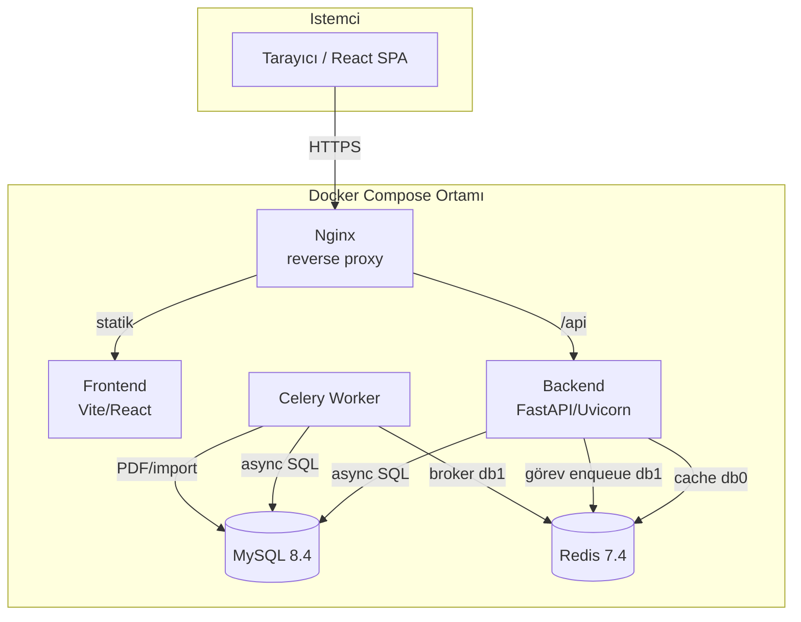
```mermaid
graph TB
    subgraph Istemci
        B[Tarayıcı / React SPA]
    end
    subgraph Docker_Compose["Docker Compose Ortamı"]
        N[Nginx<br/>reverse proxy]
        F[Frontend<br/>Vite/React]
        BE[Backend<br/>FastAPI/Uvicorn]
        CW[Celery Worker]
        MY[(MySQL 8.4)]
        RD[(Redis 7.4)]
    end
    B -->|HTTPS| N
    N -->|statik| F
    N -->|/api| BE
    BE -->|async SQL| MY
    BE -->|cache db0| RD
    BE -->|görev enqueue db1| RD
    CW -->|broker db1| RD
    CW -->|async SQL| MY
    CW -->|PDF/import| MY
```

### 4.2 Katmanlı Mimari (Backend)

Backend, **istisnasız uygulanan** üç katmanlı bir mimari izler (`backend/CLAUDE.md` §3):

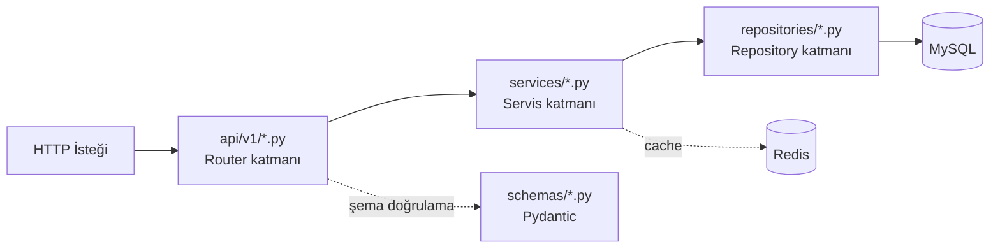
```mermaid
graph LR
    HTTP[HTTP İsteği] --> R[api/v1/*.py<br/>Router katmanı]
    R --> S[services/*.py<br/>Servis katmanı]
    S --> RP[repositories/*.py<br/>Repository katmanı]
    RP --> DB[(MySQL)]
    R -.->|şema doğrulama| SC[schemas/*.py<br/>Pydantic]
    S -.->|cache| RD[(Redis)]
```

| Katman | Sorumluluk | Girmez |
|---|---|---|
| **Router** (`api/v1/`) | HTTP metodu, Pydantic doğrulama, durum kodu, dependency injection | İş mantığı, SQL |
| **Service** (`services/`) | İş mantığı, KPI formülleri, transaction yönetimi, orkestrasyon | HTTP detayları (Request/Response) |
| **Repository** (`repositories/`) | Yalnızca SQLAlchemy sorguları, CRUD | İş kuralları |
| **Model** (`models/`) | SQLAlchemy ORM tablo tanımları | API serialization |
| **Schema** (`schemas/`) | Pydantic Create/Update/Response sınıfları | Hesaplama, DB erişimi |

Bu ayrım sayesinde KPI formülleri tek noktada (`kpi_service.py`), SQL tek noktada
(`repositories/`) yönetilir; test edilebilirlik ve bakım kolaylaşır.

### 4.3 Bileşenler Arası İletişim ve Veri Akışı

**Tipik bir KPI isteği akışı (örn. `/dashboard/overview`):**

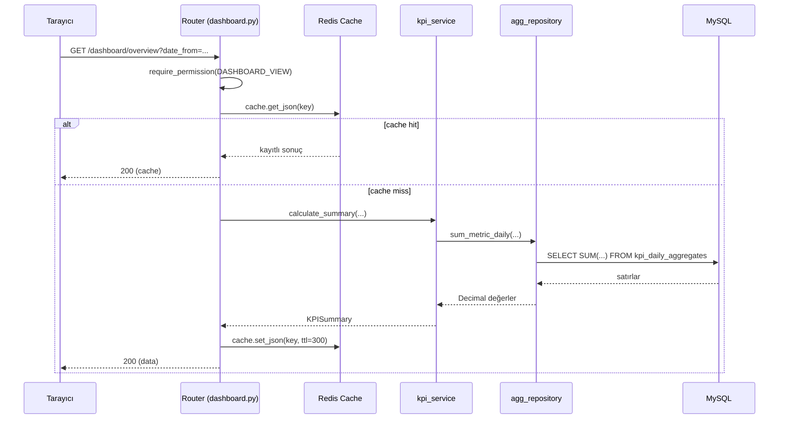
```mermaid
sequenceDiagram
    participant U as Tarayıcı
    participant R as Router (dashboard.py)
    participant C as Redis Cache
    participant S as kpi_service
    participant AR as agg_repository
    participant DB as MySQL
    U->>R: GET /dashboard/overview?date_from=...
    R->>R: require_permission(DASHBOARD_VIEW)
    R->>C: cache.get_json(key)
    alt cache hit
        C-->>R: kayıtlı sonuç
        R-->>U: 200 (cache)
    else cache miss
        R->>S: calculate_summary(...)
        S->>AR: sum_metric_daily(...)
        AR->>DB: SELECT SUM(...) FROM kpi_daily_aggregates
        DB-->>AR: satırlar
        AR-->>S: Decimal değerler
        S-->>R: KPISummary
        R->>C: cache.set_json(key, ttl=300)
        R-->>U: 200 (data)
    end
```

**Asenkron iş akışı (import / PDF):** Router görevi Celery'ye `delay()` ile enqueue eder,
hemen bir job ID döner; frontend polling ile durumu sorgular; Celery worker arka planda
işi tamamlar.

### 4.4 Tasarım Desenleri ve Mimari Kararlar

| Desen / Karar | Uygulanışı |
|---|---|
| **Katmanlı Mimari (Layered)** | Router → Service → Repository ayrımı |
| **Repository Pattern** | Tüm DB erişimi `repositories/` üzerinden; ham SQL servis katmanında yasak |
| **Dependency Injection** | FastAPI `Depends()` ile `get_db`, `get_current_user`, `require_permission` |
| **Cache-Aside** | KPI sonuçları önce Redis'te aranır, yoksa hesaplanıp yazılır (5 dk TTL) |
| **Asenkron Görev Kuyruğu** | 3 saniyeden uzun işler Celery'ye taşınır |
| **Pre-Aggregation** | KPI'lar ham tablolardan değil `kpi_*_aggregates` tablolarından hesaplanır |
| **Tek Doğru Kaynak (SSOT)** | İzinler tek enum'da, KPI formülleri tek serviste, cache key'leri tek dosyada |
| **Soft Delete** | `users`, `roles`, `customers`, `products` vb. tablolar `deleted_at` ile silinir |
| **Standart API Zarfı** | Tüm yanıtlar `{success, data}` veya `{success:false, error}` formatında |
| **Frontend State Ayrımı** | Sunucu durumu TanStack Query, istemci durumu Zustand, URL durumu searchParams |

---

## 5. Veritabanı Tasarımı

Veritabanı **27 alan tablosu** (+ Alembic'in `alembic_version` tablosu) içerir. Aşağıdaki
bilgiler canlı MySQL `information_schema`'sından okunmuştur.

> 📑 **Ayrıntılı veritabanı dokümanı:** Bu bölüm bir özettir. Her tablonun tüm
> kolonları, tipleri, indeksleri, kısıtlamaları, generated kolonları, partitioning ve
> FK politikaları **ayrı bir belgede** tam ayrıntısıyla dokümante edilmiştir:
> **[`VERITABANI.md`](VERITABANI.md)**.

### 5.1 Tablo Grupları

| Grup | Tablolar |
|---|---|
| **Kimlik ve Yetki** | `users`, `roles`, `permissions`, `role_permissions`, `refresh_tokens`, `password_reset_tokens`, `user_preferences` |
| **Ham Veri Kaynakları** | `ga4_traffic`, `ga4_item_engagement`, `meta_ads`, `meta_ads_breakdowns`, `google_ads`, `orders`, `order_items`, `products`, `customers`, `campaigns` |
| **KPI Aggregation** | `kpi_daily_aggregates`, `kpi_monthly_aggregates`, `kpi_campaign_aggregates` |
| **Sistem / Operasyon** | `imports`, `import_errors`, `audit_logs`, `notifications`, `reports`, `saved_views`, `channel_mapping` |

### 5.2 İlişkiler (ER Diyagramı)

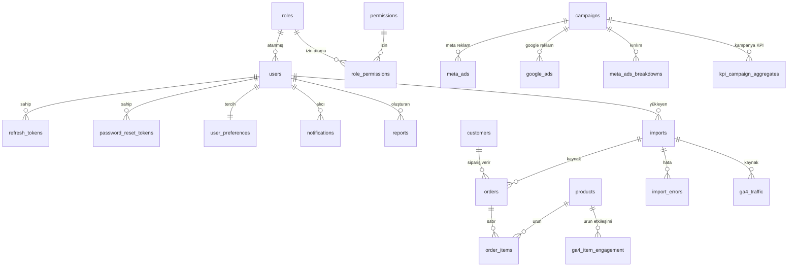
```mermaid
erDiagram
    users ||--o{ refresh_tokens : "sahip"
    users ||--o{ password_reset_tokens : "sahip"
    users ||--|| user_preferences : "tercih"
    users ||--o{ notifications : "alıcı"
    users ||--o{ reports : "oluşturan"
    users ||--o{ imports : "yükleyen"
    roles ||--o{ users : "atanmış"
    roles ||--o{ role_permissions : "izin atama"
    permissions ||--o{ role_permissions : "izin"
    customers ||--o{ orders : "sipariş verir"
    orders ||--o{ order_items : "satır"
    products ||--o{ order_items : "ürün"
    products ||--o{ ga4_item_engagement : "ürün etkileşimi"
    campaigns ||--o{ meta_ads : "meta reklam"
    campaigns ||--o{ google_ads : "google reklam"
    campaigns ||--o{ meta_ads_breakdowns : "kırılım"
    campaigns ||--o{ kpi_campaign_aggregates : "kampanya KPI"
    imports ||--o{ import_errors : "hata"
    imports ||--o{ ga4_traffic : "kaynak"
    imports ||--o{ orders : "kaynak"
```

> Not: Şemada toplam **40 foreign key** ilişkisi vardır. Yukarıdaki diyagram okunabilirlik
> için ana ilişkileri gösterir; `created_by`/`updated_by` denetim alanları (audit FK'leri)
> ve tüm bağlantılar tam listede mevcuttur.

### 5.3 Önemli Tablolar (Alan Detayları)

#### `users` (kullanıcılar)
| Alan | Tip | Açıklama |
|---|---|---|
| `id` | bigint unsigned PK | Birincil anahtar |
| `email` | varchar(255) UNIQUE | Giriş kimliği, lowercase normalize |
| `password_hash` | varchar(255) | bcrypt hash |
| `first_name`, `last_name` | varchar(100) | Ad/soyad |
| `role_id` | bigint unsigned FK→roles | Atanmış rol |
| `is_active` | tinyint(1) | Aktiflik (pasif kullanıcı giriş yapamaz) |
| `failed_login_attempts`, `locked_until` | int / datetime | Brute-force kilidi |
| `bio`, `birth_date`, `location`, `website_url`, `linkedin_url`, `twitter_url`, `github_url`, `instagram_url` | çeşitli | Profil alanları (migration 0004) |
| `created_at`, `updated_at`, `deleted_at` | datetime | Zaman damgaları + soft delete |

#### `kpi_daily_aggregates` (günlük KPI aggregation)
Tüm dashboard KPI'larının kaynağı. `date × channel × platform × device` kırılımında
önceden toplanmış metrikler tutar.
| Alan | Tip | Açıklama |
|---|---|---|
| `date` | date (PK) | Gün |
| `channel` | varchar(100) | Pazarlama kanalı |
| `platform` | enum(ga4, meta, google, ecommerce) | Veri kaynağı |
| `device` | varchar(50) | Cihaz kırılımı |
| `sessions`, `users`, `new_users`, `bounce_sessions` | int | GA4 metrikleri |
| `impressions`, `clicks`, `spend`, `ad_conversions`, `ad_revenue` | çeşitli | Reklam metrikleri |
| `orders`, `revenue`, `items_sold`, `discount_total`, `refund_total` | çeşitli | E-ticaret metrikleri |

#### `orders` (siparişler)
`city`, `channel`, `device` kolonlarını **doğrudan** taşır; bu sayede şehir bazlı ciro
analizi (Türkiye haritası) mümkündür.
| Alan | Tip | Açıklama |
|---|---|---|
| `order_id` | varchar(50) UNIQUE | İş anahtarı |
| `customer_pk_id` | bigint FK→customers | Müşteri |
| `city`, `channel`, `device` | çeşitli | Kırılım boyutları |
| `net_revenue` | decimal(15,2) | Net ciro (TRY) |
| `order_status` | enum(completed, cancelled, refunded, pending, shipped) | Durum |

### 5.4 Tip ve Kısıtlama Kuralları

- **Para:** `DECIMAL(15,2)`, tek para birimi TRY. Float kullanılmaz (yuvarlama hatası).
- **Yüzde:** `DECIMAL(7,4)` veya `DECIMAL(8,4)`.
- **Zaman:** `datetime`, her zaman UTC saklanır; dönüşüm yalnızca frontend'de
  (Europe/Istanbul).
- **ID:** `BIGINT UNSIGNED AUTO_INCREMENT`.
- **Soft delete:** `deleted_at TIMESTAMP NULL`. Aktif kayıt sorguları `WHERE deleted_at IS NULL`.
- **Kısmi unique index:** `roles.name_active` ve `channel_mapping.source_medium_active`
  generated (computed) kolonlardır; soft-deleted kayıtların unique kısıtını ihlal etmemesi
  için `deleted_at NULL` iken değer üretir (migration 0006).
- **Computed column örneği:**
  `name_active = IF(deleted_at IS NULL, name, NULL)` — silinmiş roller benzersizlik
  kısıtına takılmaz.

### 5.5 İndeksler

Tablolarda performans için kapsamlı indeksleme yapılmıştır: tarih kolonları (`ga4_traffic.date`,
`orders.order_date`), foreign key kolonları, sık filtrelenen boyutlar (`orders.channel`,
`customers.city`) ve unique iş anahtarları (`users.email`, `orders.order_id`, `products.sku`)
indekslidir.

### 5.6 Migration Zinciri ve Önemli Bulgu

Alembic migration zinciri: `0001` (baseline marker) → `0002` (post-baseline no-op) →
`0003` (password reset purpose) → `0004` (kullanıcı profil alanları) → `0005` (reports
tablosu) → `0006` (soft-delete kısmi unique) → `0007` (notifications tablosu) →
`0008` (segments özelliğinin kaldırılması).

**Tasarım yaklaşımı:** Şema, MySQL ilk açılışta `db/init/01-baseline.sql` ile kurulur;
`0001` ve `0002` migration'ları yalnızca "marker" (no-op) görevi görür. Üretimde
`scripts/deploy.sh` ilk kurulumda `alembic stamp head` kullanır.

**⚠️ Tespit edilen tutarsızlık:** `01-baseline.sql` dosyası migration head'inden sapmıştır;
`0004` (kullanıcı profil alanları), `0005` (`reports` tablosu) ve `0008` (`segments`
kaldırma) değişikliklerini yansıtmaz. Bu, mevcut çalışan veritabanını etkilemez ancak
**sıfırdan kurulum** senaryosunda hatalı şema üretir. Detay ve çözüm Bölüm 12'dedir.

---

## 6. API / Endpoint Dokümantasyonu

API, `/api/v1` önekiyle versiyonlanmış REST mimarisindedir. Toplam **77 operasyon**
bulunur. Tam interaktif dokümantasyon `/api/docs` (Swagger UI) ve `/api/redoc` (ReDoc)
adreslerinde otomatik üretilir.

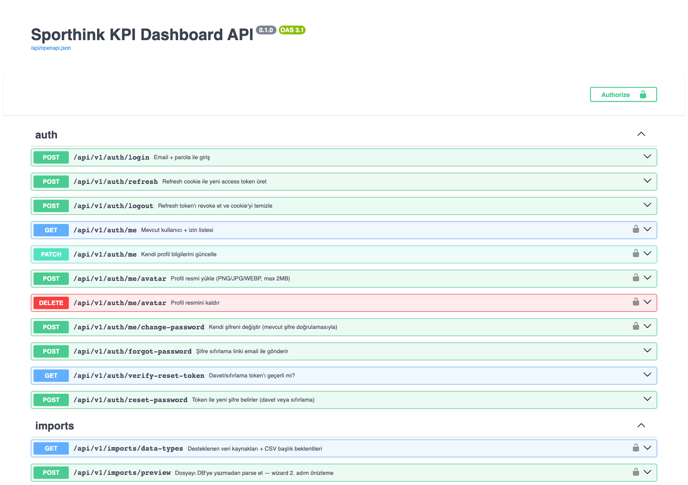
*Swagger UI — interaktif API dokümantasyonu (`/api/docs`)*

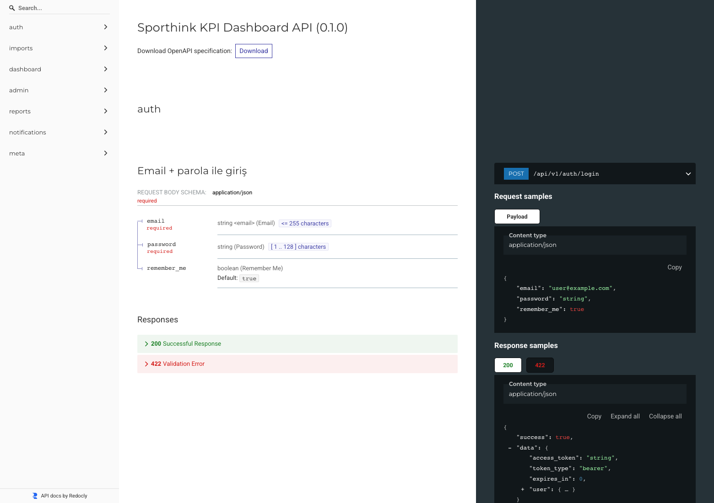
*ReDoc — okunabilir API dokümantasyonu (`/api/redoc`)*

### 6.1 Standart Yanıt Formatı

**Başarılı:**
```json
{ "success": true, "data": { ... } }
```
**Sayfalı liste:**
```json
{ "success": true, "data": [ ... ], "pagination": { "page": 1, "page_size": 50, "total": 1234 } }
```
**Hata:**
```json
{ "success": false, "error": { "code": "VALIDATION_ERROR", "message": "...", "field": "email" } }
```

### 6.2 HTTP Durum Kodları

| Durum | Kod | Örnek `error.code` |
|---|---|---|
| Başarılı | 200, 201, 204 | — |
| Kimlik gerekli | 401 | `AUTH_REQUIRED`, `TOKEN_EXPIRED` |
| Yetkisiz | 403 | `PERMISSION_DENIED` |
| Bulunamadı | 404 | `RESOURCE_NOT_FOUND` |
| Doğrulama | 422 | `VALIDATION_ERROR` |
| Çakışma | 409 | `EMAIL_ALREADY_EXISTS` |
| Rate limit | 429 | `RATE_LIMIT_EXCEEDED` |

### 6.3 Endpoint Listesi (Gruplu)

**Kimlik Doğrulama (`/auth`) — 11 operasyon**
| Method | Route | Görev | Yetki |
|---|---|---|---|
| POST | `/auth/login` | E-posta + parola ile giriş | Açık |
| POST | `/auth/refresh` | Refresh cookie ile yeni access token | Açık (cookie) |
| POST | `/auth/logout` | Refresh token revoke + cookie temizleme | Oturum |
| GET | `/auth/me` | Mevcut kullanıcı + izin listesi | Oturum |
| PATCH | `/auth/me` | Kendi profilini güncelle | Oturum |
| POST | `/auth/me/avatar` | Profil resmi yükle (PNG/JPG/WEBP, max 2MB) | Oturum |
| DELETE | `/auth/me/avatar` | Profil resmini kaldır | Oturum |
| POST | `/auth/me/change-password` | Parola değiştir (mevcut parola doğrulamalı) | Oturum |
| POST | `/auth/forgot-password` | Şifre sıfırlama e-postası gönder | Açık |
| POST | `/auth/reset-password` | Token ile yeni parola belirle | Açık (token) |
| GET | `/auth/verify-reset-token` | Davet/sıfırlama token geçerliliği | Açık (token) |

**Dashboard (`/dashboard`) — 13 GET operasyonu**
| Route | Görev |
|---|---|
| `/dashboard/overview` | Genel Özet: 9 KPI + chart blokları + şehir geo |
| `/dashboard/traffic` | GA4 trafik: KPI + trend + kanal/cihaz/şehir kırılımı |
| `/dashboard/meta` | Meta Ads: 8 KPI + trend + kampanya tablosu |
| `/dashboard/google` | Google Ads: 8 KPI + trend + kampanya tablosu |
| `/dashboard/ecom` | E-Ticaret: filtreli KPI + chart + sipariş tablosu |
| `/dashboard/ecom/order-detail` | Tek sipariş detayı (modal) |
| `/dashboard/campaign` | Kampanya analizi (Meta + Google birleşik) |
| `/dashboard/campaign-detail` | Tek kampanya detayı |
| `/dashboard/funnel` | Dönüşüm hunisi (View → Cart → Checkout → Purchase) |
| `/dashboard/cohort` | Cohort retention heatmap |
| `/dashboard/customers` | Müşteri analizi: KPI + demografik kırılımlar |
| `/dashboard/products` | Ürün performansı |
| `/dashboard/channel-analysis` | Kanal analizi: ROAS/dönüşüm karşılaştırması |

**Yönetim, Filtre ve Diğerleri**
| Grup | Operasyonlar |
|---|---|
| **Admin** (5) | `aggregations/rebuild`, `audit-logs`, `channel-mappings` (CRUD) |
| **Filters** (7) | `brands`, `categories`, `channels`, `cities`, `devices`, `order-statuses`, `payment-methods` |
| **Users** (7) | liste, oluştur (davet), detay, güncelle, sil, şifre sıfırlama, süper admin sayısı |
| **Roles** (5) | liste, oluştur, detay, güncelle, sil |
| **Saved Views** (5) | liste, oluştur, detay, güncelle, sil |
| **Imports** (7) | liste, yükle, veri tipleri, önizleme, detay, sil, hata CSV |
| **Reports** (6) | liste, oluştur, bölümler, detay, indir, sil |
| **Notifications** (5) | liste, okunmamış sayısı, tümünü okundu, oku, sil |
| **Export** (1) | `/export/{kind}` — CSV/JSON/XLSX dışa aktarma |
| **Permissions** (1) | İzin listesi (4 kategori altında) |
| **Sistem** (2) | `/` (API bilgisi), `/health` |

### 6.4 Örnek İstek / Yanıt

**İstek — `POST /api/v1/auth/login`:**
```json
{ "email": "kullanici@sporthink.com.tr", "password": "********" }
```
**Yanıt — `200 OK`:**
```json
{
  "success": true,
  "data": {
    "access_token": "eyJhbGci...",
    "token_type": "bearer",
    "expires_in": 900,
    "user": { "id": 1, "email": "...", "full_name": "...", "role": { "name": "Süper Admin" } }
  }
}
```
Refresh token yanıt gövdesinde **dönmez**; httpOnly cookie olarak set edilir.

### 6.5 Kimlik Doğrulama Gereksinimi

`/auth/login`, `/auth/refresh`, `/auth/forgot-password`, `/auth/reset-password`,
`/auth/verify-reset-token` ve `/health` dışındaki **tüm endpoint'ler** geçerli bir
access token gerektirir. Korumalı endpoint'lerin büyük çoğunluğu ayrıca belirli bir
**izin** (`require_permission`) ile korunur (bkz. Bölüm 9).

---

## 7. Klasör ve Dosya Yapısı

```
sporthink-kpi-dashboard/
├── backend/                       # FastAPI + Celery + MySQL
│   ├── app/
│   │   ├── main.py                # FastAPI app, middleware, exception handler
│   │   ├── config.py              # Pydantic Settings — tüm .env burada okunur
│   │   ├── dependencies.py        # get_db, get_current_user, require_permission
│   │   ├── seed.py                # İlk kurulum seed (permissions, süper admin)
│   │   ├── celery_app.py          # Celery yapılandırması
│   │   ├── api/v1/                # Router katmanı (7 dosya: auth, dashboard,
│   │   │                          #   admin, users, imports, reports, notifications)
│   │   ├── services/              # İş mantığı (22 dosya: kpi_service, auth_service,
│   │   │                          #   import_service, report_service, ...)
│   │   ├── repositories/          # DB erişimi (10 dosya)
│   │   ├── models/                # SQLAlchemy ORM (27 dosya)
│   │   ├── schemas/               # Pydantic şemalar (11 dosya)
│   │   ├── core/                  # permissions, exceptions, security, cache_keys
│   │   ├── tasks/                 # Celery görevleri (import, normalize, report)
│   │   ├── parsers/               # CSV/XLSX parser'lar (kaynak bazlı)
│   │   ├── middleware/            # Audit middleware
│   │   ├── templates/             # Jinja2: PDF rapor + e-posta şablonları
│   │   └── utils/                 # Saf yardımcı fonksiyonlar
│   ├── alembic/versions/          # 8 migration dosyası
│   ├── db/init/01-baseline.sql    # MySQL ilk açılış şeması
│   ├── tests/                     # pytest (unit + integration)
│   ├── requirements.txt
│   └── Dockerfile.dev
├── frontend/                      # React 19 + Vite + TS
│   ├── src/
│   │   ├── main.tsx               # Giriş noktası, provider'lar
│   │   ├── App.tsx                # Route tanımları
│   │   ├── pages/                 # Sayfa bileşenleri
│   │   │   ├── auth/              # Login, ForgotPassword, ResetPassword
│   │   │   ├── dashboard/         # 12 dashboard sayfası + _shared helpers
│   │   │   ├── admin/             # Kullanıcı/rol yönetimi, audit, bildirimler
│   │   │   ├── import/            # Import sihirbazı + geçmiş
│   │   │   ├── reports/           # Rapor üretim sayfası
│   │   │   ├── settings/          # Profil, güvenlik
│   │   │   └── error/             # 403, 404
│   │   ├── components/
│   │   │   ├── ui/                # shadcn primitive'leri
│   │   │   ├── feature/           # Domain bileşenleri (KPICard, ChartCard,
│   │   │   │                      #   TurkeyMap, charts/, filters/)
│   │   │   ├── layout/            # Sidebar, TopBar, PageHeader
│   │   │   └── common/            # ErrorBoundary, ProtectedRoute
│   │   ├── lib/api/               # Axios istemci + domain API modülleri
│   │   ├── stores/                # Zustand store'ları
│   │   ├── hooks/                 # Custom hook'lar
│   │   └── types/                 # TypeScript tipleri
│   ├── public/locales/            # TR/EN çeviri dosyaları
│   └── package.json
├── docs/overview/                 # 16 markdown dokümantasyon (tek doğru kaynak)
├── nginx/                         # Üretim reverse proxy yapılandırması
├── mysql/                         # my.cnf ve init scriptleri
├── scripts/deploy.sh              # Üretim dağıtım scripti
├── docker-compose.dev.yml         # Geliştirme stack
├── docker-compose.prod.yml        # Üretim override
├── docker-compose.demo.yml        # ngrok demo
└── rapor/                         # Bu teknik rapor
```

---

## 8. Önemli İş Mantığı ve Akışlar

### 8.1 KPI Hesaplama (`services/kpi_service.py`)

Tüm KPI formülleri **tek dosyada** (`kpi_service.py`, ~2400 satır) toplanır. Her KPI saf
bir fonksiyondur: aynı girdi → aynı çıktı, yalnızca DB'den okur.

- KPI'lar ham tablolardan değil, önceden toplanmış `kpi_daily_aggregates` tablosundan
  hesaplanır (performans).
- Hesaplama `repositories/kpi_aggregate_repository.py` üzerinden yapılır; bu repository
  `channels`, `devices`, `platforms` filtrelerini destekler (cross-filter temeli).
- Her KPI mevcut + önceki dönem için hesaplanır; karşılaştırma modu `sequential`
  (ardışık) veya `yoy` (geçen yıl) olabilir.
- NULL anlamlıdır: sıfıra bölme durumunda KPI değeri `None` döner ("veri yok"), 0'a
  düşürülmez.

### 8.2 Import Pipeline

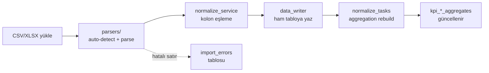
```mermaid
flowchart LR
    A[CSV/XLSX yükle] --> B[parsers/<br/>auto-detect + parse]
    B --> C[normalize_service<br/>kolon eşleme]
    C --> D[data_writer<br/>ham tabloya yaz]
    D --> E[normalize_tasks<br/>aggregation rebuild]
    E --> F[kpi_*_aggregates<br/>güncellenir]
    B -.->|hatalı satır| G[import_errors<br/>tablosu]
```

- Parser fail-fast etmez; hatalı satırları toplayıp `import_errors` tablosuna yazar,
  ilk 100 hatayı frontend'e gösterir.
- `parsers/auto_detector.py` kolon başlıklarını fuzzy match ile tanır; düşük güvende
  manuel eşleme sihirbazı sunulur.
- Tüm import işi Celery task'ı olarak çalışır; idempotenttir (aynı dosya iki kez
  işlenirse duplikat üretmez).

### 8.3 Cross-Filter Mekanizması

Genel Özet ve Kanal Analizi sayfalarında, kanal donut grafiğine veya Türkiye haritasında
bir şehre tıklamak `useFiltersStore` (Zustand) durumunu günceller; TanStack Query'nin
sorgu anahtarı bu duruma bağlı olduğu için tüm sayfa otomatik yeniden yüklenir. Backend
`/dashboard/overview` endpoint'i `channels`/`devices` filtre parametrelerini kabul eder.
Filtreler ayrıca çoklu seçim dropdown'lu bir panelden de yönetilebilir (bkz. Bölüm 11,
Filtre Paneli ekran görüntüsü).

### 8.4 PDF Rapor Üretimi

Kullanıcı dönem + bölüm seçer → `POST /reports` bir `reports` kaydı oluşturur ve Celery
task'ı enqueue eder → worker veriyi toplar, Jinja2 şablonundan HTML üretir, WeasyPrint
ile PDF render eder → durum `completed` olur → frontend polling ile durumu görür ve
PDF'i indirir.

### 8.5 RBAC İzin Çözümleme

`require_permission(Permission.X)` dependency'si her korumalı endpoint'te çalışır:
kullanıcının izinleri rol üzerinden çözümlenir, sonuç Redis'te 5 dakika cache'lenir
(`user_perms:{id}`). Süper Admin rolü (`is_system=True`) tüm izin kontrollerini
**tek noktada** bypass eder.

---

## 9. Kimlik Doğrulama ve Güvenlik

### 9.1 Kimlik Doğrulama Akışı

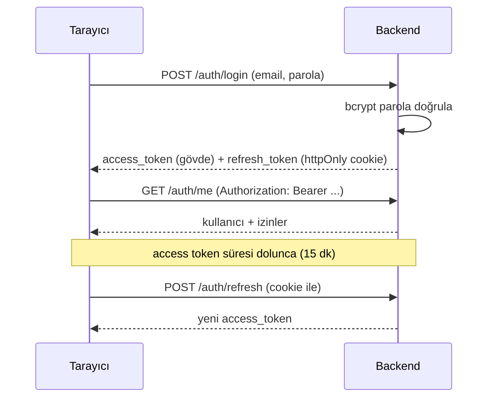
```mermaid
sequenceDiagram
    participant U as Tarayıcı
    participant API as Backend
    U->>API: POST /auth/login (email, parola)
    API->>API: bcrypt parola doğrula
    API-->>U: access_token (gövde) + refresh_token (httpOnly cookie)
    U->>API: GET /auth/me (Authorization: Bearer ...)
    API-->>U: kullanıcı + izinler
    Note over U,API: access token süresi dolunca (15 dk)
    U->>API: POST /auth/refresh (cookie ile)
    API-->>U: yeni access_token
```

- **Access token:** JWT, 15 dakika ömürlü, yanıt gövdesinde döner, frontend'de yalnızca
  bellekte (Zustand non-persist) tutulur — XSS riskini azaltır.
- **Refresh token:** 7 gün ömürlü, **httpOnly cookie** olarak set edilir, hash'lenmiş
  hali `refresh_tokens` tablosunda saklanır; logout'ta revoke edilir.

### 9.2 Yetkilendirme (RBAC)

İzinler `core/permissions.py` içinde tek bir enum'da, 4 kategori altında tanımlıdır:

| Kategori | İçerik |
|---|---|
| **1. Veri Görüntüleme** | Dashboard, trafik, ads, e-ticaret, funnel, cohort, ürün, müşteri, kanal sayfaları (11 izin) |
| **2. Veri İşlemleri** | Import, kanal eşleme, kayıtlı görünüm, export, rapor izinleri (16 izin) |
| **3. Kullanıcı ve Rol** | Kullanıcı/rol CRUD, şifre sıfırlama (9 izin) |
| **4. Sistem ve Loglar** | Log görüntüleme, sistem ayarları (5 izin) |

İzinler `app/seed.py` ile DB'ye senkronize edilir; tek doğru kaynak enum'dur. Frontend de
aynı izin kodlarını `lib/permissions.ts`'te yansıtır ancak frontend kontrolü yalnızca
UX içindir — asıl güvenlik backend'dedir. RBAC'in yönetim arayüzü (kullanıcı listesi, rol
atama) ve tüm sistem olaylarının izlendiği denetim kaydı ekranı Bölüm 11'de gösterilmiştir.

### 9.3 Güvenlik Önlemleri

| Önlem | Uygulanışı |
|---|---|
| Parola hashleme | bcrypt, cost 12 (`passlib`) |
| Brute-force koruması | `failed_login_attempts` + `locked_until`; ayrıca `slowapi` rate limit |
| Token güvenliği | Access kısa ömürlü + bellekte; refresh httpOnly cookie + DB'de hash'li |
| SQL injection | SQLAlchemy parametreli sorgular; ham SQL string concat yok |
| Yetki sızması | ORM modeli doğrudan response'a dönmez; her zaman Pydantic şemaya çevrilir (parola hash'i sızmaz) |
| Audit log | Tüm mutasyon istekleri (POST/PATCH/DELETE) ve auth olayları `audit_logs`'a yazılır |
| CORS | `config.py`'de allowlist; üretimde yalnızca `FRONTEND_ORIGIN` |
| Hassas veri (KVKK) | Parola, token, kişisel veri log'a yazılmaz; yalnızca olay adı + ID loglanır |

### 9.4 Hassas Veri Yönetimi

`.env` dosyası `.gitignore`'dadır; commit edilmez. Hassas ortam değişkenleri
(`MYSQL_ROOT_PASSWORD`, `JWT_SECRET_KEY`, `SUPER_ADMIN_PASSWORD`, SMTP kimlik bilgileri)
yalnızca dağıtım ortamında bulunur. Audit log'a kişisel veri değeri değil, yalnızca
alan adı yazılır.

---

## 10. Kurulum ve Çalıştırma Rehberi

### 10.1 Gereksinimler

- Docker 27+ ve Docker Compose 2.30+
- (Geliştirme için ek bir şey gerekmez; tüm stack konteynerde çalışır)

### 10.2 Ortam Değişkenleri

Tüm değişkenler `.env.example` dosyasında tam listelenir. Kritik olanlar:

| Değişken | Açıklama |
|---|---|
| `MYSQL_ROOT_PASSWORD`, `MYSQL_DATABASE`, `MYSQL_USER`, `MYSQL_PASSWORD` | Veritabanı kimlik bilgileri |
| `JWT_SECRET_KEY` | JWT imzalama anahtarı (min 64 karakter) |
| `FRONTEND_ORIGIN` | CORS ve e-posta linkleri için frontend adresi |
| `SUPER_ADMIN_EMAIL`, `SUPER_ADMIN_PASSWORD` | İlk süper admin (seed ile oluşur) |
| `SMTP_*`, `MAIL_FROM` | E-posta gönderimi (Gmail SMTP) |

### 10.3 Geliştirme Ortamı Kurulumu

```bash
# 1. Ortam dosyasını hazırla
cp .env.example .env          # değerleri düzenle

# 2. Tüm stack'i ayağa kaldır
docker compose -f docker-compose.dev.yml up -d --build

# 3. Veritabanı migration (gerekirse)
docker compose -f docker-compose.dev.yml exec backend alembic upgrade head

# 4. Seed (süper admin + izinler + kanal eşleme)
docker compose -f docker-compose.dev.yml exec backend python -m app.seed
```

Erişim adresleri:
- Frontend: `http://localhost:5173`
- Backend API: `http://localhost:8000`
- Swagger: `http://localhost:8000/api/docs`
- ReDoc: `http://localhost:8000/api/redoc`

### 10.4 Üretim Dağıtımı

`scripts/deploy.sh` ile Ubuntu 24.04 VDS üzerinde: kod çek → frontend build → image
build → migration → compose up → health check. İlk kurulumda `--init` modu
`alembic stamp head` kullanır (bkz. Bölüm 12 — baseline.sql notu).

---

## 11. Ekran Görüntüleri

Aşağıdaki görüntüler çalışan uygulamadan (karanlık tema) alınmıştır.

### Giriş Ekranı
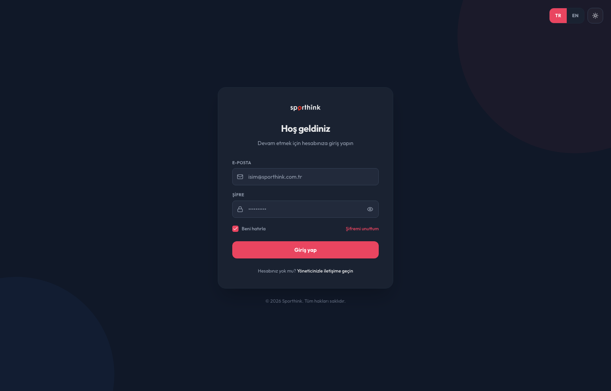

### Genel Özet
9 hero/destek KPI, ciro-sipariş trendi, kanal donut'u, Türkiye şehir haritası, dönüşüm
hunisi ve en çok satan ürünler tablosu. Filtre çubuğu ve cross-filter bu sayfada.


### Trafik (GA4)
7 trafik KPI'si, günlük oturum trendi, kanal/cihaz/şehir kırılımları.


### Meta Ads
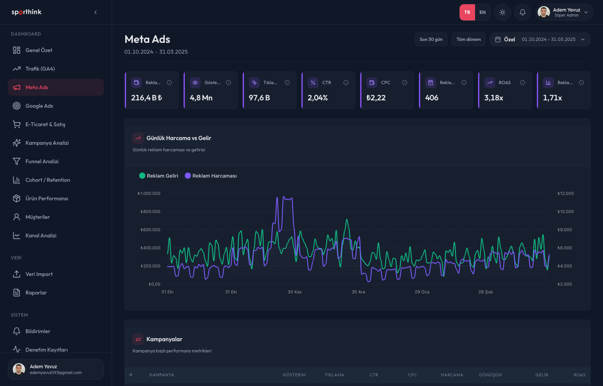

### Google Ads
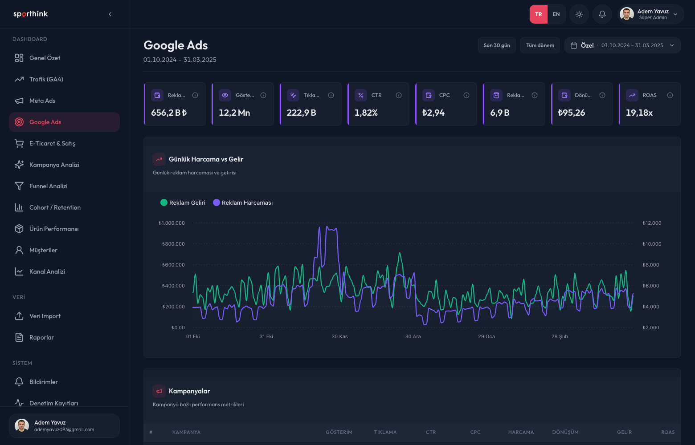

### E-Ticaret
Filtre çubuğu (kategori/marka/durum/ödeme), 6 KPI, trend, kırılım grafikleri ve sipariş
tablosu.
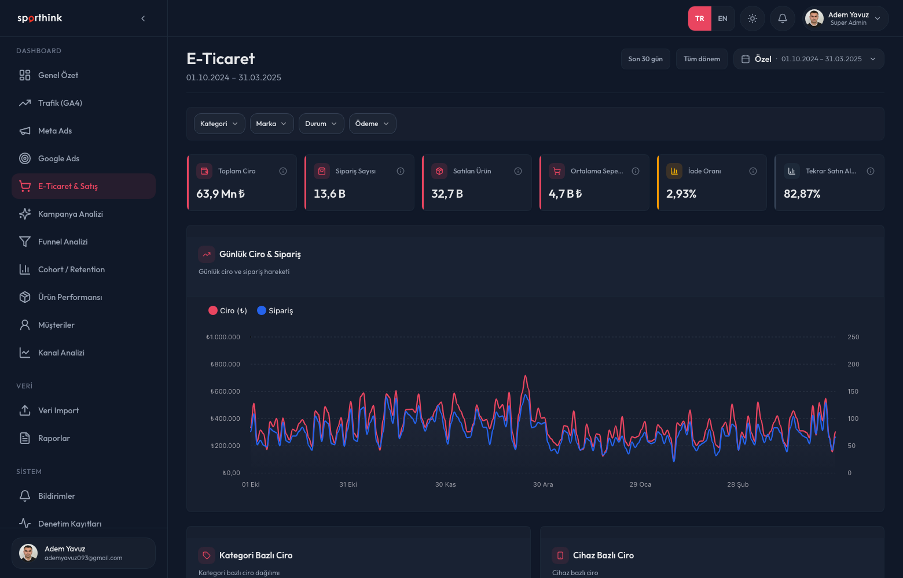

### Kampanya Analizi


### Funnel Analizi
Gradyan funnel barları, adımlar arası düşüş yüzdeleri, genel dönüşüm.
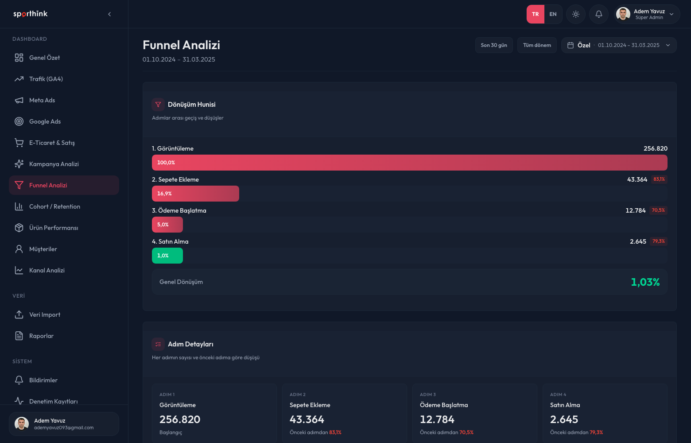

### Cohort / Retention
İlk sipariş ayına göre retention heatmap'i.


### Ürün Performansı
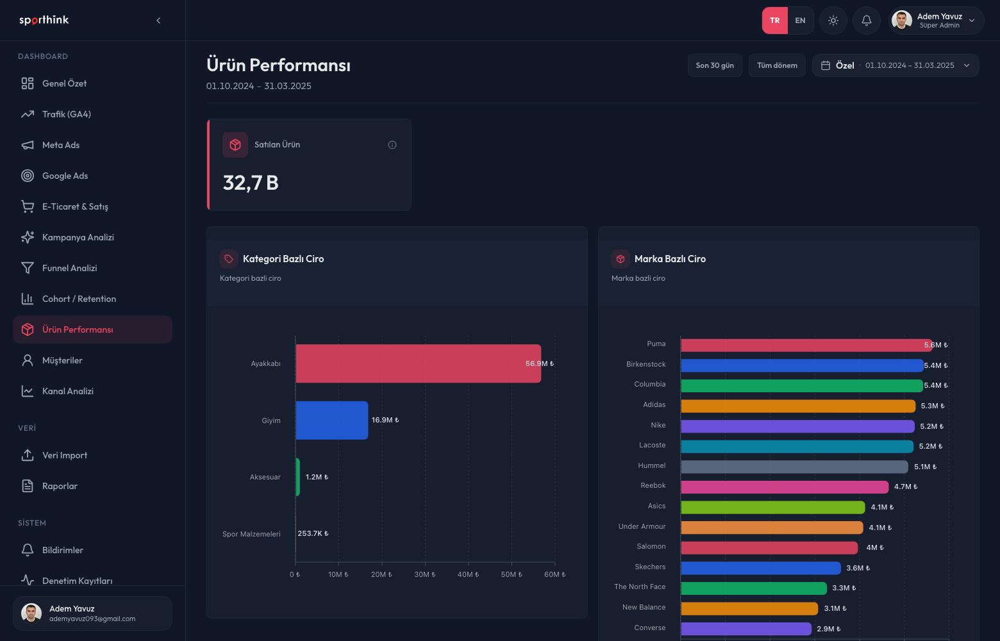

### Müşteriler
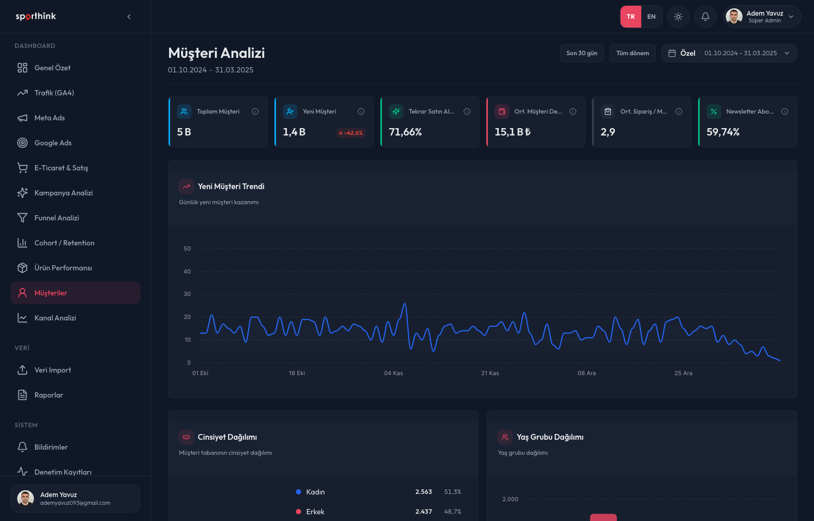

### Kanal Analizi
Yapışkan filtre çubuğu (GlobalFilterBar) ile filtrelenebilir kanal performansı.
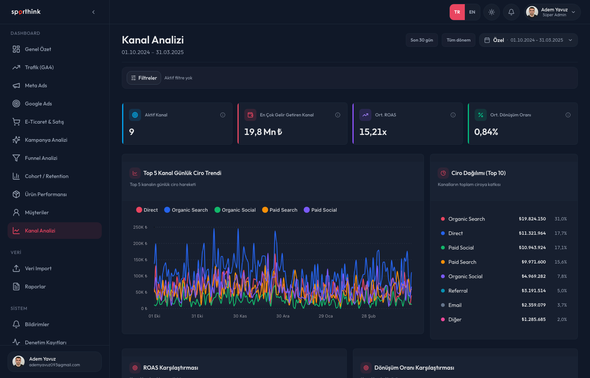

### Veri Import


### Raporlar
PDF rapor üretim formu ve geçmiş raporlar tablosu.


### Yönetim ve Sistem Ekranları

**Kullanıcı ve Rol Yönetimi** — kullanıcı listesi, rol atama, arama ve durum filtreleri
(Kullanıcılar / Roller sekmeli). RBAC'in yönetim arayüzü.
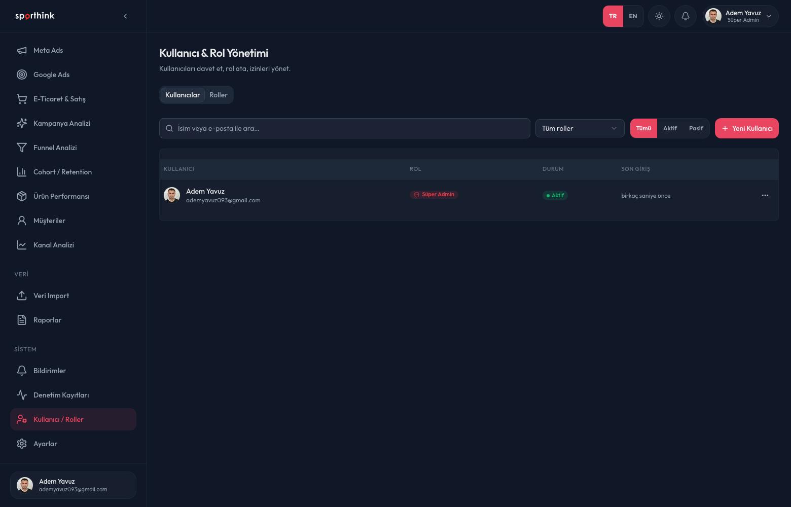

**Denetim Kayıtları (Audit Log)** — sistemdeki tüm mutasyon ve kimlik doğrulama
olaylarının kaydı.
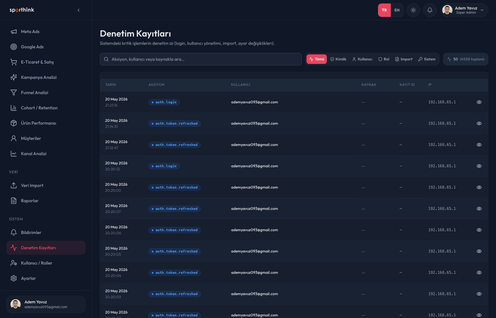

**Bildirim Merkezi** — kullanıcı bazlı, sunucu kaynaklı bildirimler (import tamamlandı,
rapor üretildi vb.).
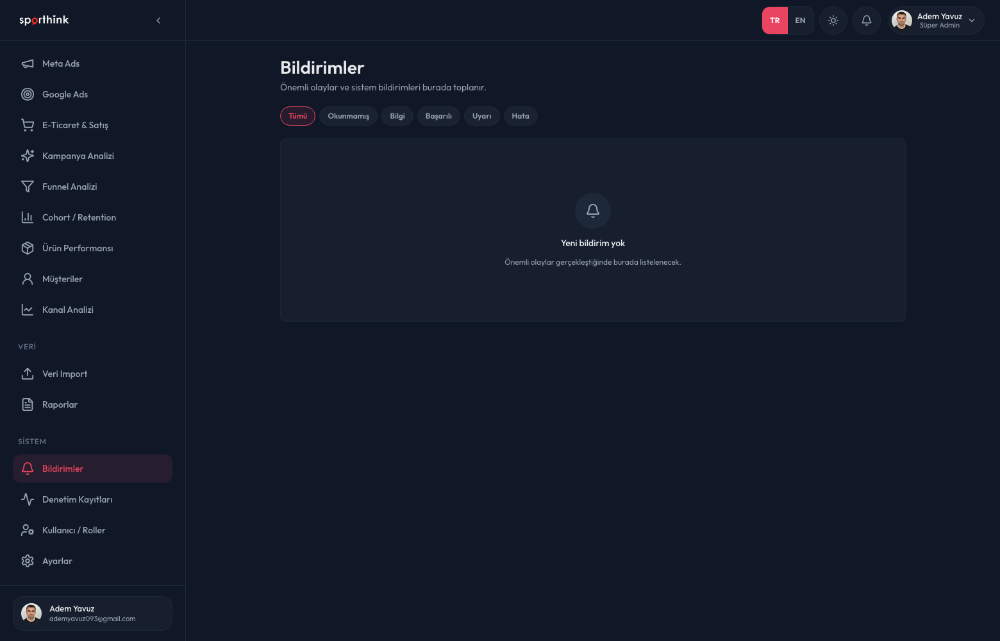

**Profil Ayarları** — kullanıcının kendi profil bilgileri, avatar ve güvenlik ayarları.
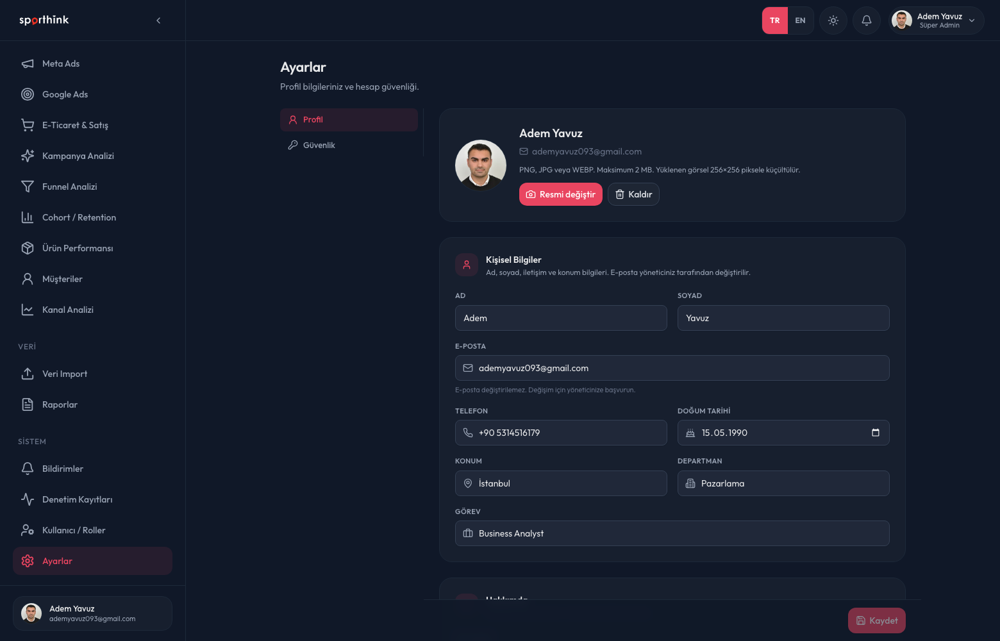

**Import Geçmişi** — geçmiş CSV import işlemlerinin durumu, satır sayıları ve süreleri.
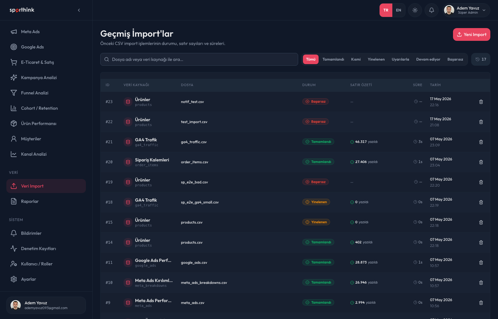

### Filtre Paneli

Çoklu seçim dropdown yapısındaki temel filtreler (kanal, cihaz, şehir) ve aralık tabanlı
gelişmiş filtreler. "Uygula" ile global filtre durumuna yazılır.


### Aydınlık Tema

Sistem aydınlık ve karanlık tema arasında geçişi destekler; tercih `localStorage`'da
saklanır. Aşağıda Genel Özet sayfasının aydınlık tema görünümü:
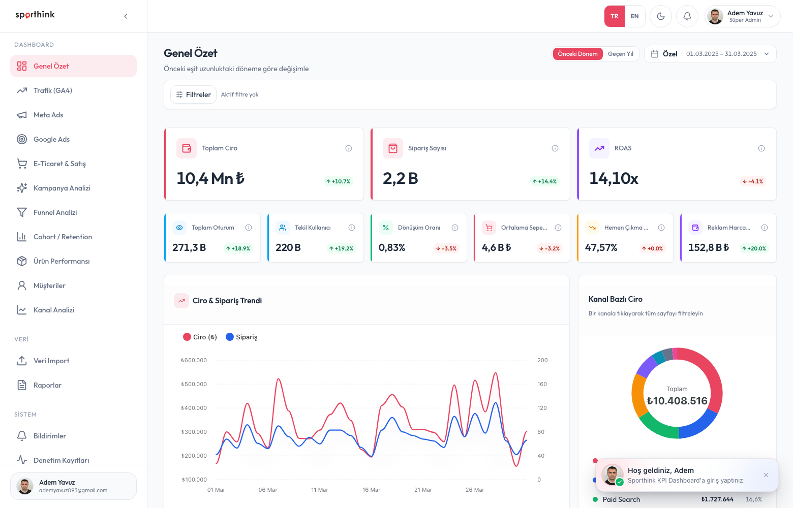

---

## 12. Sonuç ve Öneriler

### 12.1 Genel Değerlendirme

Sporthink KPI Dashboard, bir bitirme projesi için **olağanüstü kapsamlı ve teknik olarak
olgun** bir sistemdir. Katmanlı backend mimarisi, 77 endpoint'lik tam dokümante API,
RBAC, asenkron iş kuyruğu, kapsamlı test paketi ve konteynerize dağıtım ile profesyonel
bir SaaS ürününe yakın bir seviyededir.

### 12.2 Güçlü Yönler

- **Temiz katmanlı mimari:** Router/Service/Repository ayrımı istisnasız uygulanmış;
  bakım ve test kolaylığı yüksek.
- **Tek doğru kaynak disiplini:** İzinler, KPI formülleri, cache key'leri tek noktada.
- **Performans bilinci:** Pre-aggregation tabloları ve Redis cache ile hızlı dashboard.
- **Tam dokümantasyon:** `docs/overview/` altında 16 referans doküman + otomatik
  OpenAPI.
- **Profesyonel frontend:** Tutarlı tasarım dili, i18n, karanlık tema, cross-filter,
  erişilebilir bileşenler.
- **Test kapsamı:** Backend pytest paketi ve uçtan uca doğrulama mevcut.

### 12.3 İyileştirme Önerileri (Önceliklendirilmiş)

| Öncelik | Bulgu | Öneri |
|---|---|---|
| **Yüksek** | `db/init/01-baseline.sql` migration head'inden sapmış (`0004`, `0005`, `0008` eksik). Sıfırdan kurulumda hatalı şema üretir. | `baseline.sql`'i mevcut doğru şemadan yeniden üretmek (`mysqldump`), böylece `stamp head` dürüst çalışır. |
| **Orta** | Frontend production build'de bazı chunk'lar 500 KB üzeri uyarı veriyor. | Route bazlı code-splitting zaten var; ağır kütüphaneler (ApexCharts) için `manualChunks` ile ayrı bundle. |
| **Orta** | `permissions` tablosundaki satır sayısı ile enum arasında küçük sapma olabilir (test koşularından kalan kayıtlar). | `seed.py`'yi düzenli çalıştırmak; orphan izinleri temizleyen bir bakım scripti. |
| **Düşük** | Bazı kod yorumlarında Türkçe karakterler ASCII yazılmış. | Kullanıcıya görünür değil; isteğe bağlı temizlik. |
| **Düşük** | Demo amaçlı `FRONTEND_ORIGIN` ngrok adresine ayarlı kalabiliyor. | Lokal geliştirmede `.env`'i `http://localhost:5173`'e döndürmek. |
| **Gelecek** | Veri yalnızca manuel CSV ile geliyor. | GA4/Meta/Google Ads canlı API entegrasyonu (roadmap'te). |

### 12.4 Sonuç

Proje, tanımlanan problemi (dağınık pazarlama/e-ticaret verisi) net biçimde çözmekte;
mimari kararlar tutarlı, kod kalitesi yüksek ve sistem üretime alınmaya hazıra yakındır.
Tek kritik teknik borç `baseline.sql` sapmasıdır ve düşük eforla giderilebilir. Genel
değerlendirme: **başarılı, profesyonel kalitede, üretim seviyesine yakın bir sistem.**

---

*Bu rapor Sporthink KPI Dashboard projesinin Mayıs 2026 tarihli kaynak kodu temel
alınarak hazırlanmıştır.*
