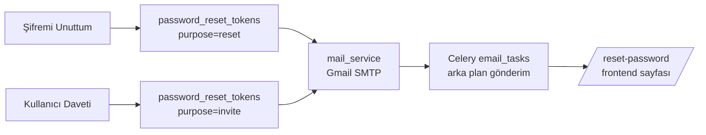
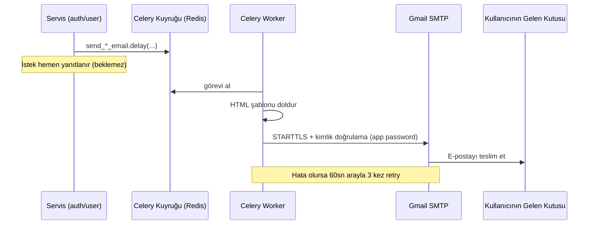
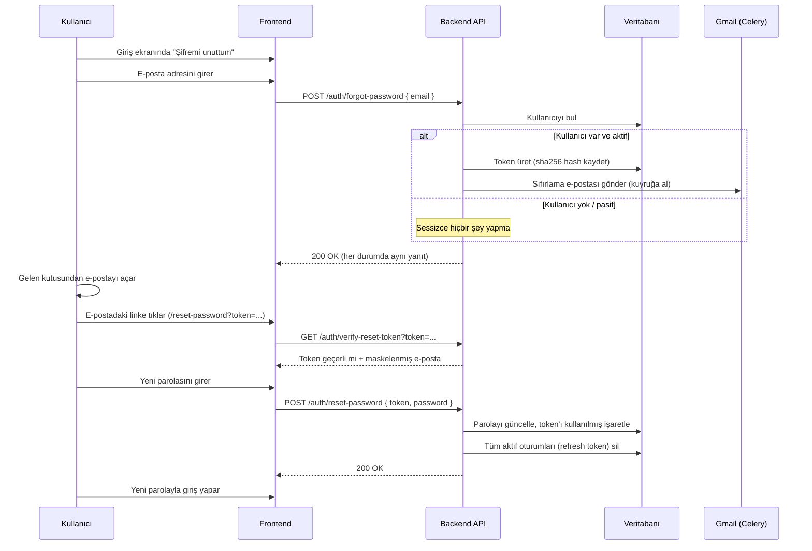
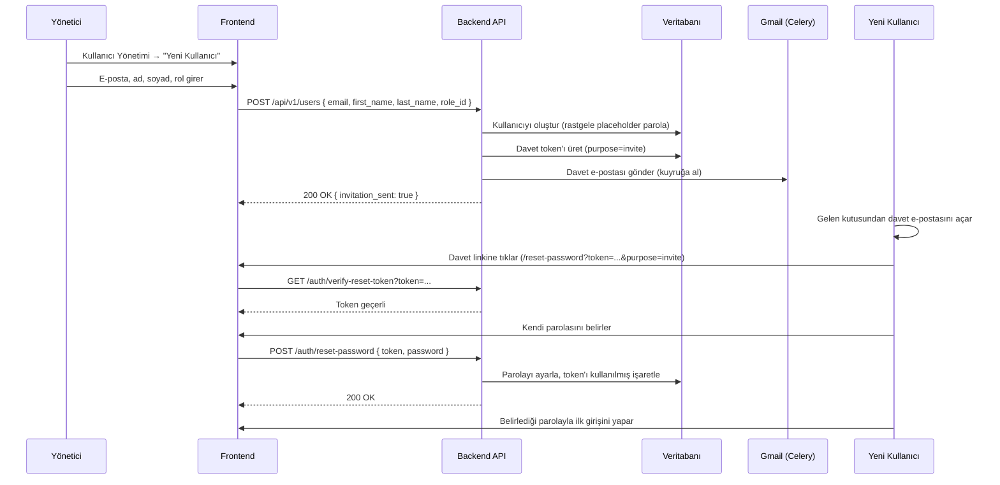
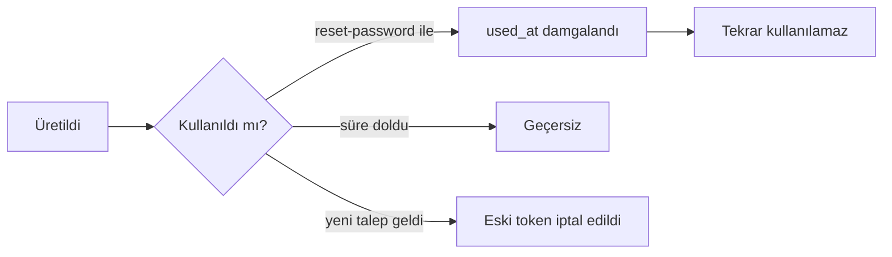

# Şifre Sıfırlama, Kullanıcı Daveti ve E-Posta Gönderimi

> Bu belge, sistemin **"Şifremi Unuttum"** akışını, **kullanıcı davet** akışını ve
> bunların altında yatan **Gmail SMTP e-posta gönderim** mekanizmasını adım adım anlatır.
> Tüm açıklamalar mevcut kaynak koddan doğrulanmıştır.
>
> 📷 **Not:** Ekran görüntüsü yer tutucuları `> 📷 EKRAN GÖRÜNTÜSÜ:` satırlarıyla
> belirtilmiştir. Görselleri çekip `gorseller/` klasörüne ekledikten sonra, hemen
> altındaki yorum satırını (`<!-- ... -->`) açarak görseli yerleştirebilirsiniz.

---

## İçindekiler

1. [Genel Bakış](#1-genel-bakış)
2. [E-Posta Gönderim Altyapısı (Gmail SMTP)](#2-e-posta-gönderim-altyapısı-gmail-smtp)
3. [Şifremi Unuttum Akışı](#3-şifremi-unuttum-akışı)
4. [Kullanıcı Davet Akışı](#4-kullanıcı-davet-akışı)
5. [Token Yönetimi ve Güvenlik](#5-token-yönetimi-ve-güvenlik)
6. [E-Posta Şablonları](#6-e-posta-şablonları)
7. [Yapılandırma (.env)](#7-yapılandırma-env)
8. [Güvenlik Özeti](#8-güvenlik-özeti)

---

## 1. Genel Bakış

Sistemde kullanıcının parola belirlemesini gerektiren **iki akış** vardır ve ikisi de
**aynı altyapıyı** paylaşır:

| Akış | Tetikleyen | Amaç |
|---|---|---|
| **Şifremi Unuttum** | Kullanıcının kendisi (giriş ekranından) | Mevcut kullanıcı parolasını sıfırlar |
| **Kullanıcı Daveti** | Bir yönetici (Kullanıcı Yönetimi sayfasından) | Yeni kullanıcı ilk parolasını kurar |

Ortak altyapı:

- **`password_reset_tokens`** tablosu — her iki akış için tek seferlik token saklar.
  Token'lar `purpose` alanı ile ayrışır: `reset` (sıfırlama) veya `invite` (davet).
- **`password_reset_service.py`** — token üretimi, doğrulama ve tüketme mantığı.
- **`mail_service.py`** — Gmail SMTP üzerinden e-posta gönderimi.
- **`email_tasks.py`** — e-postaları arka planda (Celery) gönderen görevler.
- Ortak **frontend sayfası** — `/reset-password?token=...&purpose=...`. Hem sıfırlama
  hem davet bu sayfayı kullanır; `purpose` parametresi yalnızca arayüz metnini değiştirir.

---

## 2. E-Posta Gönderim Altyapısı (Gmail SMTP)

### 2.1 Nasıl Çalışır

E-postalar **Gmail'in SMTP sunucusu** üzerinden gönderilir. Akış şöyledir:

1. Bir servis (örn. şifre sıfırlama) e-posta gönderilmesi gerektiğine karar verir.
2. Gönderim doğrudan yapılmaz; bir **Celery görevi** kuyruğa eklenir (`*.delay(...)`).
   Böylece kullanıcının isteği SMTP gecikmesini (1-3 saniye) beklemez.
3. Arka plandaki **Celery worker** görevi alır, ilgili HTML şablonu doldurur ve
   `mail_service.send_email(...)` ile Gmail SMTP'ye bağlanıp e-postayı yollar.
4. SMTP hatası olursa görev **otomatik olarak 3 kez, 60 saniye arayla** yeniden dener.

### 2.2 Teknik Bileşenler

| Bileşen | Dosya | Görevi |
|---|---|---|
| Mail servisi | `app/services/mail_service.py` | MIME multipart (text + HTML) e-posta üretir, `aiosmtplib` ile STARTTLS üzerinden gönderir |
| E-posta görevleri | `app/tasks/email_tasks.py` | `send_invitation_email` ve `send_password_reset_email` Celery görevleri |
| Şablonlar | `app/templates/emails/` | `invite_tr/en.html`, `reset_tr/en.html` |
| Kütüphane | `aiosmtplib` 3.0.2 | Asenkron SMTP istemcisi |

### 2.3 Gmail Özellikleri ve Sınırları

- **Sunucu:** `smtp.gmail.com`, port `587`, STARTTLS ile şifreli bağlantı.
- **Kimlik doğrulama:** Gmail hesabının normal parolası değil, **uygulama şifresi
  (app password)** kullanılır (bkz. Bölüm 7).
- **Gönderen adresi:** Gmail SMTP'de "From" adresi, SMTP kullanıcısı ile **aynı olmak
  zorundadır** (`config.py` → `effective_mail_from`).
- **Günlük limit:** Gmail SMTP relay'inin günlük gönderim limiti yaklaşık **500
  e-posta/gün**'dür. Üretimde kurumsal bir SMTP servisi önerilir (`config.py` notu).
- **SMTP yapılandırılmamışsa:** `smtp_user` boşsa `send_email` sessizce `False` döner
  ve link log'a yazılır — geliştirme ortamında mail kutusu olmadan akışı test etmeyi
  sağlar.

---

## 3. Şifremi Unuttum Akışı

Kullanıcının parolasını unuttuğunda kendi başına sıfırlayabilmesini sağlar.

### 3.1 Adım Adım Akış

### 3.2 İlgili Endpoint'ler

| Method | Route | Görevi |
|---|---|---|
| POST | `/api/v1/auth/forgot-password` | E-posta alır, varsa sıfırlama linki gönderir |
| GET | `/api/v1/auth/verify-reset-token` | Token geçerliliğini kontrol eder (reset sayfası açılışında) |
| POST | `/api/v1/auth/reset-password` | Token + yeni parola alır, parolayı günceller |

### 3.3 Kod Referansları

- **Endpoint'ler:** `app/api/v1/auth.py` → `forgot_password`, `verify_reset_token`,
  `reset_password`
- **İş mantığı:** `app/services/password_reset_service.py` →
  `request_password_reset()`, `verify_token()`, `consume_token_and_set_password()`
- **E-posta görevi:** `app/tasks/email_tasks.py` → `send_password_reset_email`

### 3.4 Önemli Davranışlar

- **E-posta sızdırma koruması:** Girilen e-posta sistemde kayıtlı olmasa veya kullanıcı
  pasif olsa bile, endpoint **her zaman aynı `200` yanıtını** döner. Böylece bir
  saldırgan "bu e-posta kayıtlı mı?" bilgisini öğrenemez (email enumeration koruması).
- **Token ömrü:** Sıfırlama token'ı varsayılan **60 dakika** geçerlidir.
- **Tek aktif token:** Yeni bir sıfırlama talebi, kullanıcının önceki aktif sıfırlama
  token'larını iptal eder.
- **Oturum temizliği:** Parola başarıyla değiştiğinde kullanıcının **tüm aktif
  oturumları** (refresh token'lar) silinir; kullanıcı her cihazda yeniden giriş yapmak
  zorunda kalır.
- **Maskelenmiş e-posta:** `verify-reset-token` yanıtında e-posta maskelenir
  (`ademyavuz@gmail.com` → `ad***@gmail.com`).

### 3.5 Ekran Görüntüleri

> 📷 EKRAN GÖRÜNTÜSÜ: Giriş ekranındaki "Şifremi unuttum" bağlantısı
<!--  -->

> 📷 EKRAN GÖRÜNTÜSÜ: "Şifremi Unuttum" sayfası — e-posta giriş formu
<!--  -->

> 📷 EKRAN GÖRÜNTÜSÜ: E-posta gönderildi onay mesajı
<!--  -->

> 📷 EKRAN GÖRÜNTÜSÜ: Gmail gelen kutusunda sıfırlama e-postası
<!--  -->

> 📷 EKRAN GÖRÜNTÜSÜ: Yeni parola belirleme sayfası (/reset-password)
<!--  -->

---

## 4. Kullanıcı Davet Akışı

Bir yöneticinin sisteme yeni bir kullanıcı eklemesini sağlar. Yönetici parola
belirlemez; davet edilen kullanıcı kendi parolasını e-postadaki linkten kurar.

### 4.1 Adım Adım Akış

### 4.2 İlgili Endpoint'ler

| Method | Route | Görevi |
|---|---|---|
| POST | `/api/v1/users` | Yeni kullanıcı oluşturur ve davet e-postası gönderir |
| GET | `/api/v1/auth/verify-reset-token` | Davet token'ını doğrular |
| POST | `/api/v1/auth/reset-password` | Davet edilen kullanıcı ilk parolasını belirler |

### 4.3 Kod Referansları

- **Kullanıcı oluşturma:** `app/services/user_management_service.py` → `create_user()`
- **Davet token + e-posta:** `app/services/password_reset_service.py` →
  `create_invitation()`
- **E-posta görevi:** `app/tasks/email_tasks.py` → `send_invitation_email`

### 4.4 Önemli Davranışlar

- **Parola sızmaz:** Yeni kullanıcı, login yapılamayacak **rastgele bir placeholder
  parola** ile oluşturulur. Yönetici parola belirlemez; backend yanıtında parola yer
  almaz (`invitation_sent: true` döner).
- **Yetki gereksinimi:** Kullanıcı oluşturma işlemi `users.create` iznini gerektirir.
- **Token ömrü:** Davet token'ı varsayılan **7 gün (168 saat)** geçerlidir — sıfırlama
  token'ından (60 dk) çok daha uzun, çünkü davet edilen kişinin e-postayı görmesi zaman
  alabilir.
- **Aynı sayfa, farklı metin:** Davet linki sıfırlama ile aynı `/reset-password`
  sayfasını açar; `purpose=invite` parametresi arayüz metnini "Şifre belirle" olarak
  değiştirir.
- **Davet süresi dolarsa:** Yönetici yeni bir davet gönderebilir (yeni token üretilir,
  eski iptal edilir).

### 4.5 Ekran Görüntüleri

> 📷 EKRAN GÖRÜNTÜSÜ: Kullanıcı Yönetimi sayfası — "Yeni Kullanıcı" butonu
<!--  -->

> 📷 EKRAN GÖRÜNTÜSÜ: Yeni kullanıcı davet formu (e-posta, ad, soyad, rol)
<!--  -->

> 📷 EKRAN GÖRÜNTÜSÜ: Davet gönderildi onay mesajı
<!--  -->

> 📷 EKRAN GÖRÜNTÜSÜ: Gmail gelen kutusunda davet e-postası
<!--  -->

> 📷 EKRAN GÖRÜNTÜSÜ: Davet edilen kullanıcının parola belirleme sayfası
<!--  -->

---

## 5. Token Yönetimi ve Güvenlik

Her iki akış da `password_reset_tokens` tablosunu kullanır.

### 5.1 Token Üretimi

- Token, `secrets.token_urlsafe(32)` ile üretilen **kriptografik olarak güvenli, ~43
  karakterlik** URL-safe bir dizedir.
- Veritabanında **düz metin token saklanmaz**; yalnızca SHA-256 hash'i tutulur
  (`token_hash`). Doğrulama sırasında gelen token'ın hash'i ile karşılaştırılır.
- Token URL'i şu formattadır:
  `{FRONTEND_ORIGIN}/reset-password?token={token}&purpose={reset|invite}`

### 5.2 `purpose` ve TTL

| Amaç (`purpose`) | Kullanım | Varsayılan Geçerlilik |
|---|---|---|
| `reset` | Şifremi Unuttum | 60 dakika (`RESET_TOKEN_EXPIRE_MINUTES`) |
| `invite` | Kullanıcı Daveti | 7 gün / 168 saat (`INVITE_TOKEN_EXPIRE_HOURS`) |

### 5.3 Token Yaşam Döngüsü

- Bir token kullanıldığında `used_at` alanı damgalanır ve tekrar kullanılamaz.
- Aynı amaçlı yeni bir token üretildiğinde, kullanıcının önceki aktif token'ları iptal
  edilir (tek aktif token kuralı).
- Parola belirlendiğinde kullanıcının tüm `refresh_tokens` kayıtları silinir.

### 5.4 İlgili Tablo: `password_reset_tokens`

| Kolon | Açıklama |
|---|---|
| `token_hash` | Token'ın SHA-256 hash'i (düz metin saklanmaz) |
| `purpose` | `reset` veya `invite` |
| `expires_at` | Son geçerlilik zamanı |
| `used_at` | Kullanım zamanı (NULL ise henüz kullanılmamış) |
| `requested_ip` | Talebin geldiği IP |

---

## 6. E-Posta Şablonları

E-postalar `app/templates/emails/` altındaki HTML şablonlarından üretilir. Şablonlar
`{degisken}` yer tutucuları içerir; `mail_service.render_template` bunları doldurur
(Jinja2 yerine hafif `str.format_map` yaklaşımı).

| Şablon | Kullanım | Doldurulan Değişkenler |
|---|---|---|
| `invite_tr.html` / `invite_en.html` | Kullanıcı daveti | `first_name`, `inviter_name`, `role_name`, `action_url`, `expires_in` |
| `reset_tr.html` / `reset_en.html` | Şifre sıfırlama | `first_name`, `action_url`, `expires_in` |

Şablon dili, kullanıcının/davet edenin dil tercihine (`tr` / `en`) göre seçilir.
E-posta konusu da dile göre belirlenir (örn. davet için
*"... sizi Sporthink Dashboard'a davet ediyor"*).

> 📷 EKRAN GÖRÜNTÜSÜ: Davet e-postası şablonunun render edilmiş hali
<!--  -->

> 📷 EKRAN GÖRÜNTÜSÜ: Şifre sıfırlama e-postası şablonunun render edilmiş hali
<!--  -->

---

## 7. Yapılandırma (.env)

E-posta gönderiminin çalışması için aşağıdaki ortam değişkenleri ayarlanmalıdır.
Bunlar `app/config.py` içinde okunur.

| Değişken | Açıklama | Örnek |
|---|---|---|
| `SMTP_HOST` | SMTP sunucusu | `smtp.gmail.com` |
| `SMTP_PORT` | SMTP portu | `587` |
| `SMTP_USER` | Gmail hesabı | `ornek@gmail.com` |
| `SMTP_PASSWORD` | Gmail **uygulama şifresi** (app password) | `xxxx xxxx xxxx xxxx` |
| `SMTP_USE_TLS` | STARTTLS kullan | `true` |
| `MAIL_FROM` | Gönderen adresi (boşsa `SMTP_USER` kullanılır) | `ornek@gmail.com` |
| `MAIL_FROM_NAME` | Gönderen görünen adı | `Sporthink Dashboard` |
| `FRONTEND_ORIGIN` | E-posta linklerinin işaret ettiği frontend adresi | `http://localhost:5173` |
| `INVITE_TOKEN_EXPIRE_HOURS` | Davet token geçerlilik süresi | `168` |
| `RESET_TOKEN_EXPIRE_MINUTES` | Sıfırlama token geçerlilik süresi | `60` |

### 7.1 Gmail Uygulama Şifresi (App Password) Nasıl Alınır

Gmail, normal hesap parolasıyla SMTP erişimine izin vermez. Bir **uygulama şifresi**
oluşturulması gerekir:

1. Gmail hesabında **2 Adımlı Doğrulama** (2FA) etkin olmalıdır.
2. `https://myaccount.google.com/apppasswords` adresine gidilir.
3. Yeni bir uygulama şifresi oluşturulur (örn. "Sporthink Dashboard" adıyla).
4. Üretilen 16 karakterlik şifre `SMTP_PASSWORD` değişkenine yazılır.

> ⚠️ **Güvenlik:** `.env` dosyası `.gitignore`'dadır ve asla repoya commit edilmez.
> Uygulama şifresi yalnızca dağıtım ortamında bulunmalıdır.

> 📷 EKRAN GÖRÜNTÜSÜ: Gmail uygulama şifresi (app password) oluşturma ekranı
<!--  -->

---

## 8. Güvenlik Özeti

| Önlem | Uygulanışı |
|---|---|
| **E-posta sızdırma koruması** | `forgot-password` kullanıcı bulunmasa da aynı `200` yanıtını döner |
| **Token gizliliği** | Token DB'de düz metin değil, SHA-256 hash olarak saklanır |
| **Kriptografik token** | `secrets.token_urlsafe(32)` ile tahmin edilemez token |
| **Kısa ömür** | Sıfırlama token'ı 60 dk, davet 7 gün sonra geçersiz olur |
| **Tek kullanım** | Token kullanıldığında `used_at` damgalanır, tekrar kullanılamaz |
| **Tek aktif token** | Yeni talep önceki aktif token'ları iptal eder |
| **Oturum temizliği** | Parola değişiminde tüm refresh token'lar silinir (her cihazdan çıkış) |
| **Parola politikası** | Yeni parola en az 10 karakter olmak zorundadır |
| **Brute-force sıfırlama** | Parola değişince `failed_login_attempts` ve `locked_until` temizlenir |
| **Hassas veri loglanmaz** | Token ve link log'a yazılmaz; yalnızca olay ve hedef e-posta loglanır |
| **Asenkron gönderim** | E-posta Celery ile gönderilir; SMTP gecikmesi/hatası istek akışını etkilemez |
| **Denetim kaydı** | `password_reset_requested`, `password_reset_completed`, `invitation_completed` olayları `audit_logs`'a yazılır |

---

*Bu belge, Sporthink KPI Dashboard projesinin Mayıs 2026 tarihli kaynak kodu temel
alınarak hazırlanmıştır. Ana teknik rapor için bkz. `RAPOR.md`, veritabanı detayı için
bkz. `VERITABANI.md`.*
