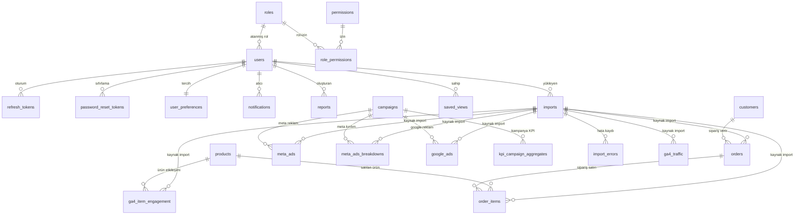

# Sporthink KPI Dashboard — Veritabanı Dokümantasyonu

> Bu belge, sistemin veritabanını **en ince ayrıntısına kadar** dokümante eder. Tüm bilgiler
> canlı MySQL veritabanının şemasından (`SHOW CREATE TABLE` / `mysqldump --no-data`)
> doğrulanarak hazırlanmıştır; tahmine yer yoktur.

**Veritabanı motoru:** MySQL 8.4 LTS
**Karakter seti / collation:** `utf8mb4` / `utf8mb4_unicode_ci`
**Storage engine:** InnoDB (tüm tablolar)
**Toplam tablo:** 27 alan tablosu + `alembic_version` (migration izleyici)
**Hazırlanma tarihi:** Mayıs 2026

---

## İçindekiler

1. [Genel Bakış](#1-genel-bakış)
2. [Tasarım Kuralları ve Konvansiyonlar](#2-tasarım-kuralları-ve-konvansiyonlar)
3. [ER Diyagramı](#3-er-diyagramı)
4. [Tablo Grupları](#4-tablo-grupları)
5. [Grup A — Kimlik ve Yetkilendirme](#5-grup-a--kimlik-ve-yetkilendirme)
6. [Grup B — Ham Veri Kaynakları](#6-grup-b--ham-veri-kaynakları)
7. [Grup C — KPI Aggregation Tabloları](#7-grup-c--kpi-aggregation-tabloları)
8. [Grup D — Sistem ve Operasyon](#8-grup-d--sistem-ve-operasyon)
9. [Yabancı Anahtar (FK) İlişki Matrisi](#9-yabancı-anahtar-fk-i̇lişki-matrisi)
10. [İndeks Stratejisi](#10-i̇ndeks-stratejisi)
11. [Generated (Hesaplanan) Kolonlar](#11-generated-hesaplanan-kolonlar)
12. [Partitioning (Bölümleme)](#12-partitioning-bölümleme)
13. [Migration Geçmişi](#13-migration-geçmişi)

---

## 1. Genel Bakış

Veritabanı, bir pazarlama/e-ticaret analitik platformunun tüm verisini barındırır. Şema
üç işlevsel düzeyde organize edilmiştir:

- **Ham veri katmanı:** GA4, Meta Ads, Google Ads ve e-ticaret CSV dosyalarından içe
  aktarılan satır-satır kayıtlar (`ga4_traffic`, `meta_ads`, `orders` vb.).
- **Aggregation katmanı:** Ham veriden türetilen, önceden toplanmış KPI tabloları
  (`kpi_daily_aggregates` vb.). Dashboard sorguları daima bu katmandan beslenir.
- **Operasyonel/kimlik katmanı:** Kullanıcılar, roller, izinler, import takibi, denetim
  kaydı, bildirim, rapor.

Şema MySQL'in ilk açılışında `backend/db/init/01-baseline.sql` ile kurulur; sonraki
değişiklikler Alembic migration'ları ile sürümlenir.

| Ölçüt | Değer |
|---|---|
| Toplam alan tablosu | 27 |
| Toplam yabancı anahtar | 40 |
| Generated (hesaplanan) kolon | 6 |
| Partition'lı tablo | 2 (`audit_logs`, `kpi_daily_aggregates`) |
| Soft-delete uygulayan tablo | 7 |
| En büyük tablo (satır) | `ga4_traffic` (~46.000 satır) |

---

## 2. Tasarım Kuralları ve Konvansiyonlar

Şema genelinde **istisnasız** uygulanan kurallar:

### 2.1 Veri Tipleri

| Veri | Tip | Gerekçe |
|---|---|---|
| Birincil anahtar (PK) | `BIGINT UNSIGNED AUTO_INCREMENT` | Büyük veri hacmi için geniş aralık |
| Para / tutar | `DECIMAL(15,2)` | Float yuvarlama hatasını önler; tek para birimi TRY |
| Yüzde / oran | `DECIMAL(7,4)` veya `DECIMAL(8,4)` | Hassas oran saklama |
| Zaman damgası | `DATETIME` | Her zaman UTC saklanır |
| Tarih | `DATE` | Gün hassasiyetli alanlar |
| Sabit kümeli alan | `ENUM(...)` | Durum, cinsiyet, platform gibi alanlar |
| Yapısal metadata | `JSON` | `audit_logs.details`, `reports.sections`, `saved_views.filters` |
| Boolean | `TINYINT(1)` | `is_active`, `is_read` vb. |

### 2.2 Denetim (Audit) Alanları

Çoğu tablo standart denetim alanları taşır:
`created_at` (oluşturma), `updated_at` (`ON UPDATE CURRENT_TIMESTAMP` ile otomatik),
`created_by` / `updated_by` (`users.id`'ye FK).

### 2.3 Soft Delete

`users`, `roles`, `customers`, `products`, `campaigns`, `saved_views`, `channel_mapping`
tabloları **soft-delete** uygular: kayıt fiziksel olarak silinmez, `deleted_at` alanına
zaman damgası yazılır. Aktif kayıt sorguları `WHERE deleted_at IS NULL` filtresi ekler.
Log ve aggregation tabloları (`audit_logs`, `kpi_*`, `imports`) soft-delete **uygulamaz**.

### 2.4 Yabancı Anahtar Politikaları

| `ON DELETE` davranışı | Kullanım |
|---|---|
| `CASCADE` | Bağımlı kayıtlar (örn. `role_permissions`, `notifications`, `import_errors`) |
| `SET NULL` | Denetim referansları (`created_by`, `updated_by`) ve opsiyonel bağlar |
| `RESTRICT` | Veri bütünlüğü kritik bağlar (`orders` → `customers`, ham tablolar → `imports`) |

Tüm FK'lerde `ON UPDATE CASCADE` kullanılır.

### 2.5 İsimlendirme

- Tablolar: çoğul, snake_case (`order_items`, `kpi_daily_aggregates`).
- Birincil anahtar: `id`.
- İş anahtarı (external): `customer_id`, `order_id`, `sku` gibi.
- FK kolonları: `<entity>_pk_id` (iç PK referansı) veya `<entity>_id`.
- İndeks: `idx_*`, unique: `uk_*`, FK: `fk_*`.

---

## 3. ER Diyagramı

> `kpi_daily_aggregates` ve `kpi_monthly_aggregates` tabloları FK ilişkisi içermez;
> `channel/platform/device` metinsel boyutlar üzerinden çalışan denormalize aggregation
> tablolarıdır. `users` tablosu `created_by`/`updated_by` üzerinden kendine referans verir
> (self-referential). Denetim FK'leri (`created_by`/`updated_by`) okunabilirlik için
> diyagrama dahil edilmemiştir; tam liste Bölüm 9'dadır.

---

## 4. Tablo Grupları

| Grup | Tablolar | Tablo Sayısı |
|---|---|---|
| **A — Kimlik ve Yetki** | `users`, `roles`, `permissions`, `role_permissions`, `refresh_tokens`, `password_reset_tokens`, `user_preferences` | 7 |
| **B — Ham Veri Kaynakları** | `ga4_traffic`, `ga4_item_engagement`, `meta_ads`, `meta_ads_breakdowns`, `google_ads`, `orders`, `order_items`, `products`, `customers`, `campaigns` | 10 |
| **C — KPI Aggregation** | `kpi_daily_aggregates`, `kpi_monthly_aggregates`, `kpi_campaign_aggregates` | 3 |
| **D — Sistem ve Operasyon** | `imports`, `import_errors`, `audit_logs`, `notifications`, `reports`, `saved_views`, `channel_mapping` | 7 |

---

## 5. Grup A — Kimlik ve Yetkilendirme

### 5.1 `users` — Kullanıcılar

Sistem kullanıcıları. Giriş kimliği, profil bilgisi, güvenlik durumu ve rol ataması.

| Kolon | Tip | Null | Varsayılan | Açıklama |
|---|---|---|---|---|
| `id` | bigint unsigned | Hayır | AUTO_INCREMENT | Birincil anahtar |
| `email` | varchar(255) | Hayır | — | Giriş kimliği (UNIQUE, lowercase) |
| `password_hash` | varchar(255) | Hayır | — | bcrypt hash |
| `first_name` | varchar(100) | Hayır | — | Ad |
| `last_name` | varchar(100) | Hayır | — | Soyad |
| `phone` | varchar(20) | Evet | NULL | Telefon |
| `department` | varchar(100) | Evet | NULL | Departman |
| `job_title` | varchar(100) | Evet | NULL | Unvan |
| `avatar_url` | varchar(500) | Evet | NULL | Profil resmi yolu |
| `role_id` | bigint unsigned | Evet | NULL | Atanmış rol (FK → roles) |
| `is_active` | tinyint(1) | Hayır | 1 | Aktiflik (pasif → giriş yapamaz) |
| `deactivated_reason` | varchar(255) | Evet | NULL | Pasifleştirme nedeni |
| `last_login_at` | datetime | Evet | NULL | Son giriş zamanı |
| `last_login_ip` | varchar(45) | Evet | NULL | Son giriş IP'si |
| `failed_login_attempts` | int unsigned | Hayır | 0 | Başarısız giriş sayacı |
| `locked_until` | datetime | Evet | NULL | Brute-force kilidi bitiş zamanı |
| `bio` | varchar(500) | Evet | NULL | Profil biyografisi |
| `birth_date` | date | Evet | NULL | Doğum tarihi |
| `location` | varchar(100) | Evet | NULL | Konum |
| `website_url`, `linkedin_url`, `twitter_url`, `github_url`, `instagram_url` | varchar(255) | Evet | NULL | Sosyal/web bağlantıları |
| `created_at`, `updated_at` | datetime | Hayır | CURRENT_TIMESTAMP | Denetim zaman damgaları |
| `created_by`, `updated_by` | bigint unsigned | Evet | NULL | Denetim referansı (FK → users) |
| `deleted_at` | datetime | Evet | NULL | Soft-delete zaman damgası |

**Anahtarlar:** PK `id` · UNIQUE `uk_email(email)`
**İndeksler:** `idx_role`, `idx_active`, `idx_deleted`
**Yabancı anahtarlar:**
- `role_id` → `roles(id)` `ON DELETE RESTRICT`
- `created_by` / `updated_by` → `users(id)` `ON DELETE SET NULL` (self-referential)

**Notlar:** İlk Süper Admin kullanıcısı `app/seed.py` tarafından ortam değişkenlerinden
oluşturulur. Soft-delete uygular.

### 5.2 `roles` — Roller

RBAC rolleri. Süper Admin sistem rolüdür ve tüm izinleri otomatik alır.

| Kolon | Tip | Null | Varsayılan | Açıklama |
|---|---|---|---|---|
| `id` | bigint unsigned | Hayır | AUTO_INCREMENT | Birincil anahtar |
| `name` | varchar(100) | Hayır | — | Rol adı |
| `description` | text | Evet | NULL | Açıklama |
| `color` | varchar(7) | Evet | NULL | UI rozet rengi (hex) |
| `icon` | varchar(20) | Evet | NULL | UI ikon (emoji) |
| `is_system` | tinyint(1) | Hayır | 0 | Sistem rolü mü (Süper Admin = 1) |
| `created_at`, `updated_at` | datetime | Hayır | CURRENT_TIMESTAMP | Denetim |
| `created_by`, `updated_by` | bigint unsigned | Evet | NULL | Denetim referansı |
| `deleted_at` | datetime | Evet | NULL | Soft-delete |
| `name_active` | varchar(100) | Evet | (generated) | `deleted_at NULL` ise `name`, değilse NULL — kısmi benzersizlik için |

**Anahtarlar:** PK `id` · UNIQUE `uk_name_active(name_active)`
**İndeksler:** `idx_system`, `idx_deleted`
**Yabancı anahtarlar:** `created_by` / `updated_by` → `users(id)` `ON DELETE SET NULL`
**Notlar:** `name_active` **generated (VIRTUAL) kolon**'dur; silinmiş rollerin aynı ada
sahip yeni rollerle çakışmaması için kullanılır (bkz. Bölüm 11).

### 5.3 `permissions` — İzinler

Granüler izinler. 4 kategori altında gruplanır; tek doğru kaynak backend
`core/permissions.py` enum'udur, `app/seed.py` ile bu tabloya senkronlanır.

| Kolon | Tip | Null | Varsayılan | Açıklama |
|---|---|---|---|---|
| `id` | bigint unsigned | Hayır | AUTO_INCREMENT | Birincil anahtar |
| `code` | varchar(100) | Hayır | — | İzin kodu (örn. `dashboard.view`) — UNIQUE |
| `module` | varchar(50) | Hayır | — | Modül (örn. `dashboard`) |
| `action` | varchar(50) | Hayır | — | Eylem (örn. `view`) |
| `description` | varchar(255) | Evet | NULL | İnsan-okunur açıklama |
| `category` | varchar(50) | Hayır | — | Kategori (`view`, `data`, `admin`, `system`) |

**Anahtarlar:** PK `id` · UNIQUE `uk_code(code)`
**İndeksler:** `idx_module`, `idx_category`
**Notlar:** İzinler 4 kategoride toplanır: Veri Görüntüleme (11), Veri İşlemleri (16),
Kullanıcı/Rol Yönetimi (9), Sistem ve Loglar (5).

### 5.4 `role_permissions` — Rol-İzin Eşlemesi

Roller ile izinler arasındaki çoktan-çoğa (many-to-many) bağlantı tablosu.

| Kolon | Tip | Null | Varsayılan | Açıklama |
|---|---|---|---|---|
| `role_id` | bigint unsigned | Hayır | — | Rol (FK → roles) — bileşik PK |
| `permission_id` | bigint unsigned | Hayır | — | İzin (FK → permissions) — bileşik PK |
| `granted_at` | datetime | Hayır | CURRENT_TIMESTAMP | Atama zamanı |
| `granted_by` | bigint unsigned | Evet | NULL | Atayan kullanıcı (FK → users) |

**Anahtarlar:** Bileşik PK `(role_id, permission_id)`
**İndeksler:** `idx_role`, `idx_permission`
**Yabancı anahtarlar:**
- `role_id` → `roles(id)` `ON DELETE CASCADE`
- `permission_id` → `permissions(id)` `ON DELETE CASCADE`
- `granted_by` → `users(id)` `ON DELETE SET NULL`

### 5.5 `refresh_tokens` — Yenileme Token'ları

JWT refresh token'larının hash'lenmiş kayıtları. Logout/güvenlik için revoke edilebilir.

| Kolon | Tip | Null | Varsayılan | Açıklama |
|---|---|---|---|---|
| `id` | bigint unsigned | Hayır | AUTO_INCREMENT | Birincil anahtar |
| `user_id` | bigint unsigned | Hayır | — | Sahip kullanıcı (FK → users) |
| `token_hash` | varchar(255) | Hayır | — | Token'ın hash'i (UNIQUE) — düz metin saklanmaz |
| `device_info` | varchar(500) | Evet | NULL | Cihaz/User-Agent bilgisi |
| `ip_address` | varchar(45) | Evet | NULL | IP adresi |
| `issued_at` | datetime | Hayır | CURRENT_TIMESTAMP | Üretim zamanı |
| `expires_at` | datetime | Hayır | — | Son geçerlilik (7 gün) |
| `revoked_at` | datetime | Evet | NULL | Revoke zamanı (logout vb.) |

**Anahtarlar:** PK `id` · UNIQUE `uk_token_hash`
**İndeksler:** `idx_user`, `idx_expires`, `idx_user_active(user_id, revoked_at, expires_at)`
**Yabancı anahtarlar:** `user_id` → `users(id)` `ON DELETE CASCADE`

### 5.6 `password_reset_tokens` — Şifre Sıfırlama / Davet Token'ları

Şifre sıfırlama ve yeni kullanıcı davet token'ları (`purpose` ile ayrışır).

| Kolon | Tip | Null | Varsayılan | Açıklama |
|---|---|---|---|---|
| `id` | bigint unsigned | Hayır | AUTO_INCREMENT | Birincil anahtar |
| `user_id` | bigint unsigned | Hayır | — | İlgili kullanıcı (FK → users) |
| `token_hash` | varchar(255) | Hayır | — | Token hash'i (UNIQUE) |
| `expires_at` | datetime | Hayır | — | Son geçerlilik |
| `used_at` | datetime | Evet | NULL | Kullanım zamanı |
| `requested_ip` | varchar(45) | Evet | NULL | Talep IP'si |
| `created_at` | datetime | Hayır | CURRENT_TIMESTAMP | Oluşturma |
| `purpose` | varchar(20) | Hayır | `'reset'` | Amaç: `reset` veya `invite` |

**Anahtarlar:** PK `id` · UNIQUE `uk_token_hash`
**İndeksler:** `idx_user`, `idx_expires`, `idx_user_purpose(user_id, purpose)`
**Yabancı anahtarlar:** `user_id` → `users(id)` `ON DELETE CASCADE`
**Notlar:** `purpose` kolonu migration `0003` ile eklenmiştir.

### 5.7 `user_preferences` — Kullanıcı Tercihleri

Kullanıcı başına 1 satır (PK = `user_id`). Tema, dil, arayüz tercihleri.

| Kolon | Tip | Null | Varsayılan | Açıklama |
|---|---|---|---|---|
| `user_id` | bigint unsigned | Hayır | — | Kullanıcı (PK + FK → users) |
| `theme` | enum(light, dark, system) | Hayır | `system` | Tema tercihi |
| `language` | enum(tr, en) | Hayır | `tr` | Dil tercihi |
| `sidebar_collapsed` | tinyint(1) | Hayır | 0 | Kenar çubuğu kapalı mı |
| `notifications_enabled` | tinyint(1) | Hayır | 1 | Bildirim açık mı |
| `updated_at` | datetime | Hayır | CURRENT_TIMESTAMP | Güncelleme |

**Anahtarlar:** PK `user_id`
**Yabancı anahtarlar:** `user_id` → `users(id)` `ON DELETE CASCADE`

---

## 6. Grup B — Ham Veri Kaynakları

### 6.1 `ga4_traffic` — GA4 Trafik Verisi

Google Analytics 4'ten içe aktarılan günlük oturum/trafik kayıtları. En büyük tablo
(~46.000 satır).

| Kolon | Tip | Null | Açıklama |
|---|---|---|---|
| `id` | bigint unsigned | Hayır | Birincil anahtar |
| `import_id` | bigint unsigned | Hayır | Kaynak import (FK → imports) |
| `date` | date | Hayır | Trafik günü |
| `session_source` | varchar(255) | Hayır | Oturum kaynağı |
| `session_medium` | varchar(100) | Hayır | Oturum aracısı (medium) |
| `session_campaign_name` | varchar(255) | Evet | Kampanya adı |
| `session_default_channel_group` | varchar(100) | Evet | GA4 varsayılan kanal grubu |
| `derived_channel` | varchar(100) | Evet | `channel_mapping` ile türetilen kanal |
| `device_category` | enum(mobile, desktop, tablet, other) | Hayır | Cihaz |
| `city` | varchar(100) | Evet | Şehir |
| `landing_page_plus_query_string` | varchar(1000) | Evet | İniş sayfası |
| `new_vs_returning` | enum(new, returning) | Evet | Yeni/dönen kullanıcı |
| `sessions`, `total_users`, `new_users`, `engaged_sessions`, `conversions`, `transactions` | int unsigned | Hayır | Sayısal metrikler |
| `bounce_rate`, `engagement_rate` | decimal(7,4) | Hayır | Oran metrikleri |
| `average_session_duration`, `screen_page_views_per_session`, `user_engagement_duration`, `purchase_revenue` | decimal | Hayır | Süre/ortalama/ciro metrikleri |
| `created_at` | datetime | Hayır | Kayıt zamanı |

**Anahtarlar:** PK `id`
**İndeksler:** `idx_date`, `idx_date_channel(date, session_default_channel_group)`,
`idx_date_device(date, device_category)`,
`idx_date_source_medium(date, session_source(50), session_medium)`, `idx_import`
**Yabancı anahtarlar:** `import_id` → `imports(id)` `ON DELETE RESTRICT`

### 6.2 `ga4_item_engagement` — GA4 Ürün Etkileşimi

GA4'ten ürün bazlı görüntülenme/sepet/satın alma etkileşimi. Funnel hesabının kaynağı.

| Kolon | Tip | Null | Açıklama |
|---|---|---|---|
| `id` | bigint unsigned | Hayır | Birincil anahtar |
| `import_id` | bigint unsigned | Hayır | Kaynak import (FK) |
| `date` | date | Hayır | Gün |
| `product_pk_id` | bigint unsigned | Evet | Eşleşen ürün (FK → products) |
| `item_id` | varchar(100) | Hayır | GA4 ürün kimliği |
| `item_name`, `item_category`, `item_category2`, `item_brand` | varchar | Evet | Ürün metadata |
| `items_viewed`, `items_added_to_cart`, `items_checked_out`, `items_purchased` | int unsigned | Hayır | Funnel adım sayıları |
| `item_revenue` | decimal(15,2) | Hayır | Ürün cirosu |
| `item_list_views`, `item_list_clicks` | int unsigned | Hayır | Liste metrikleri |
| `cart_to_view_rate` | decimal(7,4) | — | **Generated (STORED):** `items_added_to_cart / items_viewed` |
| `created_at` | datetime | Hayır | Kayıt zamanı |

**Anahtarlar:** PK `id`
**İndeksler:** `idx_date`, `idx_item`, `idx_date_item`, `idx_brand`, `idx_category`,
`idx_import`, `idx_product_pk`
**Yabancı anahtarlar:**
- `import_id` → `imports(id)` `ON DELETE RESTRICT`
- `product_pk_id` → `products(id)` `ON DELETE SET NULL`

### 6.3 `meta_ads` — Meta Ads Reklam Verisi

Meta (Facebook/Instagram) Ads reklam performans kayıtları (reklam seviyesinde).

| Kolon | Tip | Null | Açıklama |
|---|---|---|---|
| `id` | bigint unsigned | Hayır | Birincil anahtar |
| `import_id` | bigint unsigned | Hayır | Kaynak import (FK) |
| `date_start`, `date_stop` | date | Hayır | Dönem aralığı |
| `account_id`, `account_name` | varchar | Evet | Reklam hesabı |
| `campaign_pk_id` | bigint unsigned | Evet | Eşleşen kampanya (FK → campaigns) |
| `campaign_id` | varchar(50) | Hayır | Meta kampanya kimliği |
| `campaign_name`, `adset_id`, `adset_name`, `ad_id`, `ad_name` | varchar | Evet | Kampanya/reklam seti/reklam hiyerarşisi |
| `objective`, `buying_type` | varchar(50) | Evet | Hedef ve satın alma tipi |
| `impressions`, `reach`, `clicks`, `inline_link_clicks` | int unsigned | Hayır | Erişim/tıklama metrikleri |
| `frequency`, `cpc`, `cpm`, `cpp`, `ctr`, `inline_link_click_ctr` | decimal | Hayır | Oran/maliyet metrikleri |
| `spend`, `action_values_purchase` | decimal(15,2) | Hayır | Harcama ve satın alma değeri |
| `actions_*` (link_click, landing_page_view, view_content, add_to_cart, initiate_checkout, purchase, page_engagement, post_engagement, video_view) | int unsigned | Hayır | Eylem (conversion) sayıları |
| `created_at` | datetime | Hayır | Kayıt zamanı |

**Anahtarlar:** PK `id`
**İndeksler:** `idx_date`, `idx_date_campaign`, `idx_campaign`, `idx_campaign_pk`,
`idx_adset`, `idx_ad`, `idx_import`
**Yabancı anahtarlar:**
- `campaign_pk_id` → `campaigns(id)` `ON DELETE SET NULL`
- `import_id` → `imports(id)` `ON DELETE RESTRICT`

### 6.4 `meta_ads_breakdowns` — Meta Ads Demografik Kırılım

Meta Ads verisinin yaş/cinsiyet/platform/bölge kırılımı.

| Kolon | Tip | Null | Açıklama |
|---|---|---|---|
| `id` | bigint unsigned | Hayır | Birincil anahtar |
| `import_id` | bigint unsigned | Hayır | Kaynak import (FK) |
| `date_start` | date | Hayır | Dönem başı |
| `date_stop` | date | Evet | Dönem sonu |
| `campaign_pk_id` | bigint unsigned | Evet | Kampanya (FK → campaigns) |
| `campaign_id`, `adset_id`, `adset_name`, `ad_name` | varchar | Evet | Hiyerarşi |
| `age` | enum(13-17 ... 65+, unknown) | Evet | Yaş grubu |
| `gender` | enum(male, female, unknown) | Evet | Cinsiyet |
| `publisher_platform`, `platform_position`, `impression_device` | varchar(50) | Evet | Platform kırılımı |
| `country`, `region` | varchar | Evet | Coğrafi kırılım |
| `impressions`, `reach`, `clicks`, `actions_purchase` | int unsigned | Hayır | Metrikler |
| `spend`, `action_values_purchase` | decimal(15,2) | Hayır | Harcama / satın alma değeri |
| `created_at` | datetime | Hayır | Kayıt zamanı |

**Anahtarlar:** PK `id`
**İndeksler:** `idx_date_campaign`, `idx_campaign_pk`, `idx_age_gender`, `idx_platform`,
`idx_import`
**Yabancı anahtarlar:** `campaign_pk_id` → `campaigns(id)` `SET NULL` ·
`import_id` → `imports(id)` `RESTRICT`

### 6.5 `google_ads` — Google Ads Reklam Verisi

Google Ads performans kayıtları (kampanya/reklam grubu/anahtar kelime/ürün seviyesinde).
40+ kolonla en geniş ham tablo.

| Kolon grubu | Örnek kolonlar | Açıklama |
|---|---|---|
| Kimlik | `id`, `import_id`, `date` | PK, kaynak, gün |
| Hesap | `customer_id`, `customer_descriptive_name` | Google Ads hesabı |
| Kampanya | `campaign_pk_id` (FK), `campaign_id`, `campaign_name`, `campaign_status`, `advertising_channel_type` | Kampanya bilgisi |
| Reklam grubu | `ad_group_id`, `ad_group_name`, `ad_group_status`, `device`, `ad_network_type` | Reklam grubu |
| Ürün | `product_item_id`, `product_title`, `product_brand`, `product_type_l1/l2` | Shopping ürün bilgisi |
| Anahtar kelime | `keyword_text`, `keyword_match_type`, `search_term` | Arama verisi |
| Metrikler | `impressions`, `clicks`, `cost`, `ctr`, `average_cpc`, `average_cpm`, `conversions`, `conversions_value`, `all_conversions`, `cost_per_conversion`, `value_per_conversion`, `view_through_conversions`, `interaction_rate` | Performans |
| Impression share | `search_impression_share`, `search_budget_lost_impression_share`, `search_rank_lost_impression_share` | Gösterim payı |

**Anahtarlar:** PK `id`
**İndeksler:** `idx_date`, `idx_date_campaign`, `idx_campaign`, `idx_campaign_pk`,
`idx_ad_group`, `idx_product`, `idx_channel_type`, `idx_import`
**Yabancı anahtarlar:** `campaign_pk_id` → `campaigns(id)` `SET NULL` ·
`import_id` → `imports(id)` `RESTRICT`

### 6.6 `campaigns` — Reklam Kampanyaları

Meta ve Google kampanyalarının birleşik tanım tablosu. Reklam tablolarının ortak
referans noktası.

| Kolon | Tip | Null | Açıklama |
|---|---|---|---|
| `id` | bigint unsigned | Hayır | Birincil anahtar |
| `platform` | enum(meta, google) | Hayır | Reklam platformu |
| `external_campaign_id` | varchar(50) | Evet | Platform kampanya kimliği |
| `campaign_name` | varchar(500) | Hayır | Kampanya adı |
| `campaign_type`, `objective` | varchar(100) | Evet | Tür ve hedef |
| `start_date`, `end_date` | date | Evet | Kampanya dönemi |
| `daily_budget`, `total_budget` | decimal(15,2) | Evet | Bütçe |
| `target_audience` | varchar(500) | Evet | Hedef kitle |
| `status` | enum(active, paused, completed) | Hayır | Durum |
| `created_at`, `updated_at`, `created_by`, `updated_by`, `deleted_at` | — | Denetim + soft-delete |

**Anahtarlar:** PK `id` · UNIQUE `uk_platform_external(platform, external_campaign_id)`
**İndeksler:** `idx_platform`, `idx_dates`, `idx_status`,
`idx_campaign_name(campaign_name(100))` (prefix index), `idx_deleted`
**Yabancı anahtarlar:** `created_by` / `updated_by` → `users(id)` `SET NULL`

### 6.7 `products` — Ürünler

Ürün katalogu. Sipariş satırları ve GA4 ürün etkileşimi bu tabloya bağlanır.

| Kolon | Tip | Null | Açıklama |
|---|---|---|---|
| `id` | bigint unsigned | Hayır | Birincil anahtar |
| `sku` | varchar(100) | Hayır | Stok kodu (UNIQUE) |
| `product_name` | varchar(500) | Hayır | Ürün adı |
| `category`, `sub_category` | varchar(100) | Hayır/Evet | Kategori |
| `brand` | varchar(100) | Hayır | Marka |
| `gender` | enum(male, female, unisex) | Evet | Hedef cinsiyet |
| `price`, `cost_price` | decimal(15,2) | Hayır | Satış / maliyet fiyatı |
| `stock_quantity` | int | Hayır | Stok adedi |
| `is_active` | tinyint(1) | Hayır | Aktiflik |
| `color`, `size_range` | varchar(50) | Evet | Renk / beden aralığı |
| `created_at`, `updated_at`, `created_by`, `updated_by`, `deleted_at` | — | Denetim + soft-delete |

**Anahtarlar:** PK `id` · UNIQUE `uk_sku(sku)`
**İndeksler:** `idx_brand`, `idx_category`, `idx_active`, `idx_brand_category`, `idx_deleted`
**Yabancı anahtarlar:** `created_by` / `updated_by` → `users(id)` `SET NULL`

### 6.8 `customers` — Müşteriler

E-ticaret müşterileri. Demografik ve toplam sipariş/ciro özet alanları içerir.

| Kolon | Tip | Null | Açıklama |
|---|---|---|---|
| `id` | bigint unsigned | Hayır | Birincil anahtar |
| `customer_id` | varchar(50) | Hayır | Dış müşteri kimliği (UNIQUE) |
| `customer_name` | varchar(255) | Evet | Ad |
| `first_order_date`, `registration_date` | date | Hayır | İlk sipariş / kayıt tarihi |
| `last_order_date` | date | Evet | Son sipariş tarihi |
| `city` | varchar(100) | Evet | Şehir |
| `gender` | enum(male, female) | Evet | Cinsiyet |
| `age_group` | enum(18-24 ... 65+) | Evet | Yaş grubu |
| `registration_source` | varchar(100) | Evet | Kayıt kaynağı |
| `is_newsletter_subscriber` | tinyint(1) | Hayır | Bülten aboneliği |
| `total_orders` | int unsigned | Hayır | Toplam sipariş (denormalize) |
| `total_revenue` | decimal(15,2) | Hayır | Toplam ciro (denormalize) |
| `created_at`, `updated_at`, `created_by`, `updated_by`, `deleted_at` | — | Denetim + soft-delete |

**Anahtarlar:** PK `id` · UNIQUE `uk_customer_id`
**İndeksler:** `idx_first_order`, `idx_last_order`, `idx_city`, `idx_gender_age`,
`idx_total_orders`, `idx_total_revenue`, `idx_deleted`

### 6.9 `orders` — Siparişler

E-ticaret siparişleri. `city`, `channel`, `device` boyutlarını doğrudan taşır.

| Kolon | Tip | Null | Açıklama |
|---|---|---|---|
| `id` | bigint unsigned | Hayır | Birincil anahtar |
| `import_id` | bigint unsigned | Hayır | Kaynak import (FK) |
| `order_id` | varchar(50) | Hayır | Dış sipariş kimliği (UNIQUE) |
| `order_date` | datetime | Hayır | Sipariş zamanı |
| `customer_pk_id` | bigint unsigned | Hayır | Müşteri (FK → customers) |
| `customer_id` | varchar(50) | Hayır | Dış müşteri kimliği |
| `city` | varchar(100) | Hayır | Şehir (harita analizinin kaynağı) |
| `device` | enum(mobile, desktop, tablet) | Hayır | Cihaz |
| `channel` | varchar(100) | Hayır | Pazarlama kanalı |
| `source`, `medium`, `campaign_name`, `coupon_code` | varchar | Evet | Atıf bilgileri |
| `product_count` | int unsigned | Hayır | Ürün adedi |
| `order_revenue` | decimal(15,2) | Hayır | Brüt sipariş tutarı |
| `shipping_cost`, `discount_amount`, `refund_amount` | decimal | Hayır | Kargo / indirim / iade |
| `net_revenue` | decimal(15,2) | — | **Generated (STORED):** `order_revenue - discount_amount - refund_amount` |
| `order_status` | enum(completed, cancelled, refunded, pending, shipped) | Hayır | Sipariş durumu |
| `payment_method` | enum(credit_card, debit_card, bank_transfer, pay_at_door) | Hayır | Ödeme yöntemi |
| `created_at` | datetime | Hayır | Kayıt zamanı |

**Anahtarlar:** PK `id` · UNIQUE `uk_order_id`
**İndeksler:** `idx_order_date`, `idx_customer_pk`, `idx_customer_external`, `idx_channel`,
`idx_status`, `idx_date_channel`, `idx_date_device`, `idx_import`
**Yabancı anahtarlar:**
- `customer_pk_id` → `customers(id)` `ON DELETE RESTRICT`
- `import_id` → `imports(id)` `ON DELETE RESTRICT`

### 6.10 `order_items` — Sipariş Satırları

Sipariş kalemleri. Bir sipariş birden çok satır içerir.

| Kolon | Tip | Null | Açıklama |
|---|---|---|---|
| `id` | bigint unsigned | Hayır | Birincil anahtar |
| `import_id` | bigint unsigned | Hayır | Kaynak import (FK) |
| `order_pk_id` | bigint unsigned | Hayır | Üst sipariş (FK → orders) |
| `order_id` | varchar(50) | Hayır | Dış sipariş kimliği |
| `line_id` | int unsigned | Hayır | Satır numarası |
| `product_pk_id` | bigint unsigned | Evet | Ürün (FK → products) |
| `item_id` | varchar(100) | Hayır | Ürün kimliği |
| `item_name`, `item_category`, `item_category2`, `item_brand` | varchar | Evet | Ürün metadata |
| `quantity` | int unsigned | Hayır | Adet |
| `unit_price`, `line_total`, `discount_amount`, `refund_amount` | decimal(15,2) | Hayır | Fiyat / satır toplamı / indirim / iade |
| `created_at` | datetime | Hayır | Kayıt zamanı |

**Anahtarlar:** PK `id` · UNIQUE `uk_order_line(order_pk_id, line_id)`
**İndeksler:** `idx_order_pk`, `idx_order_id`, `idx_product_pk`, `idx_item`, `idx_brand`,
`idx_category`, `idx_import`
**Yabancı anahtarlar:**
- `order_pk_id` → `orders(id)` `ON DELETE CASCADE`
- `product_pk_id` → `products(id)` `ON DELETE SET NULL`
- `import_id` → `imports(id)` `ON DELETE RESTRICT`

---

## 7. Grup C — KPI Aggregation Tabloları

Bu tablolar ham veriden türetilir; dashboard sorgularının tek kaynağıdır. Import sonrası
`tasks/normalize_tasks.py` tarafından yeniden hesaplanır.

### 7.1 `kpi_daily_aggregates` — Günlük KPI Aggregation

Tüm dashboard KPI'larının ana kaynağı. `date × channel × platform × device` kırılımında
önceden toplanmış metrikler. **Tarih bazlı RANGE partition'lı** tablo.

| Kolon | Tip | Açıklama |
|---|---|---|
| `id` | bigint unsigned | Birincil anahtar (bileşik PK'nin parçası) |
| `date` | date | Gün (PK + partition anahtarı) |
| `channel` | varchar(100) | Pazarlama kanalı |
| `platform` | enum(ga4, meta, google, ecommerce) | Veri kaynağı platformu |
| `device` | varchar(50) | Cihaz kırılımı |
| `sessions`, `users`, `new_users`, `bounce_sessions`, `total_page_views` | int unsigned | GA4 metrikleri |
| `total_session_duration` | decimal(15,2) | Toplam oturum süresi |
| `impressions`, `clicks` | bigint unsigned | Reklam gösterim/tıklama |
| `spend`, `ad_conversions`, `ad_revenue` | decimal | Reklam harcama/dönüşüm/gelir |
| `orders`, `items_sold` | int unsigned | E-ticaret sipariş/ürün |
| `revenue`, `discount_total`, `refund_total` | decimal(15,2) | E-ticaret ciro/indirim/iade |
| `last_calculated_at` | datetime | Son hesaplama zamanı |

**Anahtarlar:** Bileşik PK `(id, date)` · UNIQUE `uk_date_channel_platform_device`
**İndeksler:** `idx_date`, `idx_date_channel`, `idx_date_platform`
**Partitioning:** `date` kolonuna göre `RANGE (to_days(date))` ile aylık partition'lar
(`p202605` ... `pmax`).
**Notlar:** Bu tablo FK içermez (denormalize); `channel`/`device` filtreleri cross-filter
özelliğini besler.

### 7.2 `kpi_monthly_aggregates` — Aylık KPI Aggregation

`kpi_daily_aggregates`'in aylık özeti; uzun dönem trend ve YoY karşılaştırma için.

| Kolon | Tip | Açıklama |
|---|---|---|
| `id` | bigint unsigned | Birincil anahtar |
| `period_month` | date | Ayın ilk günü |
| `channel`, `platform`, `device` | — | Kırılım boyutları (günlük tablo ile aynı) |
| Metrik kolonları | — | `sessions`, `users`, `spend`, `revenue`, `orders` vb. (günlük tablo ile aynı set, `total_page_views` hariç) |
| `last_calculated_at` | datetime | Son hesaplama |

**Anahtarlar:** PK `id` · UNIQUE `uk_month_channel_platform_device`
**İndeksler:** `idx_period_month`, `idx_period_channel`, `idx_period_platform`

### 7.3 `kpi_campaign_aggregates` — Kampanya KPI Aggregation

Kampanya bazlı reklam performans özeti. ROAS, CTR, CPC generated kolonlardır.

| Kolon | Tip | Açıklama |
|---|---|---|
| `id` | bigint unsigned | Birincil anahtar |
| `campaign_pk_id` | bigint unsigned | Kampanya (FK → campaigns) |
| `campaign_external_id`, `campaign_name`, `platform` | — | Kampanya bilgisi |
| `period_start`, `period_end` | date | Dönem aralığı |
| `impressions`, `clicks` | bigint unsigned | Gösterim / tıklama |
| `spend`, `conversions`, `conversions_value` | decimal | Harcama / dönüşüm / değer |
| `ctr` | decimal(8,4) | **Generated (STORED):** `clicks / impressions * 100` |
| `cpc` | decimal(10,4) | **Generated (STORED):** `spend / clicks` |
| `roas` | decimal(10,4) | **Generated (STORED):** `conversions_value / spend` |
| `last_calculated_at` | datetime | Son hesaplama |

**Anahtarlar:** PK `id` · UNIQUE `uk_campaign_period(campaign_pk_id, period_start, period_end)`
**İndeksler:** `idx_campaign_pk`, `idx_period`, `idx_platform`, `idx_roas`
**Yabancı anahtarlar:** `campaign_pk_id` → `campaigns(id)` `ON DELETE CASCADE`

---

## 8. Grup D — Sistem ve Operasyon

### 8.1 `imports` — İçe Aktarma İşlemleri

Her CSV/Excel içe aktarma işleminin durum ve istatistik kaydı.

| Kolon | Tip | Null | Açıklama |
|---|---|---|---|
| `id` | bigint unsigned | Hayır | Birincil anahtar |
| `user_id` | bigint unsigned | Evet | Yükleyen kullanıcı (FK → users) |
| `file_name`, `file_path` | varchar | Hayır | Dosya adı / yolu |
| `file_size` | bigint unsigned | Hayır | Dosya boyutu (byte) |
| `file_format` | enum(csv, xlsx, json) | Hayır | Dosya formatı |
| `data_type` | enum(10 değer) | Hayır | Hedef veri kaynağı (ga4_traffic, meta_ads, orders, ...) |
| `status` | enum(pending, parsing, validating, committing, completed, failed, cancelled) | Hayır | İşlem durumu |
| `progress_percentage` | int | Hayır | İlerleme yüzdesi |
| `total_rows`, `valid_rows`, `invalid_rows`, `skipped_rows`, `inserted_rows` | int | Evet | Satır istatistikleri |
| `duplicate_strategy` | enum(overwrite, skip, cancel) | Evet | Tekrar eden kayıt stratejisi |
| `error_strategy` | enum(skip, abort, ask) | Evet | Hata stratejisi |
| `column_mapping` | json | Evet | Kullanılan kolon eşlemesi |
| `error_message` | text | Evet | Genel hata mesajı |
| `started_at`, `completed_at`, `duration_seconds` | — | Süre bilgileri |
| `created_at` | datetime | Hayır | Oluşturma |

**Anahtarlar:** PK `id`
**İndeksler:** `idx_user`, `idx_status`, `idx_data_type`, `idx_created`
**Yabancı anahtarlar:** `user_id` → `users(id)` `ON DELETE SET NULL`
**Notlar:** Ham veri tabloları `imports`'a `RESTRICT` ile bağlıdır; bir import, yazdığı
ham satırlar silinmeden silinemez (rollback mantığı `import_service` içinde yönetilir).

### 8.2 `import_errors` — İçe Aktarma Hataları

Bir import sırasında doğrulamadan geçemeyen satırların kaydı.

| Kolon | Tip | Null | Açıklama |
|---|---|---|---|
| `id` | bigint unsigned | Hayır | Birincil anahtar |
| `import_id` | bigint unsigned | Hayır | İlgili import (FK → imports) |
| `source_row_number` | int unsigned | Hayır | Kaynak dosyadaki satır no |
| `field_name` | varchar(100) | Evet | Hatalı alan |
| `error_code` | varchar(50) | Hayır | Hata kodu |
| `error_message` | text | Evet | Hata mesajı |
| `row_data` | json | Evet | Hatalı satırın ham verisi |
| `created_at` | datetime | Hayır | Kayıt zamanı |

**Anahtarlar:** PK `id`
**İndeksler:** `idx_import`, `idx_error_code`
**Yabancı anahtarlar:** `import_id` → `imports(id)` `ON DELETE CASCADE`

### 8.3 `audit_logs` — Denetim Kayıtları

Sistemdeki tüm mutasyon ve kimlik doğrulama olaylarının kaydı. **Tarih bazlı RANGE
partition'lı** tablo.

| Kolon | Tip | Null | Açıklama |
|---|---|---|---|
| `id` | bigint unsigned | Hayır | Birincil anahtar (bileşik PK'nin parçası) |
| `user_id` | bigint unsigned | Evet | Eylemi yapan kullanıcı |
| `user_email` | varchar(255) | Evet | Kullanıcı e-postası (anlık kopya) |
| `action` | varchar(100) | Hayır | Eylem (örn. `login`, `user.deleted`) |
| `resource_type`, `resource_id` | varchar | Evet | Hedef kaynak |
| `ip_address`, `user_agent` | varchar | Evet | İstek bağlamı |
| `details` | json | Evet | Ek ayrıntılar (hassas veri içermez) |
| `created_at` | datetime | Hayır | Olay zamanı (PK + partition anahtarı) |

**Anahtarlar:** Bileşik PK `(id, created_at)`
**İndeksler:** `idx_user`, `idx_action`, `idx_resource(resource_type, resource_id)`,
`idx_created`
**Partitioning:** `created_at` kolonuna göre aylık RANGE partition'lar.
**Notlar:** Hard-delete edilmez; eski veri partition drop ile temizlenir. Hassas veri
(parola, token) yazılmaz.

### 8.4 `notifications` — Bildirimler

Kullanıcı bazlı, sunucu kaynaklı bildirimler (import tamamlandı, rapor üretildi vb.).

| Kolon | Tip | Null | Açıklama |
|---|---|---|---|
| `id` | bigint unsigned | Hayır | Birincil anahtar |
| `user_id` | bigint unsigned | Hayır | Alıcı kullanıcı (FK → users) |
| `type` | varchar(20) | Hayır | Tür (`info`, `success`, vb.) — varsayılan `info` |
| `title` | varchar(200) | Hayır | Başlık |
| `message` | varchar(500) | Evet | İçerik |
| `link` | varchar(500) | Evet | İlişkili sayfa bağlantısı |
| `is_read` | tinyint(1) | Hayır | Okundu mu |
| `read_at` | datetime | Evet | Okunma zamanı |
| `created_at`, `updated_at` | datetime | Hayır | Zaman damgaları |

**Anahtarlar:** PK `id`
**İndeksler:** `idx_notif_user_unread(user_id, is_read, created_at)`,
`idx_notif_user_created(user_id, created_at)`
**Yabancı anahtarlar:** `user_id` → `users(id)` `ON DELETE CASCADE`
**Notlar:** Migration `0007` ile eklenmiştir.

### 8.5 `reports` — PDF Raporlar

Kullanıcıların oluşturduğu PDF rapor üretim istekleri ve durumları.

| Kolon | Tip | Null | Açıklama |
|---|---|---|---|
| `id` | bigint unsigned | Hayır | Birincil anahtar |
| `user_id` | bigint unsigned | Evet | Oluşturan kullanıcı (FK → users) |
| `name` | varchar(255) | Hayır | Rapor adı |
| `date_from`, `date_to` | date | Hayır | Rapor dönemi |
| `language` | varchar(8) | Hayır | Dil (`tr` / `en`) |
| `sections` | json | Hayır | Dahil edilen bölümler |
| `status` | enum(pending, generating, completed, failed) | Hayır | Üretim durumu |
| `file_path` | varchar(1000) | Evet | Üretilen PDF yolu |
| `file_size_bytes` | bigint | Evet | Dosya boyutu |
| `error_message` | text | Evet | Hata mesajı |
| `started_at`, `completed_at` | datetime | Evet | Üretim zamanları |
| `created_at` | datetime | Hayır | Oluşturma |
| `deleted_at` | datetime | Evet | Soft-delete |

**Anahtarlar:** PK `id`
**İndeksler:** `ix_reports_user_id`, `ix_reports_created_at`, `ix_reports_status`
**Yabancı anahtarlar:** `user_id` → `users(id)` `ON DELETE SET NULL`
**Notlar:** Migration `0005` ile eklenmiştir.

### 8.6 `saved_views` — Kayıtlı Görünümler

Kullanıcıların dashboard sayfaları için kaydettiği filtre setleri.

| Kolon | Tip | Null | Açıklama |
|---|---|---|---|
| `id` | bigint unsigned | Hayır | Birincil anahtar |
| `user_id` | bigint unsigned | Hayır | Sahip kullanıcı (FK → users) |
| `page` | varchar(50) | Hayır | İlgili dashboard sayfası |
| `name` | varchar(255) | Hayır | Görünüm adı |
| `description` | varchar(500) | Evet | Açıklama |
| `filters` | json | Hayır | Kaydedilen filtre değerleri |
| `is_default` | tinyint(1) | Hayır | Varsayılan görünüm mü |
| `created_at`, `updated_at`, `created_by`, `updated_by`, `deleted_at` | — | Denetim + soft-delete |

**Anahtarlar:** PK `id`
**İndeksler:** `idx_user_page(user_id, page)`, `idx_deleted`
**Yabancı anahtarlar:** `user_id` → `users(id)` `CASCADE` · `created_by`/`updated_by` `SET NULL`

### 8.7 `channel_mapping` — Kanal Eşleme Referansı

`source/medium` ikililerini standart kanal gruplarına eşleyen referans tablosu.
GA4 trafiğinin `derived_channel` alanı bu tablodan türetilir.

| Kolon | Tip | Null | Açıklama |
|---|---|---|---|
| `id` | bigint unsigned | Hayır | Birincil anahtar |
| `source` | varchar(255) | Hayır | Trafik kaynağı |
| `medium` | varchar(100) | Hayır | Trafik aracısı |
| `channel_group` | varchar(100) | Hayır | Eşlenen kanal grubu |
| `is_auto_assigned` | tinyint(1) | Hayır | Otomatik mi atandı |
| `notes` | text | Evet | Notlar |
| `source_medium_active` | varchar(400) | — | **Generated (VIRTUAL):** `deleted_at NULL` ise `source + '|' + medium` |
| `created_at`, `updated_at`, `created_by`, `updated_by`, `deleted_at` | — | Denetim + soft-delete |

**Anahtarlar:** PK `id` · UNIQUE `uk_source_medium_active(source_medium_active)`
**İndeksler:** `idx_deleted`
**Yabancı anahtarlar:** `created_by` / `updated_by` → `users(id)` `SET NULL`

---

## 9. Yabancı Anahtar (FK) İlişki Matrisi

Şemada toplam **40 yabancı anahtar** bulunur. `ON UPDATE` davranışı tüm FK'lerde
`CASCADE`'tir; aşağıda `ON DELETE` davranışı belirtilmiştir.

| Kaynak Tablo | Kolon | Hedef Tablo | ON DELETE |
|---|---|---|---|
| `users` | `role_id` | `roles` | RESTRICT |
| `users` | `created_by`, `updated_by` | `users` | SET NULL |
| `roles` | `created_by`, `updated_by` | `users` | SET NULL |
| `role_permissions` | `role_id` | `roles` | CASCADE |
| `role_permissions` | `permission_id` | `permissions` | CASCADE |
| `role_permissions` | `granted_by` | `users` | SET NULL |
| `refresh_tokens` | `user_id` | `users` | CASCADE |
| `password_reset_tokens` | `user_id` | `users` | CASCADE |
| `user_preferences` | `user_id` | `users` | CASCADE |
| `notifications` | `user_id` | `users` | CASCADE |
| `reports` | `user_id` | `users` | SET NULL |
| `imports` | `user_id` | `users` | SET NULL |
| `saved_views` | `user_id` | `users` | CASCADE |
| `saved_views` | `created_by`, `updated_by` | `users` | SET NULL |
| `campaigns` | `created_by`, `updated_by` | `users` | SET NULL |
| `customers` | `created_by`, `updated_by` | `users` | SET NULL |
| `products` | `created_by`, `updated_by` | `users` | SET NULL |
| `channel_mapping` | `created_by`, `updated_by` | `users` | SET NULL |
| `orders` | `customer_pk_id` | `customers` | RESTRICT |
| `orders` | `import_id` | `imports` | RESTRICT |
| `order_items` | `order_pk_id` | `orders` | CASCADE |
| `order_items` | `product_pk_id` | `products` | SET NULL |
| `order_items` | `import_id` | `imports` | RESTRICT |
| `ga4_traffic` | `import_id` | `imports` | RESTRICT |
| `ga4_item_engagement` | `import_id` | `imports` | RESTRICT |
| `ga4_item_engagement` | `product_pk_id` | `products` | SET NULL |
| `meta_ads` | `campaign_pk_id` | `campaigns` | SET NULL |
| `meta_ads` | `import_id` | `imports` | RESTRICT |
| `meta_ads_breakdowns` | `campaign_pk_id` | `campaigns` | SET NULL |
| `meta_ads_breakdowns` | `import_id` | `imports` | RESTRICT |
| `google_ads` | `campaign_pk_id` | `campaigns` | SET NULL |
| `google_ads` | `import_id` | `imports` | RESTRICT |
| `kpi_campaign_aggregates` | `campaign_pk_id` | `campaigns` | CASCADE |
| `import_errors` | `import_id` | `imports` | CASCADE |

**Politika özeti:**
- **CASCADE** — Bir kaydı silmek bağımlı kayıtları da siler (ör. rol silinince
  `role_permissions` temizlenir; kullanıcı silinince token/bildirim/tercih temizlenir).
- **SET NULL** — Bağ kopar ama kayıt durur (ör. denetim referansları, kampanya bağı).
- **RESTRICT** — Bağımlı kayıt varken silmeyi engeller (ör. siparişi olan müşteri,
  ham verisi olan import silinemez — veri bütünlüğü koruması).

---

## 10. İndeks Stratejisi

Şema, dashboard sorgu desenlerine göre kapsamlı indekslenmiştir:

| İndeks tipi | Amaç | Örnek |
|---|---|---|
| **Birincil anahtar** | Satır kimliği | Tüm tablolarda `id` |
| **Unique iş anahtarı** | Tekrar engelleme | `users.uk_email`, `orders.uk_order_id`, `products.uk_sku` |
| **Tarih indeksi** | Tarih aralığı sorguları | `ga4_traffic.idx_date`, `orders.idx_order_date` |
| **Bileşik tarih+boyut** | Filtreli aggregation | `kpi_daily_aggregates.idx_date_channel`, `orders.idx_date_channel` |
| **FK indeksi** | JOIN performansı | `order_items.idx_order_pk`, `*.idx_import` |
| **Prefix indeks** | Uzun metin alanları | `campaigns.idx_campaign_name(campaign_name(100))` |
| **Soft-delete indeksi** | Aktif kayıt filtresi | `idx_deleted` (soft-delete tablolarında) |
| **Çok kolonlu kapsama** | Sık birlikte filtrelenen alanlar | `refresh_tokens.idx_user_active(user_id, revoked_at, expires_at)` |

---

## 11. Generated (Hesaplanan) Kolonlar

MySQL generated column özelliği 6 yerde kullanılmıştır:

| Tablo | Kolon | Tip | İfade | Amaç |
|---|---|---|---|---|
| `orders` | `net_revenue` | STORED | `order_revenue - discount_amount - refund_amount` | Net ciro otomatik hesabı |
| `ga4_item_engagement` | `cart_to_view_rate` | STORED | `items_added_to_cart / items_viewed` | Sepete ekleme oranı |
| `kpi_campaign_aggregates` | `ctr` | STORED | `clicks / impressions * 100` | Tıklama oranı |
| `kpi_campaign_aggregates` | `cpc` | STORED | `spend / clicks` | Tıklama başına maliyet |
| `kpi_campaign_aggregates` | `roas` | STORED | `conversions_value / spend` | Reklam getirisi |
| `roles` | `name_active` | VIRTUAL | `IF(deleted_at IS NULL, name, NULL)` | Soft-delete uyumlu benzersizlik |
| `channel_mapping` | `source_medium_active` | VIRTUAL | `IF(deleted_at IS NULL, source\|medium, NULL)` | Soft-delete uyumlu benzersizlik |

**STORED vs VIRTUAL:** Sayısal türevler (`net_revenue`, `roas` vb.) **STORED**'dur
(diskte saklanır, indekslenebilir). Soft-delete benzersizlik kolonları **VIRTUAL**'dır
(sorgu anında hesaplanır, yalnızca unique index'i besler).

**Kısmi benzersizlik deseni:** `roles.name_active` ve `channel_mapping.source_medium_active`
üzerindeki UNIQUE kısıtı, yalnızca aktif (`deleted_at IS NULL`) kayıtlar için geçerlidir.
Bu sayede silinmiş bir rol/eşleme ile aynı ada sahip yeni kayıt oluşturulabilir.
Bu desen migration `0006` ile eklenmiştir.

---

## 12. Partitioning (Bölümleme)

İki yüksek-hacimli, zaman-serili tablo **RANGE partitioning** kullanır:

| Tablo | Partition anahtarı | Strateji |
|---|---|---|
| `audit_logs` | `to_days(created_at)` | Aylık partition'lar (`p202605` ... `pmax`) |
| `kpi_daily_aggregates` | `to_days(date)` | Aylık partition'lar (`p202605` ... `pmax`) |

**Faydaları:**
- **Sorgu performansı:** Tarih aralığı sorgularında MySQL yalnızca ilgili partition'ları
  tarar (partition pruning).
- **Bakım:** Eski veri tek bir `ALTER TABLE ... DROP PARTITION` ile temizlenebilir;
  satır-satır `DELETE` gerekmez.
- **Bileşik PK zorunluluğu:** MySQL'de partition anahtarı birincil anahtarın parçası
  olmalıdır; bu yüzden bu tablolarda PK bileşiktir (`audit_logs`: `(id, created_at)`,
  `kpi_daily_aggregates`: `(id, date)`).

Partition listesi `pmax` (MAXVALUE) ile biter; gelecekteki veriler bu partition'a düşer
ve düzenli olarak yeni aylık partition'lar eklenmelidir.

---

## 13. Migration Geçmişi

Şema değişiklikleri Alembic ile sürümlenir (`backend/alembic/versions/`).

| Revizyon | Açıklama |
|---|---|
| `0001_auth_rbac_tables` | Baseline marker (no-op). Şema `db/init/01-baseline.sql` ile kurulur. |
| `0002_post_baseline` | Baseline'dan Alembic akışına geçiş markeri (no-op). |
| `0003_password_reset_purpose` | `password_reset_tokens` tablosuna `purpose` kolonu + indeks. |
| `0004_user_profile_fields` | `users` tablosuna profil alanları (`bio`, `birth_date`, `location`, sosyal URL'ler). |
| `0005_reports_table` | `reports` tablosu oluşturuldu. |
| `0006_soft_delete_partial_unique` | `roles` ve `channel_mapping` için generated kolon tabanlı kısmi unique index. |
| `0007_notifications_table` | `notifications` tablosu oluşturuldu. |
| `0008_remove_segments` | "Segmentler" özelliği kaldırıldı: `segments` tablosu DROP, `segments.*` izinleri silindi. |

**Migration yaklaşımı:** İlk şema `01-baseline.sql` dump'ı ile kurulur (`0001`/`0002`
yalnızca marker'dır). Sonraki gerçek değişiklikler `0003`'ten itibaren standart Alembic
akışıyla uygulanır.

> **⚠️ Önemli teknik not:** `db/init/01-baseline.sql` dosyası şu an migration head'inden
> sapmıştır — `0004` (kullanıcı profil alanları), `0005` (`reports` tablosu) ve `0008`
> (`segments` kaldırma) değişikliklerini içermez. Bu durum mevcut çalışan veritabanını
> **etkilemez** (mevcut DB migration'larla doğru `0008` durumundadır), ancak **sıfırdan
> kurulum** senaryosunda (`baseline.sql` + `alembic stamp head`) hatalı/eksik şema üretir.
> Önerilen çözüm: `baseline.sql`'i mevcut doğru veritabanından (`mysqldump`) yeniden
> üretmek, böylece baseline her zaman migration head'i ile senkron kalır.

---

*Bu doküman, Sporthink KPI Dashboard veritabanının Mayıs 2026 tarihli canlı şeması temel
alınarak hazırlanmıştır. Ana teknik rapor için bkz. `RAPOR.md`.*
